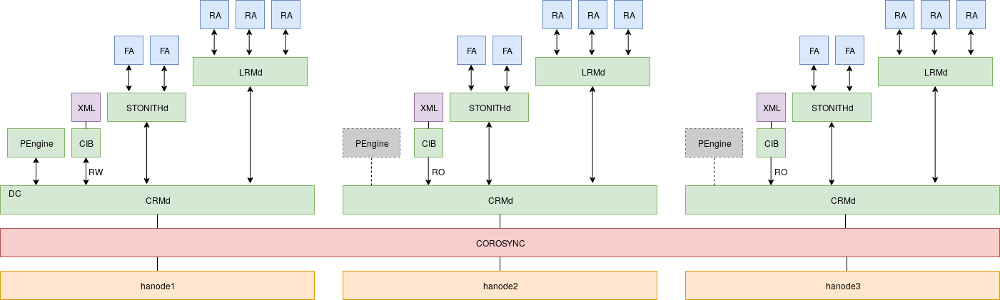
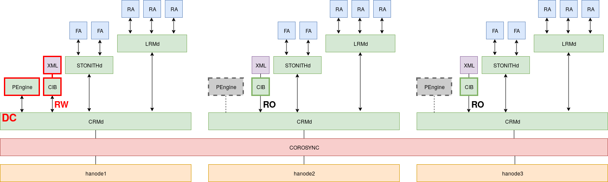
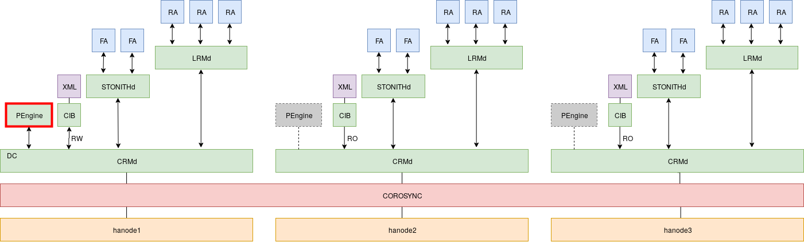
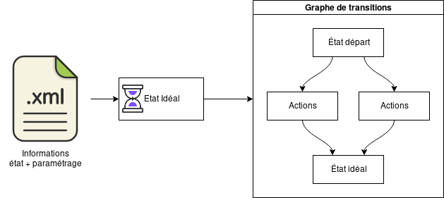
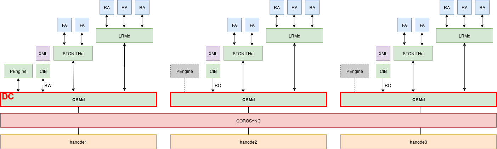
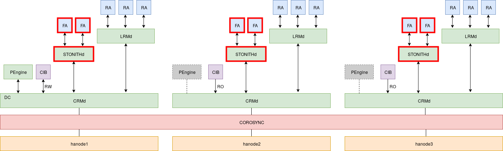
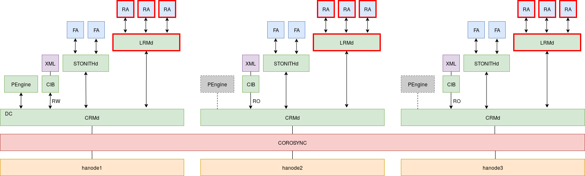
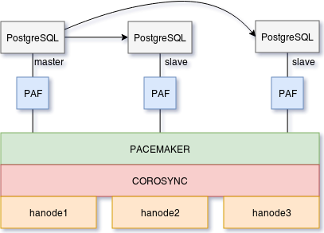

# Introduction

-----

## Prérequis minimum

* fiabilité des ressources (matériel, réseau, etc.)
* redondance de chaque élément d'architecture
* synchronisation des horloges des serveurs
* supervision de l'ensemble

::: notes

La résistance d'une chaîne repose sur son maillon le plus faible.

Un pré-requis à une architecture de haute disponibilité est d'utiliser du matériel de qualité, fiable, éprouvé,
maîtrisé et répandu. Fonder son architecture sur une technologie peu connue et non maîtrisée est la recette parfaite
pour une erreur humaine et une indisponibilité prolongée.

De même, chaque élément doit être redondé. La loi de Murphy énonce que « tout ce qui peut mal tourner, tournera mal ».
Cette loi se vérifie très fréquemment. Les incidents se manifestent rarement là où on ne les attend le plus. Il faut
réellement tout redonder:

* chaque application ou service doit avoir une procédure de bascule
* CPU (multi-socket), mémoire (multi-slot, ECC), disques (niveaux de RAID)
* redondance du SAN
* plusieurs alimentations électriques par serveur, plusieurs sources d'alimentation
* plusieurs équipements réseaux, liens réseaux redondés, cartes réseaux, WAN et LAN
* climatisation redondée
* plusieurs équipements de fencing (et chemins pour accéder)
* plusieurs administrateurs comprenant et maîtrisant chaque brique du cluster
* ...

S'il reste un seul `Single Point of Failure` dans l'architecture, ce point
subira un jour où l'autre une défaillance.

Concernant le synchronisme des horloges des serveurs entre eux, celui-ci est
important pour les besoins applicatifs et la qualité des données. Suite à une
bascule, les dates pourraient être incohérentes entre celles écrites par la
précédente instance primaire et la nouvelle.

Ensuite, ce synchronisme est important pour assurer une cohérence dans
l'horodatage des journaux applicatifs entre les serveurs. La compréhension
rapide et efficace d'un incident dépend directement de ce point. Ànoter qu'il
est aussi possible de centraliser les log sur une architecture dédiée à part
(attention aux SPoF ici aussi).

Le synchronisme des horloges est d'autant plus important dans les
environnements virtualisés où les horloges ont facilement tendance à dévier.

:::

-----

## Fencing

* difficulté de déterminer l'origine d'un incident de façon logicielle
* chaque brique doit toujours être dans un état déterminé
* garantie de pouvoir sortir du système un élément défaillant
* implémenté dans Pacemaker au travers du daemon `stonithd`

::: notes

Lorsqu'un serveur n'est plus accessible au sein d'un cluster, il est impossible aux autres nœuds de déterminer l'état
réel de ce dernier. A-t-il crashé ? Est-ce un problème réseau ? Subit-il une forte charge temporaire ?

Le seul moyen de répondre à ces questions est d'éteindre ou d'isoler le serveur fantôme d'autorité. Cette action permet
de déterminer de façon certaine son statut : le serveur est hors cluster et ne reviendra pas sans action humaine.

Une fois cette décision prise, le cluster peut mettre en œuvre les actions nécessaires pour rendre les services en HA
de nouveau disponibles.

Passer outre ce mécanisme, c'est s'exposer de façon certaine à des situations de `split brain` où deux instances
PostgreSQL sont accessibles en écriture au sein du cluster, mais ne répliquent pas entre elles. Réconcilier les données
de ces deux instances peut devenir un véritable calvaire et provoquer une ou plusieurs indisponibilités. Voici un
exemple réel d'incident de ce type:
<https://blog.github.com/2018-10-30-oct21-post-incident-analysis/>. Ici, une certaine quantité de donnée n'a pas été
répliquée de l'ancien primaire vers le nouveau avant la bascule. En conséquence, plusieurs jours ont été nécessaire
afin de réintégrer et réconcilier les données dans le cluster fraîchement reconstruit.

Ne sous-estimez jamais le pouvoir d'innovation en terme d'incident des briques de votre cluster pour provoquer une
partition des nœuds entre eux. En voici quelques exemples: <https://aphyr.com/posts/288-the-network-is-reliable>

À noter que PAF est pensé et construit pour les clusters configurés avec le fencing. En cas d'incident, il y a de
fortes chances qu'une bascule n'ait jamais lieu pour un cluster dépourvu de fencing.

:::

-----

## Quorum

* quelle partie du cluster doit fonctionner en cas de partition réseau ?
  * un vote à chaque élément du cluster
  * le cluster ne fonctionne que s'il a la majorité des votes

::: notes

Le `quorum` est le nombre minimum de vote qu'une transaction distribuée doit
obtenir pour être autorisée à effectuer une opération dans ce système. Son
objectif est d'assurer la cohérence du système distribué.

Pour se faire, chaque nœud du système se voit assigné un nombre de vote. Il
faut au moins que `(N / 2) + 1` votes soient présents pour que le `quorum` soit
atteint, avec "N" le nombre de votes possible. Le cluster ne fonctionne que si
la majorité des nœuds sont présents.

Suite à une partition réseau, le `quorum` permet au cluster de savoir
quelle partition doit conserver les services actifs, où il doit les interrompre
et qui peut déclencher des opérations de fencing si nécessaire.

En plus d'arrêter ses services locaux, une partition du cluster n'atteignant
pas le quorum ne peut notamment pas actionner le fencing des nœuds de la
partition distante.

Ce mécanisme est donc indispensable au bon fonctionnement du cluster.

:::

-----

## KISS

* une architecture complexe pose des problèmes
  * de mise en œuvre (risque de "SPOF")
  * de maintenance
  * de documentation
* il est préférable de toujours aller au plus simple

::: notes

Augmenter la complexité d'un cluster augmente aussi le nombre de défaillances possibles. Entre deux solutions, la
solution la plus simple sera souvent la meilleure et la plus pérenne.

L'incident décrit par de Gocardless dans le lien ci-après est un bon exemple. L'article indique que l'automatisation
réduit la connaissance de l'architecture. Au fil du temps il est difficile de maintenir une documentation à jour, des
équipes correctement formées :

[Incident review: API and Dashboard outage on 10 October 2017](https://gocardless.com/blog/incident-review-api-and-dashboard-outage-on-10th-october/)

> **Automation erodes knowledge**
>
> It turns out that when your automation successfully handles failures for two
years, your skills in manually controlling the infrastructure below it atrophy.
There's no "one size fits all" here. It's easy to say "just write a runbook",
but if multiple years go by before you next need it, it's almost guaranteed to
be out-of-date.

:::

-----

## Historique de Pacemaker

* plusieurs plate-formes historiques distinctes
  * projet Linux-HA mené par SUSE
  * "Cluster Services" de Red Hat
* 2007 : Pacemaker apparaît
  * issu de Linux-HA
  * 1er point de convergence

::: notes

Un historique complet est disponible
[ici](https://www.alteeve.com/w/High-Availability_Clustering_in_the_Open_Source_Ecosystem).

Plusieurs sociétés se sont forgées une longue expérience dans le domaine de la Haute Disponibilité en maintenant chacun
leur plate-forme.

SUSE d'abord, avec son projet Linux-HA. Red Hat ensuite avec "Cluster Services".

En 2007, issu d'une première collaboration, Pacemaker apparaît pour gérer les clusters peu importe la couche de
communication utilisée : OpenAIS (Red Hat) ou Heartbeat (SUSE).

:::

-----

## Historique de Pacemaker - suite

* 2009 : Corosync apparaît
  * issu de OpenAIS
  * 2ème point de convergence
* 2014 : début de l'harmonisation

::: notes

En 2009 apparaît l'uniformisation des couches de communication grâce à Corosync.

Une collaboration forte étant désormais née, Pacemaker et Corosync deviennent petit à petit la référence et chaque
distribution tend vers cette plate-forme commune.

:::

-----

## Historique de Pacemaker - futur

* 2017: les principales distributions ont convergé
  * Corosync 2.x et Pacemaker 1.1.x
* 2018: corosync 3 et Pacemaker 2.0.x

::: notes

En 2017, les dernières versions des principales distributions Linux avaient toutes fini leur convergence vers Corosync
2.x et Pacemaker 1.1.x. Seul le client d'administration de haut niveau varie en fonction de la politique de la
distribution.

Début 2018, Pacemaker 2.0 et Corosync 3.0 font leur apparition. Coté Pacemaker, les principaux changements concernent:

* la suppression de beaucoup de code consacré aux anciennes architectures devenues obsolètes : incompatibilité avec
  OpenAIS, CMAN, Corosync 1.x, Heartbeat
* plusieurs paramètres de configuration ont été supprimés ou remplacés par des équivalents pour une configuration plus
  cohérente

Pour plus de détails, voir: <https://wiki.clusterlabs.org/wiki/Pacemaker_2.0_Changes>

Concernant Corosync, la principale nouveauté est le support du projet "Kronosnet" comme protocole de communication au
sein du cluster. Cette librairie permet d'ajouter beaucoup de souplesse, de fonctionnalités, de visibilité sur
l'activité de Corosync et surtout une latence plus faible que l'actuel protocole. Entre autre nouveautés, nous
trouvons :

* le support de un à huit liens réseaux
* l'ajout de liens réseaux à chaud
* le mélange de protocoles entre les liens si nécessaire
* plusieurs algorithmes de gestions de ces liens (active/passive ou active/active)
* la capacité de gérer la compression et/ou le chiffrement

Pour plus de détails, voir: [Kronosnet:The new face of Corosync communications](http://build.clusterlabs.org/corosync/presentations/2017-Kronosnet-The-new-face-of-corosync-communications.pdf)

:::

-----

## Clients d'administration

* `crmsh`
  * outil originel
  * gestion et configuration du cluster
* `pcs`
  * introduit par Red Hat
  * supporte également Corosync

::: notes

A l'origine du projet Pacemaker, un outil apparaît : `crmsh`. Cet outil permet de configurer et de gérer le cluster
sans toucher aux fichiers de configuration. Il est principalement maintenu par Suse et présente parfois des
incompatibilités avec les autres distributions pour la création du cluster lui-même, son démarrage ou son arrêt.
Néanmoins, l'outil évolue très vite et plusieurs de ces incompatibilités sont corrigées.

Lorsque Red Hat intègre Pacemaker, un nouvel outil est créé : `pcs`. En plus de regrouper les commandes de Pacemaker,
il supporte également Corosync (et CMAN pour les versions EL 6) et inclut un service HTTP permettant (entre autre) la
configuration et la maintenance du cluster via un navigateur web.

Concernant le contrôle du cluster, `crmsh` repose sur SSH et csync2 pour l'exécution de commandes sur les serveurs
distants (via la librairie python `parallax`) et la gestion de la configuration sur tous les serveurs.

Pour ces mêmes tâches, les daemons `pcsd` échangent des commandes entre eux via leur service web. Le daemon `pcsd` gère
à la fois une API HTTP pour la communication de commandes inter-serveurs ou l'interface HTTP à destination de
l'administrateur.

Lorsqu'une commande nécessite une action côté système (donc hors Pacemaker), les daemon `pcsd` communiquent entre eux
et s'échangent les commandes à exécuter localement au travers de cette API HTTP. Les commandes sollicitant cette API
peuvent être la création du cluster lui-même, son démarrage, son arrêt, sa destruction, l'ajout ou la suppression d'un
nœud, etc.

En 2018, `pcs` a fini d'être intégré à Debian. `crmsh` est encore utilisé en priorité sous Suse, mais reste souvent
utilisé sur les Debian et Ubuntu par choix historique et reste un très bon choix, pour peu que l'administrateur ne
l'utilise pas pour interagir avec le système lui même.

**Ce workshop se base sur une distribution CentOS 7 et sur l'outil `pcs`**.

:::

-----

## Pacemaker et RHEL

* RHEL 8 : HA par défaut :
  * utilisation de Corosync 3.x
  * Pacemaker 2.x
  * client d'administration `pcs`

::: notes

L'installation recommandée (et supportée) suivant les distributions de RHEL et dérivés :

| RHEL version | Corosync | Pacemaker | Administration              |
|:------------:|:--------:|:---------:|-----------------------------|
| 7            | 2.x      | 1.1.x     | pcsd & pcs                  |
| 8            | 3.x      | 2.x       | pcsd & pcs                  |

:::

-----

## Pacemaker et Debian

* Debian 10
  * corosync 3.x
  * Pacemaker 2.x
  * client d'administration `crmsh` 4.x ou le couple `pcsd`et `pcs`

::: notes

| Debian version | Corosync | Pacemaker | Administration               |
|:--------------:|:--------:|:---------:|------------------------------|
| 8              | 1.4      | 1.1.x     | crmsh                        |
| 9              | 2.4      | 1.1.x     | pcsd & pcs 0.9 ou crmsh 2.3  |
| 10             | 3.0      | 2.0       | pcsd & pcs 0.10 ou crmsh 4.0 |

L'équipe de maintenance des paquets Pacemaker n'a pu intégrer les dernières versions des composants à temps pour la
version 8 de Debian. Il a été décidé d'utiliser officiellement le dépôt backport de Debian pour distribuer ces paquets
dans Debian 8. Les versions 8 et 9 de Debian partagent donc les mêmes versions des paquets concernant Pacemaker.

L'initialisation du cluster avec `crmsh` 2.x n'est toujours pas fonctionnelle et ne devrait pas être corrigée, la
branche 3.x étant désormais la branche principale du projet. La version 3.0 de `crmsh` supporte l'initialisation d'un
cluster sous Debian mais avec un peu d'aide manuelle et quelques erreurs d'intégration.

L'utilisation de `pcsd` et `pcs` est désormais pleinement fonctionne sous Debian. Voir à ce propos:
<https://clusterlabs.github.io/PAF/Quick_Start-Debian-9-pcs.html>

:::

-----

# Premiers pas avec Pacemaker

Ce chapitre aborde l'installation et démarrage de Pacemaker.

-----

## Installation

Paquets essentiels:

* `corosync` : communication entre les nœuds
* `pacemaker` : orchestration du cluster
* `pcs` : administration du cluster

::: notes

L'installation de Pacemaker se fait très simplement depuis les dépôts officiels de CentOS 7 avec la commande suivante:

~~~console
yum install -y pacemaker           \
               resource-agents     \
               pcs                 \
               fence-agents-all
~~~

Le paquet `corosync` est installé par dépendance de Pacemaker.

Voici le détail de chaque paquet :

* `corosync` : gère la communication entre les nœuds, la gestion du groupe, du quorum
* `pacemaker` : orchestration du cluster, prise de décision suite aux événements détectés au sein du cluster
* `pcs` : administration du cluster au travers de l'outil CLI du même nom ou du daemon HTTP. Gère la propagation des
  commandes de contrôle du cluster entre les nœuds
* `resource-agents`: collection de "_resource agents_" pour divers services
* `fence-agents-all`: collection de "_fencing agents_" pour les différentes méthode de fencing supportées

Même si l'administration du cluster peut se faire entièrement sans l'utilisation du couple `pcs`/`pcsd`, ces outils
sont très pratiques au quotidien et facilitent grandement la gestion du cluster. De plus, ils intègrent toutes les
bonnes pratiques relatives aux commandes supportées.

Le paquet `corosync` installe un certain nombre d'outils commun à toutes les distributions et que nous aborderons plus
loin:

* `corosync-cfgtool`
* `corosync-cmapctl`
* `corosync-cpgtool`
* `corosync-keygen`
* `corosync-quorumtool`

Pacemaker aussi installe un certain nombre de binaires commun à toutes les distributions, dont les suivants que vous
pourriez rencontrer dans ce workshop ou dans certaines discussions :

* `crm_attribute`
* `crm_node`
* `attrd_updater`
* `cibadmin`
* `crm_mon`
* `crm_report`
* `crm_resource`
* `crm_shadow`
* `crm_simulate`
* `crm_verify`
* `stonith_admin`

Beaucoup d'autres outils sont installés sur toutes les distributions, mais sont destinés à des utilisations très
pointues, de debug ou aux agents eux-même.

Les outils d'administration `pcs` et `crm` reposent fortement sur l'ensemble de ces binaires et permettent d'utiliser
une interface unifiée et commune à ceux-ci.

:::

-----

## Création du cluster

* authentification des daemons `pcsd` entre eux
* création du cluster à l'aide de `pcs`
  - crée la configuration corosync sur tous les serveurs

::: notes

La création du cluster se résume à la configuration de Corosync, puis au démarrage de Pacemaker qui s'appuie
directement dessus.

L'utilisation de `pcs` nous permet de ne pas avoir à éditer la configuration de Corosync manuellement. Néanmoins, un
pré-requis à l'utilisation de `pcs` est que tous les daemons soient authentifiés les uns auprès des autres pour
s'échanger des commandes au travers de leur API HTTP.

Une fois `pcsd` démarré sur tous les nœuds, l'authentification des membres
et création du cluster se fait grâce à la commande suivante (FIXME: change
avec pcmk 2):

~~~console
# passwd hacluster
# pcs cluster auth hanode1 hanode2 hanode3 -u hacluster
~~~

La commande vous demandera le mot de passe précédemment positionné pour l'utilisateur `hacluster`. Il est recommandé
d'utiliser le même mot de passe pour cet utilisateur sur tous les serveurs afin d'en simplifier la configuration.

Les daemons étant prêts à travailler entre eux, nous pouvons créer le cluster lui même:

~~~console
# pcs cluster setup --name cluster_demo hanode1 hanode2 hanode3
~~~

Cette commande permet de créer un cluster nommé "cluster_demo", composé des trois nœuds `hanode1`, `hanode2` et
`hanode3`. Le fichier de configuration de Corosync
`/etc/corosync/corosync.conf` est créé et propagé automatiquement sur tous
ces nœuds par `pcsd`.

:::

-----

## Démarrage du cluster

* cluster créé mais pas démarré
* ne pas activer Pacemaker au démarrage des serveurs
* utilisation de `pcs` pour démarrer le cluster

::: notes

Une fois le cluster créé, ce dernier n'est pas démarré automatiquement. Il
est déconseillé de démarrer Pacemaker automatiquement au démarrage des
serveurs. En cas d'incident et de fencing, un nœud toujours défaillant
pourrait déstabiliser le cluster et provoquer des interruptions de services
suite à un retour automatique prématuré. En forçant l'administrateur à
devoir démarrer Pacemaker manuellement, celui-ci a alors tout le
loisir d'intervenir, d'analyser l'origine du problème et éventuellement
d'effectuer des actions correctives avant de réintégrer le nœud, sain,
dans le cluster.

La commande suivante permet de démarrer les services Pacemaker et Corosync sur
tous les nœuds du cluster :

~~~console
# pcs cluster start --all
~~~

Cette commande propage l'ordre de démarrage à tous les daemons `pcsd` qui s'occupent alors de démarrer les services
localement. Sans l'argument `--all`, seuls les services locaux sont démarrés.

L'équivalent de cette commande indépendamment de `pcs` serait de démarrer manuellement les services Corosync puis
Pacemaker sur chaque nœud du cluster. À noter que démarrer Pacemaker suffit
souvent sur de nombreuses distributions Linux, Corosync étant démarré
automatiquement comme dépendance.

Bien entendu, la même commande existe pour interrompre tout le cluster et fonctionne de la même manière :

~~~console
# pcs cluster stop --all
~~~

Nous reviendrons sur quelques bonnes pratiques à ce propos dans le chapitre consacré à PAF.

Les commandes utiles pour vérifier l'état du cluster sont les suivantes :

~~~console
# pcs status
~~~

ou, sur toute distribution :

~~~console
# crm_mon -1
~~~

:::

-----

## TP

* Installation de Pacemaker
* Création du cluster avec pcs
* Démarrage du cluster

::: notes

### Installation de Pacemaker

~~~console
# yum install -y corosync pacemaker pcs
~~~

Il est ensuite recommandé de désactiver Pacemaker et Corosync au démarrage du serveur. Cela permet à l'administrateur
de s'assurer de l'état du nœud avant de le réintégrer au cluster suite à un incident.

~~~console
# systemctl disable corosync
# systemctl disable pacemaker
~~~

Le daemon `pcsd` s'occupe seulement de propager les configurations et commandes sur tous les nœuds. Ce dernier peut
être lancé automatiquement au démarrage :

~~~console
# systemctl enable pcsd
# systemctl start pcsd
~~~

L'outil `pcs` se sert de l'utilisateur système `hacluster` pour s'authentifier
auprès de `pcsd`. Puisque les commandes de gestion du cluster peuvent être
exécutées depuis n'importe quel membre du cluster, il est recommandé de
configurer le même mot de passe pour cet utilisateur sur tous les nœuds pour
éviter les confusions.

~~~console
# passwd hacluster
~~~

Nous pouvons désormais authentifier les membres du cluster (FIXME: pcmk 2):

~~~console
# pcs cluster auth hanode1 hanode2 hanode3 -u hacluster
~~~

Remarque : les commandes `pcs` peuvent être exécutées depuis n'importe quel nœud.

### Création du cluster avec pcs

Ci-après la commande permettant de créer le cluster sur tous les nœuds. Elle
ne doit être exécutée que sur un seul d'entre eux.

~~~console
# pcs cluster setup --name cluster_tp hanode1 hanode2 hanode3
~~~

Le fichier `/etc/corosync/corosync.conf` est créé et propagé automatiquement sur tous les nœuds grâce aux daemons
`pcsd`.

Afin de pouvoir mieux appréhender certains concepts, activons le mode debug de certains modules de Pacemaker sur chaque
serveur.

Pour ce faire, éditer la variable `PCMK_debug` dans le fichier de configuration `/etc/sysconfig/pacemaker` :

~~~console
PCMK_debug=crmd,pengine,lrmd
~~~

Ce paramétrage permet d'obtenir les messages de debug des sous processus `crmd`, `pengine` et `lrmd` que nous
aborderons dans la suite de ce workshop.

Pour obtenir l'ensemble des messages de debug de tous les processus, positionner ce paramètre à `yes`.

### Démarrage du cluster

Vérifier l'état de Pacemaker et Corosync :

~~~console
# systemctl status pacemaker.service
# systemctl status corosync.service
~~~

Démarrer le cluster sur tous les nœuds :

~~~console
# pcs cluster start --all
~~~

Vérifier à nouveau l'état de Pacemaker et Corosync :

~~~console
# systemctl status pacemaker.service
# systemctl status corosync.service
~~~

Vérifier l'état du cluster :

~~~console
# pcs status
~~~

ou

~~~console
# crm_mon -n1D
~~~

:::

-----

## Visualiser l'état du cluster

Pour visualiser l'état du cluster :

* `crm_mon`
* `pcs`

::: notes

L'outil `crm_mon` permet de visualiser l'état complet du cluster et des
ressources. Voici le détail des arguments disponibles :

* `-1`: affiche l'état du cluster et quitte
* `-n`: regroupe les ressources par nœuds
* `-r`: affiche les ressources non actives
* `-f`: affiche le nombre fail count pour chaque ressource
* `-t`: affiche les dates des événements
* `-c`: affiche les tickets du cluster (utile pour les cluster étendus sur réseau WAN)
* `-L`: affiche les contraintes de location négatives
* `-A`: affiche les attributs des nœuds
* `-R`: affiche plus de détails (node IDs, individual clone instances)
* `-D`: cache l'entête

Voici des exemples d'utilisation:

~~~console
# crm_mon -DnA
# crm_mon -fronA
# crm_mon -1frntcLAR
~~~

À noter que ces différents arguments peuvent être aussi activés ou désactivés
dans le mode interactif.

L'outil `pcs` contient quelques commandes utiles pour consulter l'état d'un
cluster, mais n'a pas de mode interactif. Voici quelques exemples
d'utilisation:

~~~console
# pcs cluster status
# pcs status
# pcs cluster cib
# pcs constraint show
~~~

:::

-----

# Pacemaker, fonctionnement interne

::: notes

Dans ce chapitre, nous abordons rapidement le fonctionnement interne de Pacemaker. Le but est de comprendre le rôle de
chaque brique et ainsi mieux diagnostiquer l'état du cluster, son paramétrage et savoir interpréter les messages de log
correctement.

Le diagramme présente les différents éléments de Pacemaker au sein d'un cluster à trois nœuds. Une vue plus détaillée
mais centrée sur un seul nœud est présenté dans la documentation de Pacemaker. Voir:
[Schémas de l'architecture interne de Pacemaker](http://clusterlabs.org/pacemaker/doc/en-US/Pacemaker/2.0/html/Pacemaker_Explained/_pacemaker_architecture.html#_internal_components)

Cette architecture et le paramétrage de Pacemaker permet de supporter différents types de scénario de cluster dont
certains (vieux) exemples sont présentés dans le wiki de Pacemaker:

[Schémas des différentes configuration de nœuds possibles avec Pacemaker](https://wiki.clusterlabs.org/wiki/Pacemaker#Example_Configurations)

:::

-----

## Cluster Information Base (CIB)

* détient la configuration du cluster
* l'état des différentes ressources
* un historique des actions exécutées
* géré par le processus `pacemaker-based` (`cib` en 1.1)
* stockage fichier au format XML
* synchronisé automatiquement entre les nœuds
* historisé

::: notes

La CIB est la représentation interne de la configuration et de l'état des composantes du cluster. C'est un fichier XML,
créée par Pacemaker à l'initialisation du cluster et qui évolue ensuite au fil des configurations et évènements du
cluster.

En fonction de cet ensemble d'états et du paramétrage fourni, le cluster détermine l'état idéal de chaque ressource
qu'il gère (démarré/arrêté/promu et sur quel serveur) et calcule les transitions permettant d'atteindre cet état.

Le processus `pacemaker-based` est chargé d'appliquer les modifications dans la CIB, de conserver les information transitoires en
mémoire (statuts, certains scores, etc) et de notifier les autres processus de ces modifications si nécessaire.

Le contenu de la CIB est historisé puis systématiquement synchronisé entre les nœuds à chaque modification. Ces
fichiers sont stockés dans `/var/lib/pacemaker/cib` :

~~~
ls /var/lib/pacemaker/cib/ -alh
total 68K
drwxr-x--- 2 hacluster haclient 4.0K Feb  7 16:46 .
drwxr-x--- 6 hacluster haclient 4.0K Feb  7 12:16 ..
-rw------- 1 hacluster haclient  258 Feb  7 16:43 cib-1.raw
-rw------- 1 hacluster haclient   32 Feb  7 16:43 cib-1.raw.sig
-rw------- 1 hacluster haclient  442 Feb  7 16:43 cib-2.raw
-rw------- 1 hacluster haclient   32 Feb  7 16:43 cib-2.raw.sig
-rw------- 1 hacluster haclient  639 Feb  7 16:43 cib-3.raw
-rw------- 1 hacluster haclient   32 Feb  7 16:43 cib-3.raw.sig
-rw------- 1 hacluster haclient  959 Feb  7 16:43 cib-4.raw
-rw------- 1 hacluster haclient   32 Feb  7 16:43 cib-4.raw.sig
-rw------- 1 hacluster haclient  959 Feb  7 16:43 cib-5.raw
-rw------- 1 hacluster haclient   32 Feb  7 16:43 cib-5.raw.sig
-rw------- 1 hacluster haclient  959 Feb  7 16:46 cib-6.raw
-rw------- 1 hacluster haclient   32 Feb  7 16:46 cib-6.raw.sig
-rw-r----- 1 hacluster haclient    1 Feb  7 16:46 cib.last
-rw------- 1 hacluster haclient  959 Feb  7 16:46 cib.xml
-rw------- 1 hacluster haclient   32 Feb  7 16:46 cib.xml.sig
~~~

`cib.xml` correspond à la version courante de la CIB, les autres fichiers `cib-*.raw`, aux versions précédentes.

Par défaut, Pacemaker conserve toutes les versions de la CIB depuis la création du cluster. Il est recommandé de
limiter ce nombre de fichier grâce aux paramètres ''pe-error-series-max'', ''pe-warn-series-max'' et
''pe-input-series-max''.

Il n'est pas recommandé d'éditer la CIB directement en XML. Préférez toujours utiliser les commandes de haut niveau
proposées par `pcs` ou `crm`. En dernier recours, utilisez l'outil `cibadmin`.

:::

-----

## TP

découverte de la CIB

::: notes

La CIB est synchronisée et versionnée entre tous les nœuds du cluster.

Les fichiers sont stockés dans `/var/lib/pacemaker/cib`.

* consulter le contenu de ce répertoire
* identifier la dernière version de la CIB
* comparer avec `cibadmin --query` et `pcs cluster cib`

Vous devriez observer une section "\<status\>" supplémentaire dans le document
XML présenté par `cibadmin`. Cette section contient l'état du cluster et est
uniquement conservée en mémoire.

:::

-----

## Designated Controler (DC) - Diagramme global

FIXME diagram

-----

## Designated Controler (DC)

* démon `controller` désigné pilote principal sur un nœud uniquement
* lit et écrit dans la CIB
* invoque PEngine pour générer les éventuelles transitions
* contrôle le déroulement des transitions
* envoie les actions à réaliser aux démons `controller` des autres nœuds
* possède les journaux applicatifs les plus complets

::: notes

Le *Designated Controler* est élu au sein du cluster une fois le groupe de communication établi au niveau de Corosync.
Il pilote l'ensemble du cluster.

Il est responsable de:

* lire l'état courant dans la CIB
* invoquer le `scheduler` en cas d'écart avec l'état stable (changement d'état d'un service, changement de configuration,
  évolution des scores ou des attributs, etc)
* mettre à jour la CIB (mises à jour propagée aux autres nœuds)
* transmettre aux `controller` distants une à une les actions à réaliser sur leur nœud

C'est le DC qui maintient l'état primaire de la CIB ("master copy").

:::

-----

## Scheduler - Diagramme global

FIXME diagram

-----

## Scheduler

* reçoit en entrée les informations d'état des ressources et le paramétrage
* décide de l'état idéal du cluster
* génère un graphe de transition pour atteindre cet état
* anciennement appelé `PEngine`

::: notes

Le `scheduler` est la brique de Pacemaker qui calcule les transitions nécessaires pour passer d'un état à l'autre.

Il reçoit en entrée des informations d'état et de paramétrage au format XML (extrait de la CIB), détermine si un nouvel
état est disponible pour les ressources du cluster, et calcule toutes les actions à mettre en œuvre pour l'atteindre.

Toutes ces actions sont regroupées au sein d'un graph de transition que le
`Designated Controller`, qui pilote le cluster, devra ensuite mettre en œuvre.

Voici un exemple de transition complexe présentant une bascule maître-esclave DRBD:

Ce diagramme vient de la documentation de Pacemaker. L'original est disponible à cette adresse:
<https://clusterlabs.org/pacemaker/doc/en-US/Pacemaker/2.0/html/Pacemaker_Administration/images/Policy-Engine-big.png>

Les explications sur les codes couleurs sont disponibles à cette adresse:
<https://clusterlabs.org/pacemaker/doc/en-US/Pacemaker/2.0/html/Pacemaker_Administration/_visualizing_the_action_sequence.html>

Dans cet exemple chaque flèche impose une dépendance et un ordre entre les actions. Pour qu'une action soit déclenchée,
toutes les actions précédentes doivent être exécutées et réussies. Les textes en jaune sont des "actions virtuelles",
simples points de passage permettant de synchroniser les actions entre elles avant de poursuivre les suivantes. Les
textes en noir représentent des actions à exécuter sur l'un des nœuds du cluster.

Le format des textes est le suivant: `<resource>_<action>_<interval>`

Une action avec un intervalle à 0 est une action ponctuelle ("start", "stop", etc). Une action avec un intervalle
supérieur à 0 est une action récurrente, tel que `monitor`.

Dans cet exemple:

* les actions 1 à 4 concernent l'exécution des actions `notify` "pre-demote" sur les nœuds "frigg" et "odin" du cluster
* l'action 1 déclenche en parallèle les deux actions 2 et 3
* l'action 4 est réalisée une fois que les actions 1, 2 et 3 sont validées
* l'action 5 est exécutée n'importe quand
* l'action 5 interrompt l'exécution récurrente de l'action `monitor` sur la ressource "drbd0:0" du serveur "frigg"
* l'action 7 est exécutée après que 5 et 6 soient validées
* l'action 7 effectue un `demote` de la ressource "drbd0:0" sur "frigg" (qui n'est donc plus supervisée)
* la pseudo action 8 est réalisée une fois que l'action `demote` est terminée
* la pseudo action 9 initialise le déclenchement des actions `notify` "post-demote" et dépend de la réalisation
  précédente de la notification "pre-demote" et de l'action `demote` elle même
* les actions 9 à 12 représentent l'exécution des notifications "post-demote" dans tout le cluster
* les actions 13 à 24 représentent les actions de `notify` "pre-promote", `promote` de drbd sur "odin" et `notify`
  "post-promote" au sein du cluster
* les actions 25 et 27 peuvent alors être exécutées et redémarrent les actions de monitoring récurrentes de drbd sur
  "odin" et "frigg"
* les actions 26, 28 à 30 démarrent un groupe de ressource dépendant de la ressource drbd

:::

-----

## TP

Étude du `scheduler`.

::: notes

* sur quels nœuds est lancé le processus `schedulerd` ?
* où se trouvent les logs ?
* quelles différences observer entre les différents nœuds (identifier le DC) ?

:::

-----

## Cluster Resource Manager (CRM) - Diagramme global

FIXME diagram

-----

## Controller

* démon `controld` local à chaque nœud
* chargé du pilotage des événements
* reçoit des instructions du _scheduler_ s'il est DC ou du _controller_ DC distant
* transmet les actions à réaliser au sein des transitions
  * au démon `execd` local
  * au démon `fenced` local
* récupère les codes retours des actions
* transmets les codes retours de chaque action au _controller_ DC
* anciennement appelé `CRMd`

::: notes

Le  démon `controld` est local à chaque nœud qui pilote les événements. Il peut soit être actif (DC), et donc être chargé
de l'ensemble du pilotage du cluster, soit passif, et attendre que le _controller_ DC lui fournisse des instructions.

Lorsque des instructions lui sont transmises, il les communique aux démons `execd` et/ou `fenced` locaux pour qu'ils
exécutent les actions appropriées auprès des _ressources agents_ et _fencing agents_.

Une fois l'action réalisée, le _controller_ récupère le statut de l'action (via
son code retour) et le transmet au _controller_ DC qui en valide la cohérence
avec ce qui est attendu au sein de la transition.

En cas de code retour différent de celui attendu, le _controller_ DC décide d'annuler la transition en cours. Il
demande alors une nouvelle transition au _scheduler_.

:::

-----

## TP

Étude du démon `controld`.

::: notes

* comment sont désignés les messages du _controller_ dans les log ?
* qui est le DC dans votre cluster ?

Solutions possibles:

* `crm_mon`
* `pcs status`
* log : "Set DC to "

:::

-----

## _Fencer_ et _Fencing Agent_ - Diagramme global

FIXME diagram

-----

## Fencer

* démon `fenced`
* gestionnaire des agents de fencing (_FA_)
* utilise l'API des fencing agent pour exécuter les actions demandées
* reçoit des commandes du _controller_ et les passe aux _FA_
* renvoie le code de retour de l'action au _controller_
* capable de gérer plusieurs niveau de fencing avec ordre de priorité
* anciennement appelé `STONITHd`

::: notes

Le _fencer_ joue sensiblement un rôle identique au _local executor_ vis-à-vis des
agents de fencing (_FA_).

:::

-----

## _Fencing Agent_ (_FA_)

* script permettant de traduire les instructions du _fencer_ vers l'outil de fencing
* doit assurer que le nœud cible est bien complètement isolé du cluster
* doit renvoyer des codes retours définis dans l'API des _FA_ en fonction des résultats

::: notes

Attention aux _FA_ qui dépendent du nœud cible !

Exemple classique : la carte IPMI. Si le serveur a une coupure électrique le
_FA_ (la carte IPMI donc) n'est plus joignable. Pacemaker ne reçoit donc
aucune réponse et ne peut pas savoir si le fencing a fonctionné, ce qui
empêche toute bascule.

Il est conseillé de chaîner plusieurs _FA_ si la méthode de fencing présente
un _SPoF_: IPMI, rack d'alimentation, switch réseau ou SAN, ...

:::

-----

## TP

Découverte et installation du fencing

::: notes

Au cours de workshop, nous utilisons l'agent de fencing `fence_virsh`. Il ne
fait pas parti des agents de fencing distribués par défaut et s'installe via le
paquet `fence-agents-virsh`. Cet agent de fencing est basé sur SSH et la
commande `virsh`.

Installer les _FA_ : `yum install -y fence-agents fence-agents-virsh`

Lister les FA à l'aide de la commande `pcs resource agents stonith` ou
`stonith_admin -V -I`.

Nous abordons la création d'une ressource de fencing plus loin dans le workshop.

:::

-----

## _Local Executor_ et _Resources Agent_ - Diagramme global

FIXME diagram

-----

## _Local Executor_

* démon `execd`
* interface entre le _controller_ et les _resource agents_ (_RA_)
* capable d'exécuter les différents types de _RA_ supportés (OCF, systemd, LSF, etc) et d'en comprendre la réponse
* reçoit des commandes du _controller_ et les passe aux _RA_
* renvoie le résultat de l'action au _controller_ de façon homogène, quelque
  soit le type de _RA_ utilisé
* est responsable d'exécuter les actions récurrentes en toute autonomie et de
  prévenir le _controller_ en cas d'écart avec le résultat attendu
* anciennement appelé ̀̀ LRMd` (_Local Resource Manager_)

::: notes

Lorsqu'une instruction doit être transmise à un agent, le _controller_ passe
cette information au _local executor_, qui se charge de faire exécuter l'action
appropriée par le _RA_.

Le démon `execd` reçoit un code de retour de l'agent, qu'il transmet au
_controller_, lequel mettra à jour la CIB pour que cette information soit
partagée au niveau du cluster.

Pour les action dont le paramètre `interval` est supérieur à 0, le
_local executor_ est responsable d'exécuter les actions de façon récurrente
à la période indiquée dans la configuration. Le _local executor_ ne
reviendra vers le CRMd que si le code retour de l'action varie.

:::

-----

## _Ressource Agent_ (_RA_)

* exécutable permettant de traduire les instructions du _local executor_ vers la ressource
* doit renvoyer des codes retours bien définis en fonction du statut de sa
  ressource
* plusieurs types de _ressource agent_ supportés
* la spécification "OCF" est l'API la plus poussée et complète pour écrire
  un _RA_
* l'API OCF permet de présenter au _controller_ les actions supportées par
  l'agent.

::: notes

Il est possible d'utiliser plusieurs types de _RA_ différents au sein d'un même cluster:

* OCF (Open Cluster Framework, type préconisé)
* SYSV
* systemd...

Vous trouverez la liste des types supportés à l'adresse suivante:
<https://clusterlabs.org/pacemaker/doc/en-US/Pacemaker/2.0/html/Pacemaker_Explained/s-resource-supported.html>

Les agents systemd ou sysV sont souvent limités aux seules actions `start`,
`stop`, `monitor`.

Les _RA_ implémentant les actions `promote` et `demote` pilotent des ressources
"multistate": une ressource est alors clonée sur autant de nœuds que demandé,
démarrée en tant que slave, puis le cluster promeut en master un ou plusieurs
slaves.

Le _resource agent_ PAF utilise intensément toutes ces actions, sauf
`migrate_to` et `migrate_from` qui ne sont disponibles qu'aux _RA_ non
"multistate" (non implémenté dans Pacemaker pour les ressources multistate).

:::

-----

## TP

* installer les //resource agents//
* lister les RA installés à l'aide de `pcs`
* afficher les information relatives à l'agent `dummy`
* afficher les information relatives à l'agent `pgsql`

::: notes

Installer le paquet `resource-agents` qui installe un grand nombre de RA par défaut: `yum install -y resource-agents`.

Il est possible de lister les RA installés avec la commande suivante: `pcs resource agents`.

Chaque agent embarque sa propre documentation qui est accessible à l'aide de la commande
`pcs resource describe <agent>`.

Le RA `pgsql` livré avec le paquet `resource-agents` n'est **pas** celui de PAF. Vous pouvez lister l'ensemble de ses
options grâce à la commande `pcs resource describe pgsql`.

:::

-----

## PostgreSQL Automatic Failover (PAF)

* _RA_ spécifique à PostgreSQL pour Pacemaker
* alternative à l'agent existant
  * moins complexe et moins intrusif
  * compatible avec PostgreSQL 9.3 et supérieur
* Voir: <https://clusterlabs.github.io/PAF/FAQ.html>

::: notes

:::

------

## PostgreSQL Automatic Failover (PAF)

::: notes

PAF se situe entre Pacemaker et PostgreSQL. C'est un _resource agent_
qui permet au cluster d'administrer pleinement une instance PostgreSQL locale.

Un chapitre entier est dédié à son installation, son fonctionnement et sa
configuration plus loin dans ce workshop.

:::

------

# Corosync

Rapide tour d'horizon sur Corosync.

-----

## Présentation

* couche de communication bas niveau du cluster
* créé en 2004
* dérivé de OpenAIS
* avec des morceaux de CMAN dedans ensuite (à vérifier)

::: notes

Corosync est un système de communication de groupe (`GCS`). Il fournit
l'infrastructure nécessaire au fonctionnement du cluster en mettant à
disposition des APIs permettant la communication et d'adhésion des membres au
sein du cluster. Corosync fournit notamment des notifications de gain ou de
perte du quorum qui sont utilisés pour mettre en place la haute disponibilité.

Son fichier de configuration se trouve à l'emplacement
`/etc/corosync/corosync.conf`. En cas de modification manuelle, il faut
__ABSOLUMENT__ veiller à conserver une configuration identique sur tous les
nœuds. Cela peut être fait manuellement ou avec la commande `pcs cluster sync`.

La configuration de corosync est décrite dans la page de manuel
`corosync.conf`. Ses fonctionnalités liées au quorum sont décrites dans le
manuel nommé `votequorum`.

:::

-----

## Architecture

* corosync expose ses fonctionnalités sous forme de services, eg. :
  * `cgp` : API de gestion de groupe de processus ;
  * `cmap` : API de gestion de configuration ;
  * `votequorum` : API de gestion du quorum.

::: notes

Corosync s'appuie sur une ensemble de services internes pour proposer plusieurs APIs aux applications
qui l'utilisent.

Corosync expose notamment l'api `cpg` dont l'objet est d'assurer le moyen de
communication d'une applications distribuées. Cette api permet de gérer :

* l'entrée et la sortie des membres dans un ou plusieurs groupes ;
* la propagation des messages à l'ensemble des membres des groupes ;
* la propagation des changements de configuration ;
* l'ordre de délivrance des messages.

Corosync utilise `cmap` pour gérer et stocker sa configuration sous forme de stockage
clé-valeur. Cette API est également mise à disposition des applications qui utilisent corosync.
Pacemaker s'en sert notamment pour récupérer certaines informations sur le cluster et
ses membres.

Le service `votequorum` permet à corosync de fournir des notifications sur la gain ou la
perte du quorum dans le cluster, le nombre de vote courant, etc.

:::

-----

## Fonctionnalités de corosync 3

Nouvelle librairie `kronosnet` (`knet`):

* évolution du chiffrement
* redondance des canaux de communications
* compression

::: notes

Corosync3 utilise la librairie kronosnet (`knet`). Cette libraire :

* remplace les modes de transport `multicast` et `unicast` ;
* remplace le protocole `RRP` (_Redundant Ring Protocole_).

Corosync implémente le protocole _Totem Single Ring Ordering and Membership_ pour la gestion
des messages et des groupes. Il est possible de redonder les canaux de communications ou liens
en créant plusieurs interfaces (option `totem` > `interface` > `linknumber`) qui seront
utilisés comme support des rings (option `nodelist` > `node` > `ringX_addr`). `knet` permet
de créer jusqu'à 8 liens avec des protocoles et des priorités différentes.

Le chiffrement peut être configuré soit avec l'option `totem` > `secauth` soit avec les
paramètres `totem` > `crypto_model`, `totem` > `crypto_cipher` et `totem` > `crypto_hash`.

Il est également possible d'utiliser la compression.

-----

## Clusters à deux nœuds

* paramètre dédié : `two_node: 1`
* option héritée de CMAN
* requiers `expected-votes: 2`
* implique `wait_for_all: 1`
* requiers un fencing hardware configuré sur la même interface que le heartbeat

::: notes

Considérons un cluster à deux nœuds avec un vote par nœud. Le nombre de vote
attendu est 2 (`expected-votes`), il n'est donc pas possible d'avoir une
majorité en cas de partition du cluster. La configuration `two_node` permet de
fixer artificiellement le quorum à 1 et de résoudre ce problème.

Ce paramétrage, implique `wait_for_all : 1` qui empêche le cluster d'établir
une majorité tant que l'ensemble des nœuds n'est pas présent. Ce qui évite une
partition au démarrage du cluster.

En cas de partition réseau, les deux nœuds font la course pour fencer l'autre.
Le nœud vainqueur conserve alors le quorum grâce au paramètre `two_node: 1`.
Quand au second nœud, après redémarrage de Pacemaker, si la partition réseau
existe toujours, ce dernier n'obtient donc pas le quorum grâce au paramètre
`wait_for_all: 1` et en conséquence ne peut démarrer aucune ressource.

Même si elle fonctionne, ce genre de configuration n'est cependant pas
optimale. Comme en témoigne
[cet article du blog de clusterlabs](http://blog.clusterlabs.org/blog/2018/two-node-problems).

:::

-----

## Outils

Corosync installe plusieurs outils:

* `corosync-cfgtool` : administration, paramétrage
* `corosync-cpgtool` : visualisation des différents groupes CPG
* `corosync-cmapctl` : administration de la base d'objets
* `corosync-quorumtool` : gestion du quorum

::: notes

`corosync-cfgtool` permet de :

* arrêter corosync sur le serveur ;
* récupérer l'IP d'un nœud ;
* tuer un nœud ;
* récupérer des informations sur les rings et réinitialiser leur statut ;
* demander à l'ensemble des nœuds de recharger leur configuration.

`corosync-cpgtool` permet d'afficher les groupes cpg et leurs membres.

`corosync-cmapctl` permet de manipuler et consulter la base d'objet de corosync,
les actions possibles sont :

* lister les valeurs associées aux clés : directement (ex: totem.secauth), par
préfix(ex: totem.) ou sans filtre ;
* définir ou supprimer des valeurs ;
* changer la configuration depuis un fichier externe ;
* suivre les modifications des clés stockées dans `cmap` en temps réel en filtrant
sur un préfix ou directement sur un clé.

`corosync-quorumtool` permet d'accéder au service de quorum pour par exemple:

* modifier la configuration des votes (nombre, nombre attendu) ;
* suivre les modifications de quorum ;
* lister les nœuds avec leurs nom, id et IPs .

:::

-----

## TP: utilisation de Corosync

* gestion de la configuration
* utilisation des 4 commandes `corosync-*`

::: notes

**`corosync-cfgtool`**

Voir l'état, recharger la configuration, tuer un nœud, etc.

~~~console
# corosync-cfgtool -s
Printing ring status.
Local node ID 1
RING ID 0
  id  = 192.168.122.101
  status  = ring 0 active with no faults

# corosync-cfgtool -a 1
192.168.122.101

# corosync-cfgtool -a 2
192.168.122.102

# corosync-cfgtool -a 3
192.168.122.103
~~~

**`corosync-cpgtool`**

Affiche les groups cpg (groupe de communication inter processus géré au sein
de corosync) et leurs membres.

~~~console
# corosync-cpgtool -e
Group Name         PID     Node ID
crmd
          4335           1 (192.168.122.101)
          2411           2 (192.168.122.102)
          2101           3 (192.168.122.103)
attrd
          4333           1 (192.168.122.101)
          2409           2 (192.168.122.102)
          2099           3 (192.168.122.103)
stonith-ng
          4331           1 (192.168.122.101)
          2407           2 (192.168.122.102)
          2097           3 (192.168.122.103)
cib
          4330           1 (192.168.122.101)
          2406           2 (192.168.122.102)
          2096           3 (192.168.122.103)
pacemakerd
          4329           1 (192.168.122.101)
          2405           2 (192.168.122.102)
          2095           3 (192.168.122.103)
~~~

**`corosync-cmapctl`**

Visualiser et positionner les clés / valeurs dans la base CMAP (Configuration
Map) locale de corosync:

~~~console
# corosync-cmapctl | grep ^nodelist
nodelist.local_node_pos (u32) = 0
nodelist.node.0.nodeid (u32) = 1
nodelist.node.0.ring0_addr (str) = hanode1
nodelist.node.1.nodeid (u32) = 2
nodelist.node.1.ring0_addr (str) = hanode2
nodelist.node.2.nodeid (u32) = 3
nodelist.node.2.ring0_addr (str) = hanode3
~~~

**`corosync-quorumtool`**

Visualiser l'état du quorum et modifier sa configuration.

~~~console
# corosync-quorumtool
Quorum information
------------------
Date:             ...
Quorum provider:  corosync_votequorum
Nodes:            3
Node ID:          1
Ring ID:          3/8
Quorate:          Yes

Votequorum information
----------------------
Expected votes:   3
Highest expected: 3
Total votes:      3
Quorum:           2  
Flags:            Quorate 

Membership information
----------------------
    Nodeid      Votes Name
         3          1 hanode3
         2          1 hanode2
         1          1 hanode1 (local)
~~~

:::

-----

# Paramétrage et administration d'un cluster

Attention:

* les paramètres de Pacemaker sont tous sensibles à la casse
* aucune erreur n'est levée en cas de création d'un paramètre inexistant
* les paramètres inconnus sont simplement ignorés par Pacemaker

-----

## Paramétrage global du cluster

Paramètres globaux :

* `no-quorum-policy=ignore` : désactive la gestion du quorum (déconseillé !)
* `stonith-enabled=false` : désactive la gestion du fencing (déconseillé !)

:::notes

Il est techniquement possible de désactiver le [quorum][] ou [fencing][].

Comme dit précédemment c'est à proscrire hors d'un environnement de test. Sans
ces fonctionnalités, le comportement du cluster est imprévisible en cas de
panne et sa cohérence en péril.

Dans le cas d'un cluster qui gère une base de donnée cela signifie que l'on encourt le
risque d'avoir plusieurs ressources PostgreSQL disponibles en écriture sur plusieurs
nœuds (conséquence d'un `split brain`).

:::

-----

## Cluster symétrique et asymétrique

* l'attribut `symmetric-cluster` change l'effet des scores de préférence des
  ressources:
  * Asymétrique, ou _Opt-In_ : les ressources ne peuvent démarrer sur un nœud à moins
    d'y avoir un score déclaré supérieur ou égal à `0`
  * Symétrique ou _Opt-Out_ : les ressources peuvent démarrer sur tous les
    nœuds à moins d'y avoir un score déclaré inférieur à `0`

::: notes

Le paramètre `symetric-cluster` permet de changer la façon dont pacemaker choisit
où démarrer les ressources.

Configuré à `true` (defaut), le cluster est dit symétrique. Les ressources
peuvent être démarrées sur n'importe quel nœud. Le choix se fait par ordre
décroissant des valeurs des contraintes de localisation. Une contrainte de
localisation négative empêchera la ressource de démarrer sur un nœud.

Configuré à `false`, le cluster est dit asymétrique. Les ressources ne peuvent
démarrer nulle part. La définition des contraintes de localisation doit définir
sur quels nœuds les ressources peuvent être démarrées.

La notion de contraintes de localisation est définie dans le chapitre
[Contraintes de localisation][]

:::

-----

## Mode maintenance - 1

* ressource "unmanaged"
  * désactive les actions "monitor" sur cette ressource
  * aucune transition ne sera réalisée par le cluster
  * permet de réaliser des tâches de maintenance sur la **ressource**
    ou le nœud qui l'héberge

::: notes

FIXME à simplifier

:::

-----

## Mode maintenance - 2

* propriété du cluster "maintenance-mode"
  * passe toutes les ressources en "unmanaged"
  * permet de réaliser des actions de maintenance sur **l'ensemble du cluster**

::: notes

FIXME à simplifier

:::

-----

## Mode maintenance - 3

* attention, les scores des ressources peuvent tout de même être mis à jour
  * notamment au démarrage du service cluster sur un nœud ("startup probes")
  * toujours tester les transitions avec `crm_simulate` avant de sortir de la maintenance

::: notes

FIXME à simplifier

:::

-----

## TP

Manipulation des propriétés du cluster

::: notes

Afficher les valeurs par défaut des paramètres abordés :

~~~console
# pcs property list --defaults|grep -E "(no-quorum-policy|stonith-enabled|symmetric-cluster|maintenance-mode)"
 maintenance-mode: false
 no-quorum-policy: stop
 stonith-enabled: true
 symmetric-cluster: true
~~~

:::

-----

# Fonctionnement du cluster

Mécanique interne

-----

## Score d'une ressource

* pondération interne d'une ressource sur un nœud
* une valeur négative empêche toujours de lancer la ressource sur le nœud
* gestion de `INFINITY`
  * `Any value + INFINITY = INFINITY`
  * `Any value - INFINITY = -INFINITY`
  * `INFINITY - INFINITY = -INFINITY`
  * `1000000 = INFINITY`

::: notes

FIXME

:::

-----

## Paramétrage par défaut des ressources

* un ensemble de _meta-attributes_ s'appliquent à n'importe quelle ressource:
  * il est possible de positionner une valeur par défaut à ces attributs
  * il est possible de surcharger ces valeurs par défaut pour chaque ressource
* quelques exemple de méta-attributs:
  * `migration-threshold` : combien d'erreurs "soft" avant de déclencher un failover
  * `failure-timeout` : durée à partir de laquelle les erreurs "soft" sont réinitialisées
  * `resource-stickiness` : score de maintien d'une ressource sur le nœud courant

::: notes

Les _meta-attributes_ est un ensemble d'attributs commun à n'importe quelle
type de ressource. Il est possible de créer une valeur par défaut qui
sera appliquée automatiquement à toute ressource présente dans le cluster.

Par exemple avec `pcs`:

~~~
pcs resource defaults <nom_attribut>=valeur
~~~

Le même exemple avec l'outil standard `crm_attribute`:

~~~
crm_attribute --type rsc_defaults --name <nom_attribut> --update valeur
~~~

La valeur d'un méta attribut positionné au niveau de la ressource elle même
surcharge la valeur par défaut positionné précédemment.

:::

-----

## TP

paramétrage général

::: notes

Afficher et modifier la valeur du paramétrage par défaut des ressources suivantes :

* `migration-threshold: 3`
* `resource-stickiness: 1`

~~~console
# pcs resource defaults
No defaults set
# pcs resource defaults migration-threshold=3
# pcs resource defaults resource-stickiness=1
# pcs resource defaults
migration-threshold: 3
resource-stickiness: 1
~~~

Pour supprimer une valeur par defaut:

~~~console
# pcs resource defaults resource-stickiness=
Warning: Defaults do not apply to resources which override them with their own defined values
~~~

Contrôler que les modifications ont bien été prise en compte avec
`pcs config show`. Consulter les logs pour voir les changements dans la CIB.

Remarque: il existe une propriété du cluster `default-resource-stickiness`.
Cette propriété est dépréciée, il faut utiliser les valeurs par defaut des
ressources à la place.

~~~
pcs property list --defaults |grep -E "resource-stickiness"
 default-resource-stickiness: 0
~~~

:::

-----

## Actions des _FA_

* dix actions disponibles dans l'API, toutes ne sont pas obligatoires
* les _FA_ peuvent isoler un seul nœud ou plusieurs en fonction de la méthode
* tous les _FA_ ont un ensemble de paramètres en commun, plus des paramètres qui leurs sont propres

::: notes

FIXME : Est-ce qu'il faut toutes les lister? Source <https://github.com/ClusterLabs/fence-agents/blob/master/fence/agents/lib/fencing.py.py#L1494>

Voici les actions disponibles de l'API des FA:

* `off`: implémentation obligatoire. Permet d'isoler la ressource ou le serveur
* `on`: libère la ressource ou démarre le serveur
* `reboot`: isoler et libérer la ressource. Si non implémentée, le daemon exécute les actions off et on.
* `status`: permet de vérifier la disponibilité de l'agent de fencing et le statu du dispositif concerné: on ou off
* `monitor`: permet de vérifier la disponibilité de l'agent de fencing
* `list`: permet de vérifier la disponibilité de l'agent de fencing et de lister l'ensemble des dispositifs que l'agent
  est capable d'isoler (cas d'un hyperviseur, d'un PDU, etc)
* `list-status`: comme l'action `list`, mais ajoute le statut de chaque dispositif
* `validate-all`: valide la configuration de la ressource
* `meta-data`: présente les capacités de l'agent au cluster
* `manpage`: nom de la page de manuelle de l'agent de fencing

FIXME: paramétrage coté cluster

:::

-----

## TP: Fencing Agent

Nous allons créer les ressources de fencing au sein de notre cluster.

::: notes

### créer les agents de fencing

Par défaut le cluster refuse de prendre en charge des ressources en HA sans fencing configuré

~~~console
# crm_verify -VL
~~~

Afficher la description de l'agent de fencing fence_virsh : `pcs resource describe stonith:fence_virsh`

* Certaines propriétés sont spécifiques à l'agent
* D'autres globales à pacemaker : "pcmk_\*"

Les agents de fencing sont des ressources en HA prises en charge par le
cluster. Dans le cadre de ce TP, nous créons une ressource par nœud,
chacune responsable d'isoler un nœud.

Concernant la configuration de l'agent:

* `port`: nom de la VM à isoler dans libvirt
* `login`: utilisateur SSH pour se connecter à l'hyperviseur

~~~console
# pcs stonith create fence_vm_hanode1 fence_virsh pcmk_host_check="static-list" \
pcmk_host_list="hanode1" ipaddr="192.168.122.1" login="user"                    \
port="centos7_hanode1" pcmk_reboot_action="reboot"                              \
identity_file="/root/.ssh/id_rsa" login_timeout=15

# pcs stonith create fence_vm_hanode2 fence_virsh pcmk_host_check="static-list" \
pcmk_host_list="hanode2" ipaddr="192.168.122.1" login="user"                    \
port="centos7_hanode2" pcmk_reboot_action="reboot"                              \
identity_file="/root/.ssh/id_rsa" login_timeout=15

# pcs stonith create fence_vm_hanode3 fence_virsh pcmk_host_check="static-list" \
pcmk_host_list="hanode3" ipaddr="192.168.122.1" login="user"                    \
port="centos7_hanode3" pcmk_reboot_action="reboot"                              \
identity_file="/root/.ssh/id_rsa" login_timeout=15

# crm_verify -VL
# pcs status
~~~

L'outil `stonith-admin` permet d'interagir avec le démon `fenced`? Notamment:

* `stonith_admin -V --list-registered` : liste les agents configurés
* `stonith_admin -V --list-installed` : liste tous les agents disponibles
* `stonith_admin -V -l <nœud>` : liste les agents contrôlant le nœud spécifié.
* `stonith_admin -V -Q <nœud>` : contrôle l'état d'un nœud.
  
  ~~~
  lrmd:    debug: log_execute:        executing - rsc:fence_vm_paf1 action:monitor call_id:36
  lrmd:    debug: log_finished:       finished - rsc:fence_vm_paf1 action:monitor call_id:36  exit-code:0 exec-time:1248ms queue-time:0ms
  ~~~

Trouver le status de chaque nœud ?

~~~
pcs status
~~~

Afficher la configuration des agents de fencing ?

~~~
pcs stonith show --full
~~~

:::

-----

## Contraintes de localisation

* score de préférence d'une ressource pour un nœud
* `stickiness` : score de maintien en place d'une ressource sur son nœud actuel

::: notes

Les contraintes de localisation ont pour fonction d'aider pacemaker à savoir où
démarrer les ressources.

Si pacemaker n'a pas d'instruction ou si les contraintes de localisation ont le même
score alors pacemaker choisi aléatoirement parmi les nœuds candidats.

Si un nœud est sorti momentanément du cluster, ses ressources peuvent être déplacées
vers d'autres nœuds. Lors de sa réintroduction, les contraintes de localisation
définies peuvent provoquer une nouvelle bascule des ressources.

La plus part du temps, il est préférable d'éviter de déplacer des ressources qui
fonctionnent correctement. C'est particulièrement vrai pour les base de données
dont le temps de bascule peut prendre plusieurs secondes.

Le paramètre `stickiness` permet d'indiquer à pacemaker à quel point une ressource
en bonne santé préfère rester où elle se trouve. Pour cela la valeur du paramètre
`stickiness` est additionnée au score de la ressource sur le nœud courant et
comparé aux scores sur les autres nœuds pour déterminer le nœud "idéal".

Ce paramètre peut être défini globalement ou par ressource.

:::

-----

## TP: création des contraintes de localisation

Définition des contraintes sur les ressources de fencing

::: notes

Quel serait le risque si un nœud est responsable de sa propre ressource de
fencing? FIXME: aucun ? En fait, les resources de fencing seraient déclenchable de
n'importe où. Elle ne sont prise en compte comme des ressources que pour
valider leur bonne disponibilité. Ça n'influerait pas sur l'emplacement
depuis lequel un fencer serait déclenché ?

Afficher la configuration et noter quel nœud est responsable de chaque
ressource de fencing.

Ajouter des contraintes d'exclusion pour que chaque stonith évite le nœud
dont il est responsable.

Observer les changements par rapport à l'état précédent.

~~~console
# pcs constraint location fence_vm_hanode1 avoids hanode1=INFINITY
# pcs constraint location fence_vm_hanode2 avoids hanode2=INFINITY
# pcs constraint location fence_vm_hanode3 avoids hanode3=INFINITY
~~~

Vérifier l'état du cluster

~~~console
# crm_verify -VL
# pcs status
~~~

:::

-----

## Types de ressources

* _single resource_
* _clone resource_
* _multistate resource_

::: notes

_Single resource_: la ressource ne peut être active qu'à un seul emplacement
sur le cluster. Par exemple, une adresse IP.

_Clone resource_: la ressource peut avoir plusieurs instances actives, sur des
nœuds différents ("anonymous clone") ou sur un même nœud ("globally unique
clone").

_Multistate resource_ : la ressource peut avoir plusieurs instances actives, avec
un état particulier _promoted_ (ou master sur les anciennes versions ) sur un
nœud ou plus.

:::

-----

## mécanique des _RA_ (OCF)

* dix actions définies dans l'API
* toutes les actions ne sont pas obligatoires
* le code retour de l'agent informe le cluster sur le statut de la ressource manipulée

::: notes

Dans les spécifications OCF, un agent a le choix parmi dix codes retours
différents pour définir l'état de sa ressource:

* `OCF_SUCCESS` (0)
* `OCF_ERR_GENERIC` (1)
* `OCF_ERR_ARGS` (2)
* `OCF_ERR_UNIMPLEMENTED` (3)
* `OCF_ERR_PERM` (4)
* `OCF_ERR_INSTALLED` (5)
* `OCF_ERR_CONFIGURED` (6)
* `OCF_NOT_RUNNING` (7)
* `OCF_RUNNING_MASTER` (8)
* `OCF_FAILED_MASTER` (9)

Voici les actions disponibles aux RA implémentant la spec OCF:

* `start`: démarre la ressource
* `stop`: arrête la ressource
* `monitor`: vérifie l'état de la ressource
* `validate-all`: valide la configuration de la ressource
* `meta-data`: présente les capacités de l'agent au cluster
* `promote`: promote la ressource slave en master
* `demote`: démote la ressource master en slave
* `migrate_to`: actions à réaliser pour déplacer une ressource vers un autre nœud
* `migrate_from`: actions à réaliser pour déplacer une ressource vers le nœud local
* `notify`: action à exécuter lorsque le cluster notifie l'agent des actions
  le concernant au sein du cluster

En terme de configuration, chaque action peut avoir son propre délais
d'exécution ( `timeout` ), avoir une éventuelle récurrence d'exécution (
`interval` ), etc.

:::

-----

## Timeout des actions d'une ressource

* timeout par défaut des actions de 20 secondes
* cette valeur par défaut peut être modifiée
* peut être surchargé action par action à la création de la ressource
* les valeurs par défaut exposées par les _resource agents_ sont des valeurs
  recommandées, elles ne sont pas appliquées automatiquement
* le _local executor_ s'assure du respect des timeout. Ils ne doivent
  __pas__ être gérés par le _RA_ 

::: notes

Chaque action (opérations `start`, `stop`, `monitor`, etc) demandée par le
_controller_ et exécutée par le _local executor_ possède un timeout imposé. Par
défaut, ce dernier est de 20 secondes.

Cette valeur par défaut peut être modifiée dans la section `op_defaults` de
la CIB, avec l'une ou l'autre de ces commandes:

~~~
crm_attribute --type op_defaults --name timeout --update 20s
pcs resource op defaults timeout=20s
~~~

Il est possible de préciser le timeout pour chaque action définie pour chaque
ressource de votre cluster, ce dernier surcharge alors la valeur par défaut.
Préciser les timeouts de chaque action lors de la définition d'une ressource
est recommandé même s'ils sont identiques à la valeur par défaut. Cette
pratique aide à la compréhension rapide de la configuration d'un cluster.

La création d'une ressource et de son paramétrage est abordé en TP.

Les _resource agent_ n'ont pas à se préoccuper des timeout de leurs actions.
Tout au plus, ces agents peuvent indiquer des timeout par défaut à titre de
recommandation seulement. Il reste à la charge de l'administrateur de définir
les différents timeout en tenant compte de cette recommandation.

Enfin, si une action ne se termine dans le temps imparti par son timeout,

Le démon `execd`, qui exécute l'action, se charge d'interrompre une action
dès que son timeout est atteint. Habituellement, le cluster planifie des
actions palliatives à cette erreur (eg. _recovery_ ou _failover_).

:::

-----

## TP: création des RA (dummy1) dans le cluster

Création d'une première ressource "Dummy" en HA.

Ce _resource agent_ existe seulement à titre de démonstration et
d'expérimentation.

::: notes

Détails de l'agent Dummy

~~~console
# pcs resource describe ocf:pacemaker:Dummy
~~~

Créer une ressource `dummy1` utilisant le _RA_ Dummy:

* customiser le paramètre `state`
* vérifier son état toutes les 10 secondes
* positionner son attribut `migration-threshold` (surcharge la valeur par défaut du cluster)
* positionner son attribut `failure-timeout` à 4h
* lui positionner un `stickiness` faible (1 par exemple, surcharge la valeur par défaut du cluster)
* forte préférence pour le nœud 1 (100 par exemple)

Note: il est important d'utiliser un fichier xml pour appliquer les contraintes
de localisation avant de démarrer la ressource

Créer le sous-répertoire `/tmp/sub` sur les 3 nœuds.

~~~console
# pcs cluster cib dummy1.xml

# pcs -f dummy1.xml resource create dummy1 ocf:pacemaker:Dummy       \
state=/tmp/sub/dummy1.state                                          \
op monitor interval=10s                                              \
meta migration-threshold=3 failure-timeout=4h resource-stickiness=1

# pcs -f dummy1.xml constraint location dummy1 prefers hanode1=100
~~~

Contrôler le contenu du fichier `dummy1.xml` avant de pousser la configuration:

~~~ console
# pcs cluster verify -V dummy1.xml  # controle la syntaxe
# crm_simulate -S -x dummy1.xml     # simule l'effet de la commande sur le cluster

# pcs cluster cib-push dummy1.xml
~~~

Consulter les logs du DC.

~~~console
# pcs status

# pcs config show
~~~

Observer les changements opérés par le scheduler.

:::

-----

## Contraintes de "colocation"

* définit un lien entre plusieurs ressources
* peut être un lien de colocalisation ou d'exclusion
  * Par exemple une VIP là où la ressource doit être démarrée
* attention à l'ordre de déclaration !

::: notes

Les contraintes de colocation servent à indiquer à Pacemaker où une ressource _A_ doit
être placée par rapport à une ressource _B_. Elles permettent de localiser deux ressources
au même endroit ou à des endroits différents (exclusion).

L'ordre des déclarations est important car cela implique que la ressource _A_ sera
assignée à un noeud après la ressource _B_. Cela implique donc que la contraintes de
localistion placée sur la ressource _B_ décide du placement de la ressource _A_.

Ces contraintes n'ont pas d'impact sur l'[ordre de démarrage][Contraintes d'ordre].

Dans le cas de PAF, il faut utiliser une contrainte de colocation pour que la VIP
soit montée sur le même noeud que le master.

[Explication](http://clusterlabs.org/doc/Colocation_Explained.pdf)

:::

-----

## TP: création des RA (dummy2) dans le cluster

dummy2

::: notes

ajouter une ressource dummy2:

* ne doit jamais démarrer sur le même nœud que dummy1 (contrainte de localisation)
* customiser le paramètre `state`
* vérifier son état toutes les 10 secondes
* positionner son attribut `migration-threshold`
* positionner son attribut `failure-timeout` à 4h
* lui positionner un stickiness élevé (100 par exemple)
* préférence faible pour le nœud 2 (10 par exemple)

Note : il est important d'utiliser un fichier xml pour appliquer les contraintes de localisation avant de démarrer la
ressource

~~~console
# pcs cluster cib dummy2.xml

# pcs -f dummy2.xml resource create dummy2 ocf:pacemaker:Dummy       \
state=/tmp/sub/dummy2.state                                          \
op monitor interval=10s                                              \
meta migration-threshold=3 failure-timeout=4h resource-stickiness=100

# pcs -f dummy2.xml constraint location dummy2 prefers hanode1=10

# pcs -f dummy2.xml constraint colocation add dummy2 with dummy1 -INFINITY

# pcs cluster verify -V dummy3.xml
# crm_simulate -S -x dummy3.xml

# pcs cluster cib-push dummy2.xml

# pcs status

# pcs config show
~~~

:::

-----

## Contraintes d'ordre

* concerne des ressources liées
* déclaration de l'ordre de déclenchement des actions
  * `stop`
  * `start`
  * `promote`
  * `demote`
* requis ou optionnel
* symétrique ou asymétrique

::: notes

Ce type de contrainte peut être nécessaire pour spécifier l'ordre de déclenchement des action. Par exemple, le
déplacement d'une IP virtuelle une fois que le service a été déplacé sur un autre nœud.

:::

-----

## Regroupement de ressources

* "group" : regroupement de ressources liées ("primitives")
* simplification de déclaration de contraintes de "colocation"
* sont démarrées dans l'ordre de déclaration
* sont arrêtées dans l'ordre inverse de déclaration
* une impossibilité de démarrer une ressource affecte les ressources
  suivantes dans le groupe

::: notes

La notion de groupe est un raccourcis syntaxique qui permet de simplifier les
déclarations en regroupant les contraintes d'un ensemble de ressources.

Les attributs d'un groupe permettent notamment de définir la priorité et le
rôle du group ou encore de mettre l'ensemble du groupe en maintenance.

La `stickiness` d'un groupe correspond à la somme des `stickiness` des ressources
présentes dans ce groupe.

Dans le cas de PAF, on utilise un groupe pour rassembler la ressource PostgreSQL
master et la VIP.

:::

-----

## TP

* créer un ressource dummy3 en spécifiant un interval de monitoring, ainsi que les paramètres migration-threshold failure-timeout et resource-stickiness
* créer un group dummygroup qui regroupe les ressources dummy3 et dummy2 dans cet ordre
* créer une contrainte d'ordre entre le démarrage de la ressource dummy1 et dummy3
* redémarrer le cluster et se connecter sur le DC
* observer l'ordre choisi par pengine pour le démarrage de l'ensemble des ressources

~~~console
# pcs cluster cib > dummy3.xml

# pcs -f dummy3.xml ressource create dummy3 ocf:pacemaker:Dummy state=/tmp/sub/dummy3.state op monitor interval=10s meta migration-threshold=3 failure-timeout=4h resource-stickiness=100

# pcs -f dummy3.xml resource group add dummygroup dummy3 dummy2

# pcs -f dummy3.xml constraint order start dummy1 then start dummy3 symmetrical=false kind=Mandatory
Adding dummy1 dummy3 (kind: Mandatory) (Options: first-action=start then-action=start symmetrical=false)

# pcs cluster verify -V dummy3.xml
# crm_simulate -S -x dummy3.xml

# pcs cluster cib-push dummy3.xml
CIB updated
~~~

-----

## Règles

* possibilité de modifier les contraintes selon des conditions
  * par exemple une plage horaire

::: notes

Les règles permettent de définir :
* les contraintes de localisation ,
* les options et attributs d'instance d'une ressource ,
* les options du cluster ,
en fonction :
* des attributs d'un noeud ,
* de l'heure, de la date ou de la périodicité  (à la manière d'une crontab) ,
* d'une durée.

Pacemaker recalcule l'état du cluster sur la base d'évènements. Il est possible
qu'aucun évènement ne se produise pendant une période, ce qui empêcherait le
déclenchement d'une modification de configuration lié à une règle temporelle.
Il faut donc configurer le paramètre `cluster-recheck-interval` a une valeur adaptée
pour s'assurer que les règles basées sur le temps soient exécutées.

Les règles peuvent être utilisées pour favoriser l'utilisation d'un noeud plus
puissant en fonction de la périodes de la journée ou du nombre de CPU.

Il faut cependant garder à l'esprit que la bascule d'une ressource PostgreSQL n'est
pas transparente et que la [simplicité][KISS] doit rester de mise.

:::

-----

## Attributs d'un nœud

* association clé-valeur affectées à un nœud
  * non directement lié à une ressource
  * peut être persistant ou non : `--lifetime [reboot|forever]`
* Exemple pour stocker dans un attribut du nœud nommé "kernel" la version du noyau système

::: notes

* valeur réinitialisée au redémarrage (non persistant) : `--lifetime reboot`
  * note : `--type status` est également accepté. Mentionné dans la documentation mais pas dans le man de la commande
* valeur conservée au redémarrage (persistant) : `--lifetime forever`
  * note : `--type nodes` est également accepté. Mentionnée dans la documentation mais pas dans le man de la commande

Exemple pour stocker dans un attribut du nœud nommé `kernel` la version du noyau système :

~~~
crm_attribute -l forever --node hanode1 --name kernel --update $(uname -r)
~~~

[Exemple de l'utilisation d'une rule basée sur un attribut de ce type](http://clusterlabs.org/doc/en-US/Pacemaker/1.1-pcs/html/Pacemaker_Explained/_using_rules_to_determine_resource_location.html#_location_rules_based_on_other_node_properties)

Les attributs de type non persistant sont utilisés au sein du cluster pour mémoriser les failcount des ressources.

Le Resource Agent PAF utilise également les attributs non persistants. À l'annonce d'une promotion, chaque esclave
renseigne son LSN dans un attribut transient. Lors de la promotion, le nœud "élu" compare son LSN avec celui des
autres nœuds en consultant leur attribut `lsn_location` pour s'assurer qu'il est bien le plus avancé.

FIXME
Complément: PAF utilise aussi des attributs persistant pour les master_score, qui sont des attributs de nœuds "spéciaux"

:::

-----

# Administration du cluster

Administration usuelle du cluster

-----

## mode maintenance vs resource unmanaged

Différences entre les deux

::: notes

Pour éviter que les cluster ne réagissent à un incident, il est possible de le passer en mode maintenance :

~~~console
# pcs property set maintenance-mode=true
~~~

Pour l'en sortir :

~~~console
# pcs property set maintenance-mode=false
~~~

Si passer tout le cluster en mode maintenance est trop contraignant, il est possible de désactiver la supervision
d'une ressource en particulier.

~~~console
# pcs resource unmanage dummy1
~~~

L'attribut `is-managed=false` est alors attaché à cette ressource. Cela est visible avec la commande :

~~~console
# pcs resource show dummy1
~~~

L'opération inverse peut ensuite être réalisée :

~~~console
# pcs resource manage dummy1
~~~

:::

-----

## TP

failcounts

::: notes

* provoquer une défaillance de `dummy1` et observer la réaction du cluster

~~~console
# mv /tmp/sub /tmp/sub2
# crm_mon -nf
~~~

`dummy1` a migré vers `hanode2` des que le `failcount` dépasse le `migration-threshold`.

Regarder le failcount :

~~~console
# crm_failcount -r dummy1 -N hanode1 -G
scope=status  name=fail-count-dummy1 value=INFINITY

# crm_failcount -r dummy1 -N hanode2 -G
scope=status  name=fail-count-dummy1 value=0

# pcs resource failcount show dummy1
Failcounts for dummy1
hanode1: INFINITY
~~~

En observant les traces, on s'aperçoit que le failcount a augmenté de 1 lors de l'erreur de monitoring, puis est
passé à `INFINITY` lors de l'erreur sur start.

Réparer le problème et réinitialiser le failcount :

~~~console
# mv /tmp/sub2 /tmp/sub
# pcs resource cleanup dummy1
# crm_mon -nf
~~~

La ressource `dummy1` revient à sa position d'origine. Expliquer pourquoi? (score de préférence, stickiness...)

:::

-----

## Édition des ressources

modification de la configuration d'une ressource

::: notes

La configuration des ressources peut être faite avec l'outil `crm_resource` et
l'option `-s / --set-parameter` ou `-d / --delete-parameter`.

On distingue les paramètres de :
* configuration de la ressource (modifiable avec l'option --meta)
* configuration du ressource agent.

Les outils pcs et crmsh peuvent également être utilisés.

:::

-----

## TP

modification param avec reload ou restart

::: notes

L'outil `crm_resource` est utilisé par la plupart des sous-commandes de `pcs resource`.

lister les ressources existantes

~~~
crm_resource -l
~~~

visualiser la valeur du paramètre "fake" de la ressource `dummy1`

~~~
crm_resource -r dummy1 -g fake
~~~

changer la valeur d'un paramètre "updatable" pour forcer un reload

~~~
crm_resource -r dummy1 -p fake -v test
~~~

Remarque: cette commande est équivalente à `pcs resource update dummy1 fake=test`

vérifier le comportement dans les traces

~~~
hanode1       crmd:     info: do_lrm_rsc_op: Performing key=9:13:0:1d3257aa-4ec8-41c1-a54d-a625162c38b6 op=dummy1_reload_0
hanode1       lrmd:     info: log_execute: executing - rsc:dummy1 action:reload call_id:70
hanode1       lrmd:     info: log_finished:  finished - rsc:dummy1 action:reload call_id:70 pid:22839 exit-code:0 exec-time:59ms queue-time:1ms
hanode1       crmd:   notice: process_lrm_event: Result of reload operation for dummy1 on hanode1: 0 (ok) | call=70 key=dummy1_reload_0 confirmed=true cib-update=150
~~~

Sur le DC :

~~~
pengine:     info: LogActions: Leave   fence_vm_paf1   (Started hanode2)
pengine:     info: LogActions: Leave   fence_vm_paf2   (Started hanode1)
pengine:     info: LogActions: Leave   fence_vm_paf3   (Started hanode1)
pengine:   notice: LogAction:   * Reload     dummy1            (          hanode1 )
pengine:     info: LogActions: Leave   dummy2  (Started hanode3)
~~~

:::

-----

## Suppression des ressources

FIXME

::: notes

FIXME

:::

-----

## TP: supprimer les dummy

FIXME

::: notes

~~~console
# pcs resource show
 dummy1 (ocf::pacemaker:Dummy): Started hanode1
 dummy2 (ocf::pacemaker:Dummy): Started hanode3

# pcs resource delete dummy1
Attempting to stop: dummy1... Stopped

# pcs resource delete dummy2
Attempting to stop: dummy2... Stopped
~~~

:::

-----

# PAF

Présentation de PAF

-----

## Historique PAF

* agent officiel `pgsql` fastidieux et vieillissant
* premier agent stateless `pgsql-resource-agent`
* PAF est la seconde génération en mode stateful
* développé en bash, puis porté en perl (plus bas niveau, plus lisible, plus fonctionnel)

-----

Il existe déjà un agent `pgsql` distribué par le projet `resource-agents`. Cependant, cet agent accumule plusieurs
défauts:

* très fastidieux à mettre en œuvre
* cours plusieurs lapins: supporte les architectures shared disk ou shared nothing
* difficile à maintenir: code complexe, en bash
* procédures lourdes: pas de switchover, aucune souplesse, fichier de lock, etc
* configuration lourde: 31 paramètres disponibles
* détails d'implémentation visibles dans le paramétrage
* ne supporte pas le `demote` officieusement

Pour les besoins d'un projet où cet agent était peu adapté à l'environnement, un premier agent stateless nommé
`pgsqlsr` a été développé. C'est le projet `pgsql-resource-agent`, toujours disponible aujourd'hui mais plus
maintenu. Ce projet avait l'avantage d'être très simple. Cependant, il imposait des limites importantes: un seul
secondaire possible, un seul failover automatique autorisé, pas de switchover.

suite à cette expérience, les auteurs ont lancé le projet PAF, un nouvel agent multistate exploitant au maximum les
fonctionnalités de Pacemaker. Il a d'abord été développé en bash, puis porté en perl, langage plus bas niveau, plus
lisible, plus efficace, plus fonctionnel.

## Installation PAF

* disponible directement depuis les dépôts PGDG RPM ou DEB
* possibilité de l'installer à la main

-----

## TP: installation de PAF

Installation de PostreSQL et de PAF via le dépôt PGDG RPM.

::: notes

Sur chaque nœud :

~~~console
# yum install -y https://download.postgresql.org/pub/repos/yum/10/redhat/rhel-7-x86_64/pgdg-centos10-10-2.noarch.rpm
# yum install -y postgresql10 postgresql10-contrib postgresql10-server
# yum install -y resource-agents-paf
~~~

-----

## Pré-requis de PAF

FIXME

* supporte PostgreSQL à partir de la version 9.3 et supérieure
* "hot standby" actif: doit pouvoir se connecter aux secondaires
* modèle de fichier de configuration "recovery.conf.pcmk"
  * réplication streaming active entre les nœuds
  * `application_name` égal au nom du nœud
  * `recovery_target_timeline = 'latest'`
* le cluster PostgreSQL doit être prêt avant le premier démarrage
* PostgreSQL doit être désactivé au démarrage du serveur

Astuce:

* empêcher le wal receiver de se connecter sur sa propre instance
  * eg. ajout d'une règle `reject` dans `pg_hba.conf`

::: notes

L'agent PAF a peu de pré-requis.

Il supporte toutes les version de PostgreSQL supérieure ou égale à la version 9.3.

Le contrôleur du cluster a besoin de connaître le statut de chaque instance: primaire ou secondaire. Ainsi, l'action
`monitor` est exécutée à intervalle régulier autant sur le primaire que sur les secondaires. Il est donc essentiel
que le paramètre `hot standby` soit activé sur toutes les instances, même sur un primaire qui démarre toujours en
secondaire d'abord ou qui peut être repositionné en secondaire par un demote sur décision du cluster ou sur commande.

Au tout premier démarrage du cluster PAF recherche parmi les instances configurée quel est l'instance principale. Il
est donc essentiel d'avoir créé sont cluster PostgreSQL avant la création de la ressource dans Pacemaker et que ce
dernier soit fonctionnel dès son démarrage.

Lors de la création de la ressource, Pacemaker s'attend à la trouver éteinte. Il n'est pas vital que les instance
soit éteintes, mais cela reste préférable afin d'éviter une légère perte de temps et des erreurs inutiles dans
les log et les événements du cluster.

Étant donné que Pacemaker contrôle entièrement le cluster PostgreSQL, ce dernier doit être désactivé au
démarrage du serveur.

Il est recommandé d'empêcher activement chaque instance à pouvoir se connecter en réplication avec elle même. La
bascule étant automatique, un ancien primaire rétrogradé en secondaire pourrait se connecter à lui même si la
mécanique d'aiguillage des connexions vers le nouveau primaire n'a pas encore convergé.

:::

-----

## TP: création du cluster PostgreSQL

La configuration de PostgreSQL réalisée ci-dessous est une version simple et rapide. Elle convient au cadre de ce TP
dont le sujet principal est Pacemaker et PAF, mais ne convient pas pour une utilisation en production.

Dans ce cluster, l'adresse IP virtuelle `192.168.122.110` est associée au serveur hébergeant l'instance principale.

Créer l'instance sur le serveur maître :

~~~console
root# /usr/pgsql-10/bin/postgresql-10-setup initdb
~~~

Configuration de l'instance:

~~~console
root# su - postgres
postgres$ echo "listen_addresses = '*'" >> ~postgres/10/data/postgresql.conf
~~~
Note: avec postgres 10, la mise en place de la réplication a été facilitée par de nouvelles valeurs par défaut pour
wal_level, hot_standby, max_wal_sender, max_replication_slots

Création du modèle de configuration `recovery.conf.pcmk` nécessaire à PAF:

~~~console
postgres$ cat <<EOF > ~postgres/recovery.conf.pcmk
standby_mode = on
primary_conninfo = 'host=192.168.122.110 application_name=$(hostname -s)'
recovery_target_timeline = 'latest'
EOF
~~~

Notez que chaque fichier est différent sur chaque nœud grâce à l'utilisation du hostname local pour l'attribut
`application_name`. Ce point fait parti de pré-requis, est essentiel et doit toujours être vérifié. 

Enfin, nous empêchons chaque instance de pouvoir entrer en réplication avec elle même dans le fichier `pg_hba.conf`.
La dernière règle autorise toute autre connexion de réplication entrante:

~~~console
postgres$ cat <<EOF >> ~postgres/10/data/pg_hba.conf
# forbid self-replication from vIP
host replication postgres 192.168.122.110/32 reject
# forbid self-replication its own IP
host replication postgres $(hostname -s) reject
# allow any standby connection
host replication postgres 0.0.0.0/0 trust
EOF
postgres$ exit
~~~

Suite à cette configuration, nous pouvons démarrer l'instance principale et y associer l'adresse IP virtuelle choisie:

~~~console
root# systemctl start postgresql-10
root# ip addr add 192.168.122.110/24 dev eth0
root# echo "192.168.122.110 ha-vip" >> /etc/hosts
~~~

Cloner l'instance sur les serveurs secondaires :

~~~console
root# su - postgres
postgres$ pg_basebackup -h ha-vip -D ~postgres/10/data/ -P
~~~

Créer le modèle de `recovery.conf` nécessaire à PAF:

~~~console
postgres$ cat <<EOF > ~postgres/recovery.conf.pcmk
standby_mode = on
primary_conninfo = 'host=192.168.122.110 application_name=$(hostname -s)'
recovery_target_timeline = 'latest'
EOF
~~~

Adapter les règles de rejet de la réplication avec soit même dans le fichier de configuration `pg_hba.conf`:

~~~console
postgres$ cd ~postgres/10/data/
postgres$ sed -ri s/hanode[0-9]+/$(hostname -s)/ pg_hba.conf
~~~

Démarrer l'instance secondaire:

~~~console
postgres$ cp ~postgres/recovery.conf.pcmk recovery.conf
postgres$ exit
root# systemctl start postgresql-10
~~~

Vérifier le statut de la réplication depuis le serveur maître :

~~~console
postgres=# SELECT * FROM pg_stat_replication;
~~~

Enfin, éteindre tous les services PostgreSQL et les désactiver, comme indiqué dans les pré-requis.

~~~console
# systemctl stop postgresql-10
# systemctl disable postgresql-10
~~~

Supprimer également l'adresse ip virtuelle ajoutée précédemment, celle-ci est contrôlée par Pacemaker également
par la suite :

~~~console
# ip addr del 192.168.122.110/24 dev eth0
~~~

-----
## Configuration de PAF

* Obligatoire: PGDATA
* Paramétrage dépendant de la version : recovery_template (pre PG12)
* Rappel : PAF ne touche pas à la configurtion de PostgreSQL

::: notes

La configuration de la ressource PostgreSQL est faite avec les paramètres :

* bindir : localisation des binaires de PostgreSQL (defaut: /usr/bin)
* pgdata : localisation du PGDATA de l'instance (defaut: /var/lib/pgsql/data)
* datadir : chemin du répertoire data_directory si il est différent de PGDATA

* pghost : le répertoire de socket ou l'adresse IP pour se connecter à l'instance
  locale (defaut: /tmp ou /var/run/postgresql pour DEBIAN)
* pgport : le port de l'instance locale (default: 5432)

* recovery_template : un template local pour le fichier PGDATA/recovery.conf
(defaut: $PGDATA/recovery.conf.pcmk)
  * avant PG12 : Ce fichier doit exister sur tous les noeuds ;
  * à partir de PG12 : Ce fichier ne doit exister sur aucun noeud.

* start_opts : Argument supplémentaire à donner au processus PostgreSQL au démarrage
  de PostgreSQL. (defaut : '') C'est utile notamment si le fichier de configuration
  de PostgreSQL n'est pas placé dans PGDATA.
* system_user : l'utilisateur système du propriétaire d l'instance (defaut: postgres)

* maxlag : lag maximal autorisé pour une standby avant d'y placer un score négatif.
  La différence est calculée entre la position actuelle dans le journal de transaction
  sur le master et la postion écrite sur la standby (defaut : 0, désactive la
  fonction)

:::

-----

## TP: ressource PAF

La ressource `pgsqld` défini les propriétés des instances PostgreSQL :

~~~console
# pcs cluster cib pgsqld.xml

# pcs -f pgsqld.xml resource create pgsqld ocf:heartbeat:pgsqlms \
    bindir=/usr/pgsql-10/bin pgdata=/var/lib/pgsql/10/data       \
    recovery_template=/var/lib/pgsql/recovery.conf.pcmk          \
    op start timeout=60s                                         \
    op stop timeout=60s                                          \
    op promote timeout=30s                                       \
    op demote timeout=120s                                       \
    op monitor interval=15s timeout=10s role="Master"            \
    op monitor interval=16s timeout=10s role="Slave"             \
    op notify timeout=60s
~~~

La ressource `pgsql-ha` contrôle toutes les instances PostgreSQL `pgsqld` du cluster, décide où le primaire est
promu et où sont démarrés les standbys.

~~~console
# pcs -f pgsqld.xml resource master pgsql-ha pgsqld notify=true
~~~

La ressource `pgsql-master-ip` gère l'adresse IP virtuelle ha-vip. Elle sera démarrée sur le nœud hébergeant la
ressource PostgreSQL maître.

~~~console
# pcs -f pgsqld.xml resource create pgsql-master-ip ocf:heartbeat:IPaddr2 \
    ip=192.168.122.110 cidr_netmask=24 op monitor interval=10s

# pcs -f pgsqld.xml constraint colocation add pgsql-master-ip with master pgsql-ha INFINITY

# pcs -f pgsqld.xml constraint order promote pgsql-ha then start pgsql-master-ip symmetrical=false kind=Mandatory

# pcs -f pgsqld.xml constraint order demote pgsql-ha then stop pgsql-master-ip symmetrical=false kind=Mandatory
~~~

Contrôler la transition avant de pousser la configuration
avec la commande `crm_simulate -S -x  pgsqld.xml`

Enfin, pousser la configuration vers la cib :

~~~console
# pcs cluster cib-push pgsqld.xml
~~~

Observer l'état du cluster avec `pcs status`

FIXME: Découverte des scores ?

:::

-----

## Diagramme du monitor

[Diagramme](https://github.com/ClusterLabs/PAF/blob/master/docs/dev/action-monitor.pdf)

::: notes

FIXME

:::

-----

## TP

FIXME

::: notes

Identifier dans les logs le "push" de la CIB ("cib_process_request")

~~~
cib_process_replace:  Replaced 0.85.23 with 0.91.0 from hanode1
~~~

Identifier le DC et les actions du pgengine :

* Décide du monitor des ressources => identifier les actions du lrmd de chaque nœud
* Observer le comportement de PAF et lire le diagramme de monitor en //

Décrire le démarrage :

  1. Action monitor
  2. Demarrage en mode standby. Qui déclenche les action? => le lrmd
  3. Notify
  4. Le pengine prend une nouvelle décision :
     
     ~~~
     pengine:    debug: master_color: pgsqld:1 master score: 1
     pengine:     info: master_color: Promoting pgsqld:1 (Slave hanode1)
     pengine:    debug: master_color: pgsqld:0 master score: -1
     pengine:    debug: master_color: pgsqld:2 master score: -1
     pengine:     info: master_color: pgsql-ha: Promoted 1 instances of a possible 1 to master
     pengine:    debug: native_assign_node:   Assigning hanode1 to pgsql-master-ip
     pengine:    debug: master_create_actions:        Creating actions for pgsql-ha
     ~~~
  5. Comparaison des LSN puis promotion
     Est-ce que les secondaires se connectent sur le primaire? => non la vip n'a pas (encore) été affectée :
     
     ~~~
     WARNING: No secondary connected to the master
     ~~~
  6. Ensuite, le pengine prend la décision d'affecter la vip :
     
     ~~~
     pengine:    debug: native_assign_node:   Assigning hanode1 to pgsql-master-ip
     pengine:    debug: master_create_actions:        Creating actions for pgsql-ha
     ~~~
  7. Enfin, les secondaires raccrochent bien :
     
     ~~~
     INFO: Update score of "hanode2" from -1000 to 1000 because of a change in the replication lag (0).
     INFO: Update score of "hanode3" from -1000 to 990 because of a change in the replication lag (0).
     ~~~

:::

-----

## Détail d'un switchover

1. arrêt propre de l'instance primaire
2. redémarrage de l'instance primaire en secondaire
3. tentative de promotion du secondaire ayant le LSN le plus élevé au
   dernier monitor
  1. comparaison des LSN actuels entre les secondaires
  2. poursuite de la promotion si le secondaire élu est toujours le plus avancé
  3. annulation de la promotion ("soft error") sinon pour déclencher une
     nouvelle transition

::: notes

FIXME

:::

-----

## TP

faire un switchover

::: notes

Provoquer une bascule manuelle vers le nœud `hanode2` :

~~~console
# pcs resource move pgsql-ha hanode2 --master
# pcs status
# crm_simulate -sL
~~~

Identifier les actions dans les logs :

~~~
cib/configuration/constraints:  <rsc_location id="cli-prefer-pgsql-ha"
[...]  rsc="pgsql-ha" role="Master" node="hanode2" score="INFINITY"/>
[...]
pengine:     info: LogActions:   Leave   fence_vm_paf1   (Started hanode2)
pengine:     info: LogActions:   Leave   fence_vm_paf2   (Started hanode1)
pengine:     info: LogActions:   Leave   fence_vm_paf3   (Started hanode1)
pengine:     info: LogActions:   Leave   pgsqld:0        (Slave hanode3)
pengine:   notice: LogAction:     * Demote     pgsqld:1          ( Master -> Slave hanode1 )  
pengine:   notice: LogAction:     * Promote    pgsqld:2          ( Slave -> Master hanode2 )  
pengine:   notice: LogAction:     * Move       pgsql-master-ip   (        hanode1 -> hanode2 )  
~~~

Quel est l'ordre des opérations sur hanode1 et sur hanode2?

1. hanode1 : demote puis arrêt de la ressource pgsql-master-ip
2. hanode2 : une fois les deux actions sur hanode1 réalisées => promotion de
   postgres :
  1. Comparaison des différents LSN :
     
     ~~~
     pgsql_promote: checking if current node is the best candidate for promotion
     ~~~
  2. Promotion de hanode2
  3. Une fois la promotion effectuée, démarrage de la vip sur hanode2

Afficher les contraintes pour la ressource pgsql-ha

~~~console
# pcs constraint location show resource pgsql-ha
Location Constraints:
  Resource: pgsql-ha
    Enabled on: hanode2 (score:INFINITY) (role: Master)
~~~

Il faut penser à faire un clear sinon le score restera en place :

~~~
pcs resource clear pgsql-ha
~~~

:::

-----

## Algorithme d'élection

1. la position LSN des secondaires mise dans un attribut lors des monitor
2. au moment d'une bascule, tentative d'élire le secondaire le plus avancé
3. s'il n'est plus le plus avancé, alors annulation de l'élection
  * ce qui déclenche une nouvelle transition et donc la promotion d'un autre secondaire
  * cela déclenche également une "soft error"

::: notes

FIXME

:::

-----

## Détail d'un failover

1. fencing du nœud hébergeant l'instance primaire en échec si nécessaire
2. tentative de promotion du secondaire ayant le LSN le plus élevé au dernier monitor
  1. comparaison des LSN actuels entre les secondaires
  2. poursuite de la promotion si le secondaire élu est toujours le plus avancé
  3. annulation de la promotion ("soft error") sinon pour déclencher une nouvelle transition

::: notes

FIXME

:::

-----

## TP

TP failover

::: notes

FIXME : on fait un failover ici alors qu'on en refait un plus tard dans les TP?

* provoquer un incident (s'assurer qu'un clean a bien été fait suite au précédent switchover)
* détailler les actions et processus d'élection

kill -9 sur le pid du postmaster :

1. le monitor de la ressource passe en "failed"
2. Pacemaker redémarre la ressource sur le nœud.

Suppression du fichier `/var/lib/pgsql/10/data/global/pg_control`

1. postgreSQL se crashe
2. monitor en failed
3. tentative de redémarrage en échec
4. Fencing de hanode2
5. Choix de l'instance avec le LSN le plus élevé
6. Promotion
7. Déplacement de la VIP

:::

-----

## Démarrer/arrêter le cluster

FIXME

::: notes

Précision à propos du démarrage et de l'arrêt d'un cluster avec une ressource stateful active
cf. ce mail et la discussion autour: <http://lists.clusterlabs.org/pipermail/users/2017-December/006963.html>

Pas de bonne solution à part éteindre la ressource stateful avant d'éteindre le cluster

~~~console
# pcs cluster standby hanode3
# reboot
# pcs cluster start
# pcs cluster unstandby hanode3
~~~

ou

~~~console
# pcs resource disable pgsql-ha
# pcs cluster stop --all
# pcs cluster start --all
# pcs resource enable pgsql-ha
~~~

:::

-----

## Limitations

* version de PostgreSQL supportée 9.3+
* le demote de l'instance primaire nécessite un arrêt
* trop strict sur l'arrêt brutal d'une instance
* pas de reconstruction automatique de l'ancien primaire après failover
* pas de gestion des slots de réplication

::: notes

Une incohérence entre l'état de l'instance et le controldata provoque une erreur fatale ! Ne __jamais__ utiliser
 `pg_ctl -m immediate stop` !

Limitations levees:
* ne gère pas plusieurs instances PostgreSQL sur un seul nœud. Corrigé dans le commit 1a7d375.
* n'exclut pas une instance secondaire quel que soit son retard. Ajout du parametre maxlag dans le commit a3bbfa3.

:::

-----

## Fonctionnalités manquantes dans PostgreSQL pour améliorer la situation

* valider sur l'esclave ce qu'il a reçu du maître (cas du switchover)
* demote «à chaud»

::: notes

FIXME

:::

-----

# Réactions du cluster

FIXME

-----

## TP: simuler des actions

Simulation de "soft error".

::: notes

FIXME : 
[voir lien](http://clusterlabs.org/pacemaker/doc/en-US/Pacemaker/1.1/html/Pacemaker_Explained/s-config-testing-changes.html)

**Attention**, si vous avez positionné le `failure-timeout` à une valeur basse (eg. 30s), certaines étapes de ce TP
peuvent ne pas donner le résultat attendu si plus de 30s s'écoulent entre deux étapes.

Pour éviter cela, positionner ce paramètre par exemple à 4h :

~~~console
# pcs resource update pgsqld meta failure-timeout=4h
~~~

Il est également possible d'utiliser le paramètre `-t` (`--set-datetime=value`)
de la commande `crm_simulate`.

Visualiser l'état courant du cluster :

~~~console
# crm_simulate --simulate --live-check
~~~

Injecter une "soft error" sur l'action monitor de `pgsqld` du nœud maître, enregistrer l'état obtenu dans le fichier
`/tmp/step1.xml` :

~~~console
# crm_simulate --simulate --live-check --op-inject=pgsqld_monitor_15000@hanode2=1 -O /tmp/step1.xml

Current cluster status:
Online: [ hanode1 hanode2 hanode3 ]

 fence_vm_hanode1 (stonith:fence_virsh):  Started hanode2
 fence_vm_hanode2 (stonith:fence_virsh):  Started hanode3
 fence_vm_hanode3 (stonith:fence_virsh):  Started hanode2
 Master/Slave Set: pgsql-ha [pgsqld]
     Masters: [ hanode2 ]
     Slaves: [ hanode1 hanode3 ]
 pgsql-master-ip  (ocf::heartbeat:IPaddr2): Started hanode2

Performing requested modifications
 + Injecting pgsqld_monitor_15000@hanode2=1 into the configuration
 + Injecting attribute fail-count-pgsqld=value++ into /node_state '2'
 + Injecting attribute last-failure-pgsqld=1517309617 into /node_state '2'

Transition Summary:
 * Recover    pgsqld:1     ( Master hanode2 )  

Executing cluster transition:
 * Cluster action:  clear_failcount for pgsqld on hanode2
 * Pseudo action:   pgsql-ha_pre_notify_demote_0
 * Resource action: pgsqld          notify on hanode1
 * Resource action: pgsqld          notify on hanode2
 * Resource action: pgsqld          notify on hanode3
 * Pseudo action:   pgsql-ha_confirmed-pre_notify_demote_0
 * Pseudo action:   pgsql-ha_demote_0
 * Resource action: pgsqld          demote on hanode2
 * Pseudo action:   pgsql-ha_demoted_0
 * Pseudo action:   pgsql-ha_post_notify_demoted_0
 * Resource action: pgsqld          notify on hanode1
 * Resource action: pgsqld          notify on hanode2
 * Resource action: pgsqld          notify on hanode3
 * Pseudo action:   pgsql-ha_confirmed-post_notify_demoted_0
 * Pseudo action:   pgsql-ha_pre_notify_stop_0
 * Resource action: pgsqld          notify on hanode1
 * Resource action: pgsqld          notify on hanode2
 * Resource action: pgsqld          notify on hanode3
 * Pseudo action:   pgsql-ha_confirmed-pre_notify_stop_0
 * Pseudo action:   pgsql-ha_stop_0
 * Resource action: pgsqld          stop on hanode2
 * Pseudo action:   pgsql-ha_stopped_0
 * Pseudo action:   pgsql-ha_post_notify_stopped_0
 * Resource action: pgsqld          notify on hanode1
 * Resource action: pgsqld          notify on hanode3
 * Pseudo action:   pgsql-ha_confirmed-post_notify_stopped_0
 * Pseudo action:   pgsql-ha_pre_notify_start_0
 * Pseudo action:   all_stopped
 * Resource action: pgsqld          notify on hanode1
 * Resource action: pgsqld          notify on hanode3
 * Pseudo action:   pgsql-ha_confirmed-pre_notify_start_0
 * Pseudo action:   pgsql-ha_start_0
 * Resource action: pgsqld          start on hanode2
 * Pseudo action:   pgsql-ha_running_0
 * Pseudo action:   pgsql-ha_post_notify_running_0
 * Resource action: pgsqld          notify on hanode1
 * Resource action: pgsqld          notify on hanode2
 * Resource action: pgsqld          notify on hanode3
 * Pseudo action:   pgsql-ha_confirmed-post_notify_running_0
 * Pseudo action:   pgsql-ha_pre_notify_promote_0
 * Resource action: pgsqld          notify on hanode1
 * Resource action: pgsqld          notify on hanode2
 * Resource action: pgsqld          notify on hanode3
 * Pseudo action:   pgsql-ha_confirmed-pre_notify_promote_0
 * Pseudo action:   pgsql-ha_promote_0
 * Resource action: pgsqld          promote on hanode2
 * Pseudo action:   pgsql-ha_promoted_0
 * Pseudo action:   pgsql-ha_post_notify_promoted_0
 * Resource action: pgsqld          notify on hanode1
 * Resource action: pgsqld          notify on hanode2
 * Resource action: pgsqld          notify on hanode3
 * Pseudo action:   pgsql-ha_confirmed-post_notify_promoted_0
 * Resource action: pgsqld          monitor=15000 on hanode2

Revised cluster status:
Online: [ hanode1 hanode2 hanode3 ]

 fence_vm_hanode1 (stonith:fence_virsh):  Started hanode2
 fence_vm_hanode2 (stonith:fence_virsh):  Started hanode3
 fence_vm_hanode3 (stonith:fence_virsh):  Started hanode2
 Master/Slave Set: pgsql-ha [pgsqld]
     Masters: [ hanode2 ]
     Slaves: [ hanode1 hanode3 ]
 pgsql-master-ip  (ocf::heartbeat:IPaddr2): Started hanode2
~~~

Le CRM effectue un `recover` sur la ressource (`stop` / `start` sur le même nœud).

Simuler deux autres "soft errors" sur `pgsqld` pour atteindre le seuil de `migration-threshold` :

~~~console
# crm_simulate -S -x /tmp/step1.xml -i pgsqld_monitor_15000@hanode2=1 -O /tmp/step2.xml
[...]

# crm_simulate -S -x /tmp/step2.xml -i pgsqld_monitor_15000@hanode2=1 -O /tmp/step3.xml

Current cluster status:
Online: [ hanode1 hanode2 hanode3 ]

 fence_vm_hanode1 (stonith:fence_virsh):  Started hanode2
 fence_vm_hanode2 (stonith:fence_virsh):  Started hanode3
 fence_vm_hanode3 (stonith:fence_virsh):  Started hanode2
 Master/Slave Set: pgsql-ha [pgsqld]
     Masters: [ hanode2 ]
     Slaves: [ hanode1 hanode3 ]
 pgsql-master-ip  (ocf::heartbeat:IPaddr2): Started hanode2

Performing requested modifications
 + Injecting pgsqld_monitor_15000@hanode2=1 into the configuration
 + Injecting attribute fail-count-pgsqld=value++ into /node_state '2'
 + Injecting attribute last-failure-pgsqld=1517309851 into /node_state '2'

Transition Summary:
 * Promote    pgsqld:0            ( Slave -> Master hanode1 )  
 * Stop       pgsqld:1            (          Master hanode2 )   due to node availability
 * Move       pgsql-master-ip     (      hanode2 -> hanode1 )  

Executing cluster transition:
[...]

Revised cluster status:
Online: [ hanode1 hanode2 hanode3 ]

 fence_vm_hanode1 (stonith:fence_virsh):  Started hanode2
 fence_vm_hanode2 (stonith:fence_virsh):  Started hanode3
 fence_vm_hanode3 (stonith:fence_virsh):  Started hanode2
 Master/Slave Set: pgsql-ha [pgsqld]
     Masters: [ hanode1 ]
     Slaves: [ hanode3 ]
     Stopped: [ hanode2 ]
 pgsql-master-ip  (ocf::heartbeat:IPaddr2): Started hanode1
~~~

Le CRM décide de promouvoir la ressource maître sur `hanode1` et d'y déplacer également l'IP virtuelle.

Depuis l'étape 1, injecter une erreur sur le monitor de `pgsqld` du nœud maître et simuler une erreur de son démarrage
(échec du `recover`), puis générer le graphe de transition associé à l'état final (`/tmp/step4.xml`) :

~~~console
# crm_simulate -S -x /tmp/step1.xml -i pgsqld_monitor_15000@hanode2=1 -F pgsqld_start_0@hanode2=1 -O /tmp/step4.xml

Current cluster status:
Online: [ hanode1 hanode2 hanode3 ]

 fence_vm_hanode1 (stonith:fence_virsh):  Started hanode2
 fence_vm_hanode2 (stonith:fence_virsh):  Started hanode3
 fence_vm_hanode3 (stonith:fence_virsh):  Started hanode2
 Master/Slave Set: pgsql-ha [pgsqld]
     Masters: [ hanode2 ]
     Slaves: [ hanode1 hanode3 ]
 pgsql-master-ip  (ocf::heartbeat:IPaddr2): Started hanode2

Performing requested modifications
 + Injecting pgsqld_monitor_15000@hanode2=1 into the configuration
 + Injecting attribute fail-count-pgsqld=value++ into /node_state '2'
 + Injecting attribute last-failure-pgsqld=1517310141 into /node_state '2'

Transition Summary:
 * Recover    pgsqld:1     ( Master hanode2 )  

Executing cluster transition:
[...]

Revised cluster status:
Online: [ hanode1 hanode2 hanode3 ]

 fence_vm_hanode1 (stonith:fence_virsh):  Started hanode2
 fence_vm_hanode2 (stonith:fence_virsh):  Started hanode3
 fence_vm_hanode3 (stonith:fence_virsh):  Started hanode2
 Master/Slave Set: pgsql-ha [pgsqld]
     pgsqld (ocf::heartbeat:pgsqlms): FAILED Master hanode2
     Slaves: [ hanode1 hanode3 ]
 pgsql-master-ip  (ocf::heartbeat:IPaddr2): Started hanode2

# crm_simulate -S -x /tmp/step4.xml

Current cluster status:
Online: [ hanode1 hanode2 hanode3 ]

 fence_vm_hanode1 (stonith:fence_virsh):  Started hanode2
 fence_vm_hanode2 (stonith:fence_virsh):  Started hanode3
 fence_vm_hanode3 (stonith:fence_virsh):  Started hanode2
 Master/Slave Set: pgsql-ha [pgsqld]
     pgsqld (ocf::heartbeat:pgsqlms): FAILED Master hanode2
     Slaves: [ hanode1 hanode3 ]
 pgsql-master-ip  (ocf::heartbeat:IPaddr2): Started hanode2

Transition Summary:
 * Promote    pgsqld:0            ( Slave -> Master hanode1 )  
 * Stop       pgsqld:1            (          Master hanode2 )   due to node availability
 * Move       pgsql-master-ip     (      hanode2 -> hanode1 )  

Executing cluster transition:
[...]

Revised cluster status:
Online: [ hanode1 hanode2 hanode3 ]

 fence_vm_hanode1 (stonith:fence_virsh):  Started hanode2
 fence_vm_hanode2 (stonith:fence_virsh):  Started hanode3
 fence_vm_hanode3 (stonith:fence_virsh):  Started hanode2
 Master/Slave Set: pgsql-ha [pgsqld]
     Masters: [ hanode1 ]
     Slaves: [ hanode3 ]
     Stopped: [ hanode2 ]
 pgsql-master-ip  (ocf::heartbeat:IPaddr2): Started hanode1
~~~

Comme précédemment, le CRM décide de promouvoir la ressource maître sur `hanode1` et d'y déplacer également l'IP
virtuelle.

Depuis l'étape 2, injecter une erreur sur le monitor de `pgsqld` pour déclencher la bascule sur `failcount` et simuler
une erreur "hard" (`rc > 1`) de sa promotion sur `hanode1` (échec de la bascule), puis générer le graphe de transition
associé à l'état final (`/tmp/step5.xml`) :

~~~console
# crm_simulate -S -x /tmp/step2.xml -i pgsqld_monitor_15000@hanode2=1 -F pgsqld_promote_0@hanode1=2 -O /tmp/step5.xml

Current cluster status:
Online: [ hanode1 hanode2 hanode3 ]

 fence_vm_hanode1 (stonith:fence_virsh):  Started hanode2
 fence_vm_hanode2 (stonith:fence_virsh):  Started hanode3
 fence_vm_hanode3 (stonith:fence_virsh):  Started hanode2
 Master/Slave Set: pgsql-ha [pgsqld]
     Masters: [ hanode2 ]
     Slaves: [ hanode1 hanode3 ]
 pgsql-master-ip  (ocf::heartbeat:IPaddr2): Started hanode2

Performing requested modifications
 + Injecting pgsqld_monitor_15000@hanode2=1 into the configuration
 + Injecting attribute fail-count-pgsqld=value++ into /node_state '2'
 + Injecting attribute last-failure-pgsqld=1517311267 into /node_state '2'

Transition Summary:
 * Promote    pgsqld:0            ( Slave -> Master hanode1 )  
 * Stop       pgsqld:1            (          Master hanode2 )   due to node availability
 * Move       pgsql-master-ip     (      hanode2 -> hanode1 )  

Executing cluster transition:
[...]

Revised cluster status:
Online: [ hanode1 hanode2 hanode3 ]

 fence_vm_hanode1 (stonith:fence_virsh):  Started hanode2
 fence_vm_hanode2 (stonith:fence_virsh):  Started hanode3
 fence_vm_hanode3 (stonith:fence_virsh):  Started hanode2
 Master/Slave Set: pgsql-ha [pgsqld]
     pgsqld (ocf::heartbeat:pgsqlms): FAILED Master hanode1
     Slaves: [ hanode3 ]
     Stopped: [ hanode2 ]
 pgsql-master-ip  (ocf::heartbeat:IPaddr2): Stopped

# crm_simulate -S -x /tmp/step5.xml

Current cluster status:
Online: [ hanode1 hanode2 hanode3 ]

 fence_vm_hanode1 (stonith:fence_virsh):  Started hanode2
 fence_vm_hanode2 (stonith:fence_virsh):  Started hanode3
 fence_vm_hanode3 (stonith:fence_virsh):  Started hanode2
 Master/Slave Set: pgsql-ha [pgsqld]
     pgsqld (ocf::heartbeat:pgsqlms): FAILED Master hanode1
     Slaves: [ hanode3 ]
     Stopped: [ hanode2 ]
 pgsql-master-ip  (ocf::heartbeat:IPaddr2): Stopped

Transition Summary:
 * Stop       pgsqld:0            (          Master hanode1 )   due to node availability
 * Promote    pgsqld:1            ( Slave -> Master hanode3 )  
 * Start      pgsql-master-ip     (                 hanode3 )  

Executing cluster transition:
[...]

Revised cluster status:
Online: [ hanode1 hanode2 hanode3 ]

 fence_vm_hanode1 (stonith:fence_virsh):  Started hanode2
 fence_vm_hanode2 (stonith:fence_virsh):  Started hanode3
 fence_vm_hanode3 (stonith:fence_virsh):  Started hanode2
 Master/Slave Set: pgsql-ha [pgsqld]
     Masters: [ hanode3 ]
     Stopped: [ hanode1 hanode2 ]
 pgsql-master-ip  (ocf::heartbeat:IPaddr2): Started hanode3
~~~

On peut constater que si la ressource ne peut être promue sur `hanode1`, le CRM décide de promouvoir la ressource sur
le dernier nœud disponible `hanode3`.

A partir de l'état "step5.xml", simuler la perte du nœud `hanode3`

~~~console
# crm_simulate -S -x /tmp/step5.xml --node-fail=hanode3 -O /tmp/step6.xml

Current cluster status:
Online: [ hanode1 hanode2 hanode3 ]

 fence_vm_hanode1 (stonith:fence_virsh):  Started hanode2
 fence_vm_hanode2 (stonith:fence_virsh):  Started hanode3
 fence_vm_hanode3 (stonith:fence_virsh):  Started hanode2
 Master/Slave Set: pgsql-ha [pgsqld]
     pgsqld (ocf::heartbeat:pgsqlms): FAILED Master hanode1
     Slaves: [ hanode3 ]
     Stopped: [ hanode2 ]
 pgsql-master-ip  (ocf::heartbeat:IPaddr2): Stopped

Performing requested modifications
 + Failing node hanode3

Transition Summary:
 * Fence (reboot) hanode3 'peer is no longer part of the cluster'
 * Move       fence_vm_hanode2     ( hanode3 -> hanode1 )  
 * Stop       pgsqld:0             (     Master hanode1 )   due to node availability
 * Stop       pgsqld:1             (      Slave hanode3 )   due to node availability

Executing cluster transition:
[...]

Revised cluster status:
Online: [ hanode1 hanode2 ]
OFFLINE: [ hanode3 ]

 fence_vm_hanode1 (stonith:fence_virsh):  Started hanode2
 fence_vm_hanode2 (stonith:fence_virsh):  Started hanode1
 fence_vm_hanode3 (stonith:fence_virsh):  Started hanode2
 Master/Slave Set: pgsql-ha [pgsqld]
     Stopped: [ hanode1 hanode2 hanode3 ]
 pgsql-master-ip  (ocf::heartbeat:IPaddr2): Stopped
~~~

La ressource `pgsqld` ne peut plus être déplacée nulle part, à cause des échecs précédents sur `hanode1` et `hanode2`,
elle est donc arrêtée.

Simuler le retour en ligne du nœud `hanode3` :

~~~console
# crm_simulate -S -x /tmp/step6.xml --node-up=hanode3 -O /tmp/step7.xml

Current cluster status:
Online: [ hanode1 hanode2 ]
OFFLINE: [ hanode3 ]

 fence_vm_hanode1 (stonith:fence_virsh):  Started hanode2
 fence_vm_hanode2 (stonith:fence_virsh):  Started hanode1
 fence_vm_hanode3 (stonith:fence_virsh):  Started hanode2
 Master/Slave Set: pgsql-ha [pgsqld]
     Stopped: [ hanode1 hanode2 hanode3 ]
 pgsql-master-ip  (ocf::heartbeat:IPaddr2): Stopped

Performing requested modifications
 + Bringing node hanode3 online

Transition Summary:
 * Start      pgsqld:0     ( hanode3 )  

Executing cluster transition:
[...]

Revised cluster status:
Online: [ hanode1 hanode2 hanode3 ]

 fence_vm_hanode1 (stonith:fence_virsh):  Started hanode2
 fence_vm_hanode2 (stonith:fence_virsh):  Started hanode1
 fence_vm_hanode3 (stonith:fence_virsh):  Started hanode2
 Master/Slave Set: pgsql-ha [pgsqld]
     Slaves: [ hanode3 ]
     Stopped: [ hanode1 hanode2 ]
 pgsql-master-ip  (ocf::heartbeat:IPaddr2): Stopped

# crm_simulate -S -x /tmp/step7.xml

Current cluster status:
Online: [ hanode1 hanode2 hanode3 ]

 fence_vm_hanode1 (stonith:fence_virsh):  Started hanode2
 fence_vm_hanode2 (stonith:fence_virsh):  Started hanode1
 fence_vm_hanode3 (stonith:fence_virsh):  Started hanode2
 Master/Slave Set: pgsql-ha [pgsqld]
     Slaves: [ hanode3 ]
     Stopped: [ hanode1 hanode2 ]
 pgsql-master-ip  (ocf::heartbeat:IPaddr2): Stopped

Transition Summary:
 * Promote    pgsqld:0            ( Slave -> Master hanode3 )  
 * Start      pgsql-master-ip     (                 hanode3 )  

Executing cluster transition:
 * Resource action: pgsqld          cancel=16000 on hanode3
 * Pseudo action:   pgsql-ha_pre_notify_promote_0
 * Resource action: pgsqld          notify on hanode3
 * Pseudo action:   pgsql-ha_confirmed-pre_notify_promote_0
 * Pseudo action:   pgsql-ha_promote_0
 * Resource action: pgsqld          promote on hanode3
 * Pseudo action:   pgsql-ha_promoted_0
 * Pseudo action:   pgsql-ha_post_notify_promoted_0
 * Resource action: pgsqld          notify on hanode3
 * Pseudo action:   pgsql-ha_confirmed-post_notify_promoted_0
 * Resource action: pgsql-master-ip start on hanode3
 * Resource action: pgsqld          monitor=15000 on hanode3
 * Resource action: pgsql-master-ip monitor=10000 on hanode3

Revised cluster status:
Online: [ hanode1 hanode2 hanode3 ]

 fence_vm_hanode1 (stonith:fence_virsh):  Started hanode2
 fence_vm_hanode2 (stonith:fence_virsh):  Started hanode1
 fence_vm_hanode3 (stonith:fence_virsh):  Started hanode2
 Master/Slave Set: pgsql-ha [pgsqld]
     Masters: [ hanode3 ]
     Stopped: [ hanode1 hanode2 ]
 pgsql-master-ip  (ocf::heartbeat:IPaddr2): Started hanode3
~~~

Lorsque le nœud `hanode3` redevient opérationnel, la ressource `pgsqld` y est de nouveau démarrée et ensuite promue.

A partir de l'état initial, utiliser `crm_shadow` pour ajouter une contrainte de localisation à 200 pour `pgsql-ha` sur
`hanode1`, simuler le résultat et valider la configuration :

~~~console
# crm_shadow --create pgsql-ha_on_hanode1

shadow[pgsql-ha_on_hanode1] # pcs constraint location pgsql-ha prefers hanode1=200

shadow[pgsql-ha_on_hanode1] # crm_shadow -d
Diff: --- 0.156.0 2
Diff: +++ 0.157.0 (null)
+  /cib:  @epoch=157
++ /cib/configuration/constraints:  <rsc_location id="location-pgsql-ha-hanode1-200"
  [...] node="hanode1" rsc="pgsql-ha" score="200"/>

shadow[pgsql-ha_on_hanode1] # crm_shadow -F
/var/lib/pacemaker/cib/shadow.pgsql-ha_on_hanode1

shadow[pgsql-ha_on_hanode1] # exit

# crm_simulate -S -x /var/lib/pacemaker/cib/shadow.pgsql-ha_on_hanode1
[...]   
Transition Summary:
* Promote    pgsqld:0            ( Slave -> Master hanode1 )  
* Demote     pgsqld:1            ( Master -> Slave hanode2 )  
* Move       pgsql-master-ip     (      hanode2 -> hanode1 )
[...]
~~~

Puisque nous avons indiqué que nous souhaitions voir la ressource `pgsqld` maître sur le nœud `hanode1`, le CRM
applique le changement demandé.

Note : il est possible d'appliquer les changements testés à l'aide de `crm_shadow` en utilisant la commande :

~~~
crm_shadow --force --commit pgsql-ha_on_hanode1
~~~

:::

-----

## TP: provoquer une bascule manuelle

FIXME

::: notes

Bannir la ressource `pgsql-ha` de son nœud courant :

~~~console
# pcs resource ban pgsql-ha
~~~

Un score de `-INFINITY` est positionné sur le nœud `hanode2` pour la ressource `pgsql-ha` :

  * Avec `crm_simulate` :

~~~console
# crm_simulate -sL|grep pgsql-ha
 Master/Slave Set: pgsql-ha [pgsqld]
clone_color: pgsql-ha allocation score on hanode1: 0
clone_color: pgsql-ha allocation score on hanode2: -INFINITY
clone_color: pgsql-ha allocation score on hanode3: 0
~~~

  * Avec `pcs constraint`:

~~~console
 pcs constraint
Location Constraints:
[...]
  Resource: pgsql-ha
    Disabled on: hanode2 (score:-INFINITY) (role: Started)
~~~

Pour enlever cette contrainte une fois la ressource déplacée :

~~~console
# pcs resource clear pgsql-ha
~~~

:::

-----

## TP: défaillance d'une ressource

Crash d'un nœud et fencing

::: notes

Générer un graphe de simulation de l'arrêt brutal du nœud `hanode1`, sur lequel tourne la ressource `pgsql-ha` :

~~~console
# crm_simulate -sSL --node-fail=hanode1
[...]
Transition Summary:
 * Fence (reboot) hanode1 'peer is no longer part of the cluster'
 * Stop       pgsqld:0            (          Master hanode1 )   due to node availability
 * Promote    pgsqld:1            ( Slave -> Master hanode2 )  
 * Move       pgsql-master-ip     (      hanode1 -> hanode2 )  

Executing cluster transition:
 * Resource action: pgsqld          cancel=16000 on hanode2
 * Pseudo action:   pgsql-ha_pre_notify_demote_0
 * Fencing hanode1 (reboot)
 * Pseudo action:   pgsqld_post_notify_stop_0
 * Resource action: pgsqld          notify on hanode2
 * Resource action: pgsqld          notify on hanode3
 * Pseudo action:   pgsql-ha_confirmed-pre_notify_demote_0
 * Pseudo action:   pgsql-ha_demote_0
 * Pseudo action:   stonith_complete
 * Pseudo action:   pgsqld_demote_0
 * Pseudo action:   pgsql-ha_demoted_0
 * Pseudo action:   pgsql-ha_post_notify_demoted_0
 * Resource action: pgsqld          notify on hanode2
 * Resource action: pgsqld          notify on hanode3
 * Pseudo action:   pgsql-ha_confirmed-post_notify_demoted_0
 * Pseudo action:   pgsql-ha_pre_notify_stop_0
 * Pseudo action:   pgsql-master-ip_stop_0
 * Resource action: pgsqld          notify on hanode2
 * Resource action: pgsqld          notify on hanode3
 * Pseudo action:   pgsql-ha_confirmed-pre_notify_stop_0
 * Pseudo action:   pgsql-ha_stop_0
 * Pseudo action:   pgsqld_stop_0
 * Pseudo action:   pgsql-ha_stopped_0
 * Pseudo action:   pgsql-ha_post_notify_stopped_0
 * Resource action: pgsqld          notify on hanode2
 * Resource action: pgsqld          notify on hanode3
 * Pseudo action:   pgsql-ha_confirmed-post_notify_stopped_0
 * Pseudo action:   pgsqld_notified_0
 * Pseudo action:   pgsql-ha_pre_notify_promote_0
 * Pseudo action:   all_stopped
 * Resource action: pgsqld          notify on hanode2
 * Resource action: pgsqld          notify on hanode3
 * Pseudo action:   pgsql-ha_confirmed-pre_notify_promote_0
 * Pseudo action:   pgsql-ha_promote_0
 * Resource action: pgsqld          promote on hanode2
 * Pseudo action:   pgsql-ha_promoted_0
 * Pseudo action:   pgsql-ha_post_notify_promoted_0
 * Resource action: pgsqld          notify on hanode2
 * Resource action: pgsqld          notify on hanode3
 * Pseudo action:   pgsql-ha_confirmed-post_notify_promoted_0
 * Resource action: pgsql-master-ip start on hanode2
 * Resource action: pgsqld          monitor=15000 on hanode2
 * Resource action: pgsql-master-ip monitor=10000 on hanode2
[...]
~~~

Faire crasher le nœud :

~~~console
# echo c > /proc/sysrq-trigger
~~~

Suivre le déroulement des actions depuis un autre nœud :

~~~console
# crm_mon -of
~~~

Une nouvelle instance primaire a été promue, l'adresse IP virtuelle basculée et le nœud `hanode1` tué.

Avant de pouvoir le réintégrer au cluster, il faut vérifier son état et résoudre les problèmes qui seraient rencontrés.

Dans notre cas, la VM a dû être redémarrée. Il faut donc s'assurer maintenant que la machine est bien accessible et que
l'instance PostgreSQL qui s'y trouve puisse démarrer en mode standby.

~~~console
# cp -p ~postgres/recovery.conf.pcmk ~postgres/10/data/recovery.conf
# systemctl start postgresql-10
# sudo -iu postgres psql -c "select pg_is_in_recovery();"
# systemctl stop postgresql-10
# pcs cluster start
~~~

Une fois que tout est correct, on peut simuler le retour du nœud :

~~~console
# crm_simulate -sSL --node-up=hanode1
[...]
Transition Summary:
 * Start      pgsqld:2     ( hanode1 )  

Executing cluster transition:
 * Resource action: fence_vm_hanode1 monitor on hanode1
 * Resource action: fence_vm_hanode2 monitor on hanode1
 * Resource action: fence_vm_hanode3 monitor on hanode1
 * Resource action: pgsqld          monitor on hanode1
 * Pseudo action:   pgsql-ha_pre_notify_start_0
 * Resource action: pgsql-master-ip monitor on hanode1
 * Resource action: pgsqld          notify on hanode2
 * Resource action: pgsqld          notify on hanode3
 * Pseudo action:   pgsql-ha_confirmed-pre_notify_start_0
 * Pseudo action:   pgsql-ha_start_0
 * Resource action: pgsqld          start on hanode1
 * Pseudo action:   pgsql-ha_running_0
 * Pseudo action:   pgsql-ha_post_notify_running_0
 * Resource action: pgsqld          notify on hanode2
 * Resource action: pgsqld          notify on hanode3
 * Resource action: pgsqld          notify on hanode1
 * Pseudo action:   pgsql-ha_confirmed-post_notify_running_0
 * Resource action: pgsqld          monitor=16000 on hanode1
[...]
~~~

Redémarrer le service cluster du nœud :

~~~console
# pcs cluster start
~~~

Suivre le déroulement des actions :

~~~console
# crm_mon -of
~~~

:::

-----

# Supervision

Ce chapitre aborde les différents axes de supervision d'un cluster Pacemaker.

-----

## Sondes

* supervision basique avec `crm_mon`
* état du cluster avec `check_crm` (on pourrait ne pas remarquer les bascules!)
  * [check_crm](https://exchange.nagios.org/directory/Plugins/Clustering-and-High-2DAvailability/Check-CRM/details)
* état des __rings__ corosync avec `check_corosync_rings`
  * [check_corosync_rings](https://exchange.nagios.org/directory/Plugins/Clustering-and-High-2DAvailability/Check-Corosync-Rings/details)

::: notes

Il existe peu de projet permettant d'intégrer la supervision d'un cluster
Pacemaker au sein d'un système centralisé, eg. Nagios ou dérivés. Nous pouvons
citer `crm_mon`, `check_crm` ou `check_corosync_rings`.

**crm\_mon**

L'outil `crm_mon` est capable de produire une sortie adaptée à Nagios grâce
à l'argument `--simple-status`. Néanmoins, la remontée d'erreur est limitée
à la seule disponibilité des nœuds, mais pas des ressources.

Voici un exemple avec e cluster dans son état normal:

~~~console
# crm_mon --simple-status
CLUSTER OK: 3 nodes online, 7 resources configured
~~~

L'outil ne rapporte pas d'erreur en cas d'incident sur une ressource:

~~~console
[root@srv1 ~]# killall postgres

[root@srv1 ~]# pcs resource show
 Master/Slave Set: pgsqld-clone [pgsqld]
     pgsqld	(ocf::heartbeat:pgsqlms):	FAILED srv1
     Masters: [ srv2 ]
     Slaves: [ srv3 ]
 pgsql-master-ip	(ocf::heartbeat:IPaddr2):	Started srv2

[root@srv1 ~]# crm_mon --simple-status
CLUSTER OK: 3 nodes online, 7 resources configured
~~~

Mais remonte une erreur en cas de perte d'un nœud:

~~~console
[root@srv1 ~]# pcs stonith fence srv3
Node: srv3 fenced

[root@srv1 ~]# crm_mon --simple-status
CLUSTER WARN: offline node: srv3
~~~

Cette sonde est donc peu utile, car souvent en doublon avec une sonde
pré-existante confirmant que le serveur est bien démarré. Elle peut
éventuellement servir à confirmer que les services Pacemaker/Corosync sont
bien démarrés sur chaque nœud du cluster.

**check\_crm**

Malheureusement, l'outil n'a pas été mis à jour depuis 2013. Il dépend du
paquet `libmonitoring-plugin-perl` sous Debian et dérivés et de `epel-release` et
`perl-Monitoring-Plugin.noarch` sous les RedHat et dérivés.

Le module perl ayant changé de nom depuis, il est nécessaire de modifier deux
lignes dans le code source:

~~~console
sed -i 's/Nagios::Plugin/Monitoring::Plugin/' check_crm.pl
~~~

Ci dessous, le cas d'une ressource ayant subit au moins une erreur. L'option -f
permet d'indiquer le nombre minimal d'erreur avant que la sonde ne lève une
alerte:

~~~console
# ./check_crm.pl
check_crm WARNING - : pgsqld failure detected, fail-count=1

# ./check_crm.pl -f 3
check_crm OK - Cluster OK

# pcs resource failcount reset pgsqld
[...]

# ./check_crm.pl
check_crm OK - Cluster OK
~~~

L'argument `-c` de la sonde permet de lever une alerte si une
contrainte existe sur une ressource suite à un déplacement forcé
(eg. `crm_resource --ban`). Malheureusement, cette commande dépend de `crmsh`
et ne fonctionne donc pas avec `pcs`.

**check\_corosync\_rings**

L'outil **check\_corosync\_rings** permet de détecter les incidents réseau
au niveau Corosync. Par exemple, voici le cas d'un anneau défaillant :

~~~console
# ifdown eth1
Device 'eth1' successfully disconnected.

# ./check_corosync_ring.pl
check_cororings CRITICAL - Running corosync-cfgtool failed

# corosync-cfgtool -s
Printing ring status.
Local node ID 1
RING ID 0
  id  = 192.168.122.2
  status  = ring 0 active with no faults
RING ID 1
  id  = 192.168.100.2
  status  = Marking ringid 1 interface 192.168.100.2 FAULTY*

# ifup eth1
Connection successfully activated (D-Bus active path: /org/freedesktop/NetworkManager/ActiveConnection/3)

# corosync-cfgtool -s
Printing ring status.
Local node ID 1
RING ID 0
  id  = 192.168.122.2
  status  = ring 0 active with no faults
RING ID 1
  id  = 192.168.100.2
  status  = ring 1 active with no faults

# ./check_corosync_ring.pl 
check_cororings OK - ring 0 OK ring 1 OK
~~~

:::

-----

## Pacemaker alerts

* Déclencher une action en cas d'évènement (nœud défaillant, ressource qui démarre ou s'arrête...)
* Possibilité d'exécuter un script
* Exemples fournis : écriture dans un fichier de log, envoi de mail, envoi trap snmp
* Disponible depuis pacemaker 1.1.15

::: notes

Depuis la version 1.1.15, Pacemaker offre la possibilité de lancer des
[alertes](https://clusterlabs.org/pacemaker/doc/en-US/Pacemaker/1.1/html/Pacemaker_Explained/ch07.html)
en fonction de certains évènements.

Le principe est assez simple, Pacemaker lance un script et lui transmet des
variables d'environnement. Cela laisse une grande liberté dans l'écriture de
script.

Pacemaker propose plusieurs scripts en exemple stockés dans
`/usr/share/pacemaker/alerts` :

  * `alert_file.sh.sample` : écriture de l'évènement dans un fichier texte
  * `alert_smtp.sh.sample` : envoi d'un mail
  * `alert_snmp.sh.sample` : envoi d'une "trap" snmp

Voici un exemple de configuration avec *alert_file.sh.sample* :

~~~xml
<configuration>
  <alerts>
    <alert id="alert_sample" path="/usr/share/pacemaker/alerts/alert_file.sh.sample">
      <meta_attributes id="config_for_timestamp">
        <nvpair id="ts_fmt" name="timestamp-format" value="%H:%M:%S.%06N"/>
      </meta_attributes>
      <recipient id="logfile_destination" value="/var/log/alerts.log"/>
    </alert>
  </alerts>
</configuration>
~~~

Dans cet exemple, Pacemaker exécutera le script
`/usr/share/pacemaker/alerts/alert_file.sh` et lui transmet plusieurs variables :

  * `timestamp-format` : format du timestamp
  * `logfile_destination` : emplacement du fichier de destination

~~~
cp /usr/share/pacemaker/alerts/alert_file.sh.sample /usr/share/pacemaker/alerts/alert_file.sh
chmod +x /usr/share/pacemaker/alerts/alert_file.sh
touch /var/log/cluster/alerts.log
chown hacluster:haclient /var/log/cluster/alerts.log
crm_shadow --create alert
cat <<EOF > alert.xml
<configuration>
  <alerts>
    <alert id="alert_sample" path="/usr/share/pacemaker/alerts/alert_file.sh.sample">
      <meta_attributes id="config_for_timestamp">
        <nvpair id="ts_fmt" name="timestamp-format" value="%H:%M:%S.%06N"/>
      </meta_attributes>
      <recipient id="logfile_destination" value="/var/log/cluster/alerts.log"/>
    </alert>
  </alerts>
</configuration>
EOF
cibadmin --modify --xml-file alert.xml
crm_shadow -d
crm_shadow -f --commit alert
~~~

Dans les logs :

~~~
info: parse_notifications: We have an alerts section in the cib
Found alert: id=alert_sample, path=[...]/alert_file.sh, timeout=30000, tstamp_format=%H:%M:%S.%06N
Alert has recipient: id=logfile_destination, value=/var/log/cluster/alerts.log
~~~

Provoquer un changement dans le cluster :

~~~
pcs resource ban pgsql-ha
~~~

Consulter le fichier `alerts.log`. Sur hanode2:

~~~
11:47:24.397811: Resource operation 'notify' for 'pgsqld' on 'hanode2': ok
11:47:25.408174: Resource operation 'demote' for 'pgsqld' on 'hanode2': ok
11:47:26.032790: Resource operation 'notify' for 'pgsqld' on 'hanode2': ok
11:47:26.549325: Resource operation 'stop' for 'pgsql-master-ip' on 'hanode2': ok
11:47:26.789720: Resource operation 'notify' for 'pgsqld' on 'hanode2': ok
11:47:27.341088: Resource operation 'stop' for 'pgsqld' on 'hanode2': ok
~~~

Sur hanode1:

~~~
11:47:24.410008: Resource operation 'notify' for 'pgsqld' on 'hanode1': ok
11:47:25.907963: Resource operation 'notify' for 'pgsqld' on 'hanode1': ok
11:47:26.683567: Resource operation 'notify' for 'pgsqld' on 'hanode1': ok
11:47:28.084212: Resource operation 'notify' for 'pgsqld' on 'hanode1': ok
11:47:29.874471: Resource operation 'notify' for 'pgsqld' on 'hanode1': ok
11:47:30.826746: Resource operation 'promote' for 'pgsqld' on 'hanode1': ok
11:47:31.545348: Resource operation 'notify' for 'pgsqld' on 'hanode1': ok
11:47:32.493355: Resource operation 'monitor (15000)' for 'pgsqld' on 'hanode1': master (target: 8)
11:47:35.828349: Resource operation 'start' for 'pgsql-master-ip' on 'hanode1': ok
11:47:35.993734: Resource operation 'monitor (10000)' for 'pgsql-master-ip' on 'hanode1': ok
~~~

Il pourrait être intéressant d'adapter ce script pour utiliser l'outil
`logger` au lieu d'écrire directement dans un fichier. Ces modifications sont
laissés à l'exercice du lecteur.

:::
