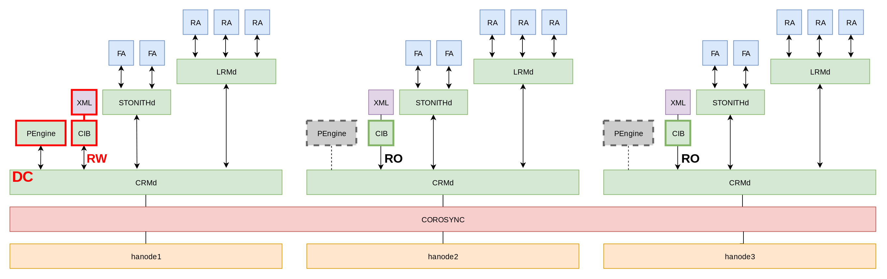

# Introduction

-----

## Prérequis minimum

* fiabilité des ressources (matériel, réseau, etc.)
* redondance de chaque élément d'architecture
* synchronisation des horloges des serveurs
* supervision de l'ensemble

::: notes

La résistance d'une chaîne repose sur son maillon le plus faible.

Un pré-requis à une architecture de haute disponibilité est d'utiliser du
matériel de qualité, fiable, éprouvé, maîtrisé et répandu.  Fonder son
architecture sur une technologie peu connue et non maîtrisée est la recette
parfaite pour une erreur humaine et une indisponibilité prolongée.

De même, chaque élément doit être redondé.  La loi de Murphy énonce que « tout
ce qui peut mal tourner, tournera mal ».  Cette loi se vérifie très
fréquemment.  Les incidents se manifestent rarement là où on ne les attend le
plus.  Il faut réellement tout redonder :

* chaque application ou service doit avoir une procédure de bascule
* CPU (multi-socket), mémoire (multi-slot, ECC), disques (niveaux de RAID)
* redondance du SAN
* plusieurs alimentations électriques par serveur, plusieurs sources
  d'alimentation
* plusieurs équipements réseaux, liens réseaux redondés, cartes réseaux, WAN et
  LAN
* climatisation redondée
* plusieurs équipements de fencing (et chemins pour accéder)
* plusieurs administrateurs comprenant et maîtrisant chaque brique du cluster
* ...

S'il reste un seul _Single Point of Failure_, ou _SPoF_, dans l'architecture,
ce point subira un jour une défaillance.

Concernant le synchronisme des horloges des serveurs entre eux, celui-ci est
important pour les besoins applicatifs et la qualité des données.  Suite à une
bascule, les dates pourraient être incohérentes entre celles écrites par la
précédente instance primaire et la nouvelle.

Ensuite, ce synchronisme est important pour assurer une cohérence dans
l'horodatage des journaux applicatifs entre les serveurs.  La compréhension
rapide et efficace d'un incident dépend directement de ce point.  À noter qu'il
est aussi possible de centraliser les logs sur une architecture dédiée à part
(attention aux _SPoF_ ici aussi).

Le synchronisme des horloges est d'autant plus important dans les
environnements virtualisés où les horloges ont facilement tendance à dévier.

:::

-----

## _Fencing_

* difficulté de déterminer l'origine d'un incident de façon logicielle
* chaque brique doit toujours être dans un état déterminé
* garantie de pouvoir sortir du système un élément défaillant
* implémenté dans Pacemaker au travers du _daemon_ `stonithd`

::: notes

Lorsqu'un serveur n'est plus accessible au sein d'un cluster, il est impossible
aux autres nœuds de déterminer l'état réel de ce dernier.  A-t-il crashé ?
Est-ce un problème réseau ?  Subit-il une forte charge temporaire ?

Le seul moyen de répondre à ces questions est d'éteindre ou d'isoler le serveur
fantôme d'autorité.  Cette action permet de déterminer de façon certaine son
statut : le serveur est hors _cluster_ et ne reviendra pas sans action humaine.

Une fois cette décision prise et appliquée avec succès, le _cluster_ peut
mettre en œuvre les actions nécessaires pour rendre les services en HA de
nouveau disponibles.

Passer outre ce mécanisme, c'est s'exposer de façon certaine à des situations
dites de _split brain_, où plusieurs sous-partitions du _cluster_ initial
continuent à fonctionner de façon autonomes.

Par exemple, si le _cluster_ contient des ressources de bases de données en
réplication avec une seule instance primaire, le _split brain_ indique que
plusieurs instances sont accessibles simultanément en écriture au sein du
_cluster_, mais ne répliquent pas entre elles.  Réconcilier les données de ces
deux instances peut devenir un véritable calvaire et provoquer une ou plusieurs
indisponibilités.  Voici un exemple réel d'incident de ce type :
<https://blog.github.com/2018-10-30-oct21-post-incident-analysis/>.  Ici, une
certaine quantité de données n'a pas été répliquée de l'ancien primaire vers le
nouveau avant la bascule.  En conséquence, plusieurs jours ont été nécessaires
afin de réintégrer et réconcilier les données dans le _cluster_ fraîchement
reconstruit.

Ne sous-estimez jamais le pouvoir d'innovation en terme d'incident des briques
de votre _cluster_ pour provoquer une partition des nœuds entre eux.  En voici
quelques exemples : <https://aphyr.com/posts/288-the-network-is-reliable>

À noter que PAF est pensé et construit pour les _clusters_ configurés avec le
_fencing_.  En cas d'incident, il y a de fortes chances qu'une bascule n'ait
jamais lieu pour un _cluster_ dépourvu de _fencing_.

:::

-----

## Quorum

* quelle partie du cluster doit fonctionner en cas de partition réseau ?
  * un vote à chaque élément du _cluster_
  * le _cluster_ ne fonctionne que s'il a la majorité des votes

::: notes

Le quorum est le nombre minimum de votes qu'une transaction distribuée doit
obtenir pour être autorisée à effectuer une opération dans le système.  Son
objectif est d'assurer la cohérence du système distribué.

Pour ce faire, chaque nœud du système se voit assigner un nombre de votes.  Il
faut au moins que `(N / 2) + 1` votes soient présents pour que le quorum soit
atteint, avec `N` le nombre de votes possible.  Le _cluster_ ne fonctionne que
si la majorité des nœuds sont présents.

Suite à une partition réseau, le quorum permet au cluster de savoir quelle
partition doit conserver les services actifs, celle(s) où il doit les
interrompre, et qui peut déclencher des opérations de fencing si nécessaire.

En plus d'arrêter ses services locaux, une partition du cluster n'atteignant
pas le quorum ne peut notamment pas actionner le fencing des nœuds de la
partition distante.

Ce mécanisme est donc indispensable au bon fonctionnement du cluster.

:::

-----

## KISS

* une architecture complexe pose des problèmes
  * de mise en œuvre (risque de _SPOF_)
  * de maintenance
  * de documentation
* il est préférable de toujours aller au plus simple

::: notes

Augmenter la complexité d'un cluster augmente aussi le nombre de défaillances possibles. Entre deux solutions, la
solution la plus simple sera souvent la meilleure et la plus pérenne.

L'incident décrit par de Gocardless dans le lien ci-après est un bon exemple. L'article indique que l'automatisation
réduit la connaissance de l'architecture. Au fil du temps il est difficile de maintenir une documentation à jour, des
équipes correctement formées :

[Incident review: API and Dashboard outage on 10 October 2017](https://gocardless.com/blog/incident-review-api-and-dashboard-outage-on-10th-october/)

> **Automation erodes knowledge**
>
> It turns out that when your automation successfully handles failures for two
years, your skills in manually controlling the infrastructure below it atrophy.
There's no "one size fits all" here. It's easy to say "just write a runbook",
but if multiple years go by before you next need it, it's almost guaranteed to
be out-of-date.

:::

-----

## Histoire

-----

### Historique de Pacemaker

* plusieurs plate-formes historiques distinctes
  * projet Linux-HA mené par SUSE
  * "Cluster Services" de Red Hat
* 2007 : Pacemaker apparaît
  * issu de Linux-HA
  * 1er point de convergence

::: notes

Un historique complet est disponible
[ici](https://www.alteeve.com/w/High-Availability_Clustering_in_the_Open_Source_Ecosystem).

Plusieurs sociétés se sont forgées une longue expérience dans le domaine de la Haute Disponibilité en maintenant chacun
leur plate-forme.

SUSE d'abord, avec son projet Linux-HA. Red Hat ensuite avec "Cluster Services".

En 2007, issu d'une première collaboration, Pacemaker apparaît pour gérer les clusters peu importe la couche de
communication utilisée : OpenAIS (Red Hat) ou Heartbeat (SUSE).

:::

-----

### Historique de Pacemaker - suite

* 2009 : Corosync apparaît
  * issu de OpenAIS
  * 2ème point de convergence
* 2014 : début de l'harmonisation

::: notes

En 2009 apparaît l'uniformisation des couches de communication grâce à Corosync.

Une collaboration forte étant désormais née, Pacemaker et Corosync deviennent petit à petit la référence et chaque
distribution tend vers cette plate-forme commune.

:::

-----

### Historique de Pacemaker - futur

* 2017: les principales distributions ont convergé
  * Corosync 2.x et Pacemaker 1.1.x
* 2018: corosync 3 et Pacemaker 2.0.x

::: notes

En 2017, les dernières versions des principales distributions Linux avaient toutes fini leur convergence vers Corosync
2.x et Pacemaker 1.1.x. Seul le client d'administration de haut niveau varie en fonction de la politique de la
distribution.

Début 2018, Pacemaker 2.0 et Corosync 3.0 font leur apparition. Coté Pacemaker, les principaux changements concernent:

* la suppression de beaucoup de code consacré aux anciennes architectures devenues obsolètes : incompatibilité avec
  OpenAIS, CMAN, Corosync 1.x, Heartbeat
* plusieurs paramètres de configuration ont été supprimés ou remplacés par des équivalents pour une configuration plus
  cohérente

Pour plus de détails, voir: <https://wiki.clusterlabs.org/wiki/Pacemaker_2.0_Changes>

Concernant Corosync, la principale nouveauté est le support du projet "Kronosnet" comme protocole de communication au
sein du cluster. Cette librairie permet d'ajouter beaucoup de souplesse, de fonctionnalités, de visibilité sur
l'activité de Corosync et surtout une latence plus faible que l'actuel protocole. Entre autre nouveautés, nous
trouvons :

* le support de un à huit liens réseaux
* l'ajout de liens réseaux à chaud
* le mélange de protocoles entre les liens si nécessaire
* plusieurs algorithmes de gestions de ces liens (active/passive ou active/active)
* la capacité de gérer la compression et/ou le chiffrement

Pour plus de détails, voir: [Kronosnet:The new face of Corosync communications](http://build.clusterlabs.org/corosync/presentations/2017-Kronosnet-The-new-face-of-corosync-communications.pdf)

:::

-----

## Clients d'administration

* `crmsh`
  * outil originel
  * gestion et configuration du cluster
* `pcs`
  * introduit par Red Hat
  * supporte également Corosync
  * utilisé dans ce workshop

::: notes

A l'origine du projet Pacemaker, un outil apparaît : `crmsh`. Cet outil permet de configurer et de gérer le cluster
sans toucher aux fichiers de configuration. Il est principalement maintenu par Suse et présente parfois des
incompatibilités avec les autres distributions pour la création du cluster lui-même, son démarrage ou son arrêt.
Néanmoins, l'outil évolue très vite et plusieurs de ces incompatibilités sont corrigées.

Lorsque Red Hat intègre Pacemaker, un nouvel outil est créé : `pcs`. En plus de regrouper les commandes de Pacemaker,
il supporte également Corosync (et CMAN pour les versions EL 6) et inclut un service HTTP permettant (entre autre) la
configuration et la maintenance du cluster via un navigateur web.

Concernant le contrôle du cluster, `crmsh` repose sur SSH et csync2 pour l'exécution de commandes sur les serveurs
distants (via la librairie python `parallax`) et la gestion de la configuration sur tous les serveurs.

Pour ces mêmes tâches, les daemons `pcsd` échangent des commandes entre eux via leur service web. Le daemon `pcsd` gère
à la fois une API HTTP pour la communication de commandes inter-serveurs ou l'interface HTTP à destination de
l'administrateur.

Lorsqu'une commande nécessite une action côté système (donc hors Pacemaker), les daemon `pcsd` communiquent entre eux
et s'échangent les commandes à exécuter localement au travers de cette API HTTP. Les commandes sollicitant cette API
peuvent être la création du cluster lui-même, son démarrage, son arrêt, sa destruction, l'ajout ou la suppression d'un
nœud, etc.

En 2018, `pcs` a fini d'être intégré à Debian. `crmsh` est encore utilisé en priorité sous Suse, mais reste souvent
utilisé sur les Debian et Ubuntu par choix historique et reste un très bon choix, pour peu que l'administrateur ne
l'utilise pas pour interagir avec le système lui même.

**Ce workshop se base sur une distribution CentOS 7 et sur l'outil `pcs`**.

:::

-----

## Versions disponibles

* RHEL 7 et Debian 9:
  * Corosync 2.x
  * Pacemaker 1.1.x

* RHEL 8 et Debian 10:
  * Corosync 3.x
  * Pacemaker 2.0.x

::: notes

L'installation recommandée (et supportée) suivant les distributions de RHEL et dérivés :

| OS        | Corosync | Pacemaker | Administration               |
|:---------:|:--------:|:---------:|------------------------------|
| EL 7      | 2.x      | 1.1.x     | pcsd 0.9                     |
| EL 8      | 3.x      | 2.0.x     | pcsd 0.10                    |
| Debian 8  | 1.4      | 1.1.x     | crmsh                        |
| Debian 9  | 2.4      | 1.1.x     | pcs 0.9 ou crmsh 2.3         |
| Debian 10 | 3.0      | 2.0.x     | pcs 0.10 ou crmsh 4.0        |

L'équipe de maintenance des paquets Pacemaker n'a pu intégrer les dernières
versions des composants à temps pour la version 8 de Debian. Il a été décidé
d'utiliser officiellement le dépôt backport de Debian pour distribuer ces
paquets dans Debian 8. Les versions 8 et 9 de Debian partagent donc les mêmes
versions des paquets concernant Pacemaker.

L'initialisation du cluster avec `crmsh` 2.x n'est toujours pas fonctionnelle
et ne devrait pas être corrigée, la branche 3.x étant désormais la branche
principale du projet. La version 3.0 de `crmsh` supporte l'initialisation d'un
cluster sous Debian mais avec un peu d'aide manuelle et quelques erreurs
d'intégration.

L'utilisation de `pcsd` et `pcs` est désormais pleinement fonctionne sous
Debian. Voir à ce propos:
<https://clusterlabs.github.io/PAF/Quick_Start-Debian-9-pcs.html>

:::

-----

# Premiers pas avec Pacemaker

Ce chapitre aborde l'installation et démarrage de Pacemaker. L'objectif est de
créer rapidement un cluster vide que nous pourrons étudier plus en détail
dans la suite du workshop.

-----

## Installation

Paquets essentiels:

* `corosync` : communication entre les nœuds
* `pacemaker` : orchestration du cluster
* `pcs` : administration du cluster

::: notes

L'installation de Pacemaker se fait très simplement depuis les dépôts
officiels de CentOS 7 en utilisant les paquets `pacemaker`. notez que
les paquets `corosync` et `resource-agents` sont installés aussi par dépendance.

Voici le détail de ces paquets :

* `corosync` : gère la communication entre les nœuds, la gestion du groupe, du quorum
* `pacemaker` : orchestration du cluster, réaction aux événements, prise de
  décision et actions
* `resource-agents`: collection de _resource agents_ (_RA_) pour divers services

Le paquet `corosync` installe un certain nombre d'outils commun à toutes les
distributions et que nous aborderons plus loin:

* `corosync-cfgtool`
* `corosync-cmapctl`
* `corosync-cpgtool`
* `corosync-keygen`
* `corosync-quorumtool`

Pacemaker aussi installe un certain nombre de binaires commun à toutes les
distributions, dont les suivants que vous pourriez rencontrer dans ce workshop
ou dans certaines discussions :

* `crm_attribute`
* `crm_node`
* `attrd_updater`
* `cibadmin`
* `crm_mon`
* `crm_report`
* `crm_resource`
* `crm_shadow`
* `crm_simulate`
* `crm_verify`
* `stonith_admin`

Beaucoup d'autres outils sont installés sur toutes les distributions, mais sont
destinés à des utilisations très pointues, de debug ou aux agents eux-même.

Les outils d'administration `pcs` et `crm` reposent fortement sur l'ensemble de
ces binaires et permettent d'utiliser une interface unifiée et commune à
ceux-ci. Bien que l'administration du cluster peut se faire entièrement sans
ces outils, ils sont très pratiques au quotidien et facilitent grandement la
gestion du cluster. De plus, ils intègrent toutes les bonnes pratiques
relatives aux commandes supportées.

Tout au long de cette formation, nous utilisons le couple `pcs` afin de
simplifier le déploiement et l'administration du cluster Pacemaker. Il est
disponible sur la plupart des distributions Linux et se comportent de la même
façon, notamment sur Debian et EL et leurs dérivés.

Ce paquet installe le CLI `pcs` et le daemon `pcsd`. Ce dernier s'occupe
seulement de propager les configurations et commandes sur tous les nœuds.

:::

-----

### TP: Installation de Pacemaker

::: notes

1. installer les paquets nécessaires et suffisants
2. vérifier les dépendances installées

:::

-----

### Correction: Installation de Pacemaker

::: notes

1. Installer les paquets nécessaires et suffisants

~~~console
# yum install -y pacemaker
~~~

2. vérifier les dépendances installées

À la fin de la commande précédente:

~~~
Dependency Installed:
[...]
  corosync.x86_64 0:2.4.3-6.el7_7.1
  pacemaker-cli.x86_64 0:1.1.20-5.el7_7.2
  resource-agents.x86_64 0:4.1.1-30.el7_7.4
~~~

Les paquets `corosync`, `resource-agents` et `pacemaker-cli` ont été installés en tant que
dépendance de `pacemaker`.

Tous les outils nécessaires et suffisants à l'administration d'un cluster
Pacemaker sont présents. Notamment:

~~~console
# ls /sbin/crm* /sbin/corosync*

/sbin/corosync            /sbin/corosync-cfgtool /sbin/corosync-cmapctl
/sbin/corosync-cpgtool    /sbin/corosync-keygen  /sbin/corosync-notifyd
/sbin/corosync-quorumtool

/sbin/crmadmin            /sbin/crm_attribute    /sbin/crm_diff
/sbin/crm_error           /sbin/crm_failcount    /sbin/crm_master
/sbin/crm_mon             /sbin/crm_node         /sbin/crm_report
/sbin/crm_resource        /sbin/crm_shadow       /sbin/crm_simulate
/sbin/crm_standby         /sbin/crm_ticket       /sbin/crm_verify
~~~

:::

-----

### TP: Installation de `pcs`

::: notes

1. installer le paquet `pcs`
2. activer le daemon `pcsd` au démarrage de l'instance et le démarrer

:::
-----

### Correction: Installation de `pcs`

::: notes

1. installer le paquet `pcs`

~~~console
# yum install -y pcs
~~~

2. activer `pcsd` au démarrage de l'instance et le démarrer

~~~console
# systemctl enable --now pcsd
~~~

ou 

~~~console
# systemctl enable pcsd
# systemctl start pcsd
~~~

:::

-----

## Création du cluster

* authentification des daemons `pcsd` entre eux
* création du cluster à l'aide de `pcs`
  - crée la configuration corosync sur tous les serveurs
* configuration de Pacemaker des _processus_ de Pacemaker

::: notes

La création du cluster se résume à créer le fichier de configuration de
Corosync, puis à démarrer de Pacemaker.

L'utilisation de `pcs` nous permet de ne pas avoir à éditer la configuration de
Corosync manuellement. Néanmoins, un pré-requis à l'utilisation de `pcs` est
que tous les daemons soient authentifiés les uns auprès des autres pour
s'échanger des commandes au travers de leur API HTTP. Cela se fait grâce à la
commande `pcs cluster auth [...]`.

Il est ensuite aisé de créer le cluster grâce à la commande `pcs cluster
setup [...]`.

Le fichier de configuration de Pacemaker ne concerne que le comportement des
processus, pas la gestion du cluster. Notamment, où sont les journaux
applicatifs et leur contenu. Pour la famille des distributions EL, son
emplacement est `/etc/sysconfig/pacemaker`. Pour la famille des distributions
Debian, il sont emplacement est `/etc/default/pacemaker`. Ce fichier en
concerne QUE l'instance locale de Pacemaker. Chaque instance peut avoir un
paramétrage différent, mais cela est bien entendu déconseillé.

:::

-----

### TP: Authentification de pcs

::: notes

1. positionner un mot de passe pour l'utilisateur `hacluster` sur chaque nœud

L'outil `pcs` se sert de l'utilisateur système `hacluster` pour s'authentifier
auprès de `pcsd`. Puisque les commandes de gestion du cluster peuvent être
exécutées depuis n'importe quel membre du cluster, il est recommandé de
configurer le même mot de passe pour cet utilisateur sur tous les nœuds pour
éviter les confusions.

2. authentifier les membres du cluster entre eux

Remarque: à partir de Pacemaker 2, cette commande doit être exécutée sur chaque
nœud du cluster.

:::

-----

### Correction: Authentification de pcs

::: notes

1. positionner un mot de passe pour l'utilisateur `hacluster` sur chaque nœud

~~~console
# passwd hacluster
~~~

2. authentifier les membres du cluster entre eux

~~~console
# pcs cluster auth hanode1 hanode2 hanode3 -u hacluster
~~~

:::

-----

### TP: Création du cluster avec pcs

::: notes

Les commandes `pcs` peuvent être exécutées depuis n'importe quel nœud.

1. créer un cluster nommé `cluster_tp` incluant les trois nœuds `hanode1`,
   `hanode2` et `hanode3`
2. trouver le fichier de configuration de corosync sur les trois nœuds
3. vérifier que le fichier de configuration de corosync est identique partout
4. activer le mode debug de Pacemaker pour les sous processus `crmd`,
`pengine`, `attrd` et `lrmd`

Afin de pouvoir mieux étudier Pacemaker, nous activons le mode debug de des
sous processus `crmd`, `pengine`, `attrd` et `lrmd` que nous aborderons dans la suite de
cette formation.

:::

-----

### Correction: Création du cluster avec pcs

::: notes

Les commandes `pcs` peuvent être exécutées depuis n'importe quel nœud.

1. créer un cluster nommé `cluster_tp` incluant les trois nœuds `hanode1`,
   `hanode2` et `hanode3`

~~~console
# pcs cluster setup --name cluster_tp hanode1 hanode2 hanode3
~~~

2. trouver le fichier de configuration de corosync sur les trois nœuds

Le fichier de configuration de Corosync se situe à l'emplacement
`/etc/corosync/corosync.conf`.

3. vérifier que le fichier de configuration de corosync est identique partout

~~~console
root@hanode1# md5sum /etc/corosync/corosync.conf
564b9964bc03baecf42e5fa8a344e489  /etc/corosync/corosync.conf

root@hanode2# md5sum /etc/corosync/corosync.conf
564b9964bc03baecf42e5fa8a344e489  /etc/corosync/corosync.conf

root@hanode3# md5sum /etc/corosync/corosync.conf
564b9964bc03baecf42e5fa8a344e489  /etc/corosync/corosync.conf
~~~

4. activer le mode debug de Pacemaker pour les sous processus `crmd`, `pengine`
   et `lrmd`

Éditer la variable `PCMK_debug` dans le fichier de configuration
`/etc/sysconfig/pacemaker` :

~~~console
PCMK_debug=crmd,pengine,lrmd,attrd
~~~

Pour obtenir l'ensemble des messages de debug de tous les processus,
positionner ce paramètre à `yes`.

:::

-----

## Démarrage du cluster

* cluster créé mais pas démarré
* désactiver Pacemaker au démarrage des serveurs
* utilisation de `pcs` pour démarrer le cluster

::: notes

Une fois le cluster créé, ce dernier n'est pas démarré automatiquement. Il est
déconseillé de démarrer Pacemaker automatiquement au démarrage des serveurs. En
cas d'incident et de fencing, un nœud toujours défaillant pourrait déstabiliser
le cluster et provoquer des interruptions de services suite à un retour
automatique prématuré. En forçant l'administrateur à devoir démarrer Pacemaker
manuellement, celui-ci a alors tout le loisir d'intervenir, d'analyser
l'origine du problème et éventuellement d'effectuer des actions correctives
avant de réintégrer le nœud, sain, dans le cluster.

Le démarrage du cluster nécessite la présence des deux services Corosync et
Pacemaker sur tous les nœuds. Démarrer d'abord les services Corosync puis
Pacemaker. À noter que démarrer Pacemaker suffit souvent sur de nombreuses
distributions Linux, Corosync étant démarré automatiquement comme dépendance.

Plutôt que de lancer manuellement Pacemaker sur chaque nœud, il est possible
de sous traiter cette tâche aux daemons `pcsd` avec une unique commande `pcs`.

:::

-----

### TP: Démarrage du cluster

::: notes

1. désactiver Pacemaker et Corosync au démarrage du serveur
2. démarrer Pacemaker et Corosync sur tous les nœuds à l'aide de `pcs`
3. vérifier l'état de Pacemaker et Corosync

:::

-----

### Correction: Démarrage du cluster

::: notes

1. désactiver Pacemaker et Corosync au démarrage du serveur

Sur tous les serveurs:

~~~console
# systemctl disable corosync pacemaker
~~~

Ou, depuis un seul des serveurs:

~~~console
# pcs cluster disable --all
~~~

2. démarrer Pacemaker et Corosync sur tous les nœuds à l'aide de `pcs`

~~~console
# pcs cluster start --all
~~~

3. vérifier l'état de Pacemaker et Corosync

Sur chaque serveur, exécuter:

~~~
# systemctl status pacemaker corosync
~~~

Ou:

~~~
# pcs status
~~~

Nous observons que les deux services sont désactivés au démarrage des
serveurs et actuellement démarrés.

:::

-----

## Visualiser l'état du cluster

Pour visualiser l'état du cluster :

* `crm_mon`: commande livrée avec Pacemaker
* `pcs`

::: notes

L'outil `crm_mon` permet de visualiser l'état complet du cluster et des
ressources. Voici le détail des arguments disponibles :

* `-1`: affiche l'état du cluster et quitte
* `-n`: regroupe les ressources par nœuds
* `-r`: affiche les ressources non actives
* `-f`: affiche le nombre fail count pour chaque ressource
* `-t`: affiche les dates des événements
* `-c`: affiche les tickets du cluster (utile pour les cluster étendus sur réseau WAN)
* `-L`: affiche les contraintes de location négatives
* `-A`: affiche les attributs des nœuds
* `-R`: affiche plus de détails (node IDs, individual clone instances)
* `-D`: cache l'entête

Voici des exemples d'utilisation:

~~~console
# crm_mon -DnA
# crm_mon -fronA
# crm_mon -1frntcLAR
~~~

À noter que ces différents arguments peuvent être aussi activés ou désactivés
dans le mode interactif.

L'outil `pcs` contient quelques commandes utiles pour consulter l'état d'un
cluster, mais n'a pas de mode interactif. Voici quelques exemples
d'utilisation:

~~~console
# pcs cluster status
# pcs status
# pcs cluster cib
# pcs constraint show
~~~

:::

-----

### TP: Visualiser l'état du cluster

::: notes

Expérimenter avec les commandes vues précédemment et leurs arguments.

:::

-----

# Corosync

Rapide tour d'horizon sur Corosync.

-----

## Présentation

* couche de communication bas niveau du cluster
* créé en 2004
* dérivé de OpenAIS
* avec des morceaux de CMAN dedans ensuite (à vérifier)

::: notes

Corosync est un système de communication de groupe (`GCS`). Il fournit
l'infrastructure nécessaire au fonctionnement du cluster en mettant à
disposition des APIs permettant la communication et d'adhésion des membres au
sein du cluster. Corosync fournit notamment des notifications de gain ou de
perte du quorum qui sont utilisés pour mettre en place la haute disponibilité.

Son fichier de configuration se trouve à l'emplacement
`/etc/corosync/corosync.conf`. En cas de modification manuelle, il faut
__ABSOLUMENT__ veiller à conserver une configuration identique sur tous les
nœuds. Cela peut être fait manuellement ou avec la commande `pcs cluster sync`.

La configuration de corosync est décrite dans la page de manuel
`corosync.conf`. Ses fonctionnalités liées au quorum sont décrites dans le
manuel nommé `votequorum`.

:::

-----

## Architecture

* corosync expose ses fonctionnalités sous forme de services, eg. :
  * `cgp` : API de gestion de groupe de processus ;
  * `cmap` : API de gestion de configuration ;
  * `votequorum` : API de gestion du quorum.

::: notes

Corosync s'appuie sur une ensemble de services internes pour proposer plusieurs APIs aux applications
qui l'utilisent.

Corosync expose notamment l'api `cpg` dont l'objet est d'assurer le moyen de
communication d'une applications distribuées. Cette api permet de gérer :

* l'entrée et la sortie des membres dans un ou plusieurs groupes ;
* la propagation des messages à l'ensemble des membres des groupes ;
* la propagation des changements de configuration ;
* l'ordre de délivrance des messages.

Corosync utilise `cmap` pour gérer et stocker sa configuration sous forme de stockage
clé-valeur. Cette API est également mise à disposition des applications qui utilisent corosync.
Pacemaker s'en sert notamment pour récupérer certaines informations sur le cluster et
ses membres.

Le service `votequorum` permet à corosync de fournir des notifications sur la gain ou la
perte du quorum dans le cluster, le nombre de vote courant, etc.

:::

-----

## Fonctionnalités de corosync 3

Nouvelle librairie `kronosnet` (`knet`):

* évolution du chiffrement
* redondance des canaux de communications
* compression

::: notes

Corosync3 utilise la librairie kronosnet (`knet`). Cette libraire :

* remplace les modes de transport `multicast` et `unicast` ;
* remplace le protocole `RRP` (_Redundant Ring Protocole_).

Corosync implémente le protocole _Totem Single Ring Ordering and Membership_ pour la gestion
des messages et des groupes. Il est possible de redonder les canaux de communications ou liens
en créant plusieurs interfaces (option `totem` > `interface` > `linknumber`) qui seront
utilisés comme support des rings (option `nodelist` > `node` > `ringX_addr`). `knet` permet
de créer jusqu'à 8 liens avec des protocoles et des priorités différentes.

Le chiffrement peut être configuré soit avec l'option `totem` > `secauth` soit avec les
paramètres `totem` > `crypto_model`, `totem` > `crypto_cipher` et `totem` > `crypto_hash`.

Il est également possible d'utiliser la compression.

-----

## Clusters à deux nœuds

* paramètre dédié : `two_node: 1`
* option héritée de CMAN
* requiers `expected-votes: 2`
* implique `wait_for_all: 1`
* requiers un fencing hardware configuré sur la même interface que le heartbeat

::: notes

Considérons un cluster à deux nœuds avec un vote par nœud. Le nombre de vote
attendu est 2 (`expected-votes`), il n'est donc pas possible d'avoir une
majorité en cas de partition du cluster. La configuration `two_node` permet de
fixer artificiellement le quorum à 1 et de résoudre ce problème.

Ce paramétrage, implique `wait_for_all : 1` qui empêche le cluster d'établir
une majorité tant que l'ensemble des nœuds n'est pas présent. Ce qui évite une
partition au démarrage du cluster.

En cas de partition réseau, les deux nœuds font la course pour fencer l'autre.
Le nœud vainqueur conserve alors le quorum grâce au paramètre `two_node: 1`.
Quand au second nœud, après redémarrage de Pacemaker, si la partition réseau
existe toujours, ce dernier n'obtient donc pas le quorum grâce au paramètre
`wait_for_all: 1` et en conséquence ne peut démarrer aucune ressource.

Même si elle fonctionne, ce genre de configuration n'est cependant pas
optimale. Comme en témoigne
[cet article du blog de clusterlabs](http://blog.clusterlabs.org/blog/2018/two-node-problems).

:::

-----

## Outils

Corosync installe plusieurs outils:

* `corosync-cfgtool` : administration, paramétrage
* `corosync-cpgtool` : visualisation des différents groupes CPG
* `corosync-cmapctl` : administration de la base d'objets
* `corosync-quorumtool` : gestion du quorum

::: notes

`corosync-cfgtool` permet de :

* arrêter corosync sur le serveur ;
* récupérer l'IP d'un nœud ;
* tuer un nœud ;
* récupérer des informations sur les rings et réinitialiser leur statut ;
* demander à l'ensemble des nœuds de recharger leur configuration.

`corosync-cpgtool` permet d'afficher les groupes cpg et leurs membres.

`corosync-cmapctl` permet de manipuler et consulter la base d'objet de corosync,
les actions possibles sont :

* lister les valeurs associées aux clés : directement (ex: totem.secauth), par
préfix(ex: totem.) ou sans filtre ;
* définir ou supprimer des valeurs ;
* changer la configuration depuis un fichier externe ;
* suivre les modifications des clés stockées dans `cmap` en temps réel en filtrant
sur un préfix ou directement sur un clé.

`corosync-quorumtool` permet d'accéder au service de quorum pour par exemple:

* modifier la configuration des votes (nombre, nombre attendu) ;
* suivre les modifications de quorum ;
* lister les nœuds avec leurs nom, id et IPs .

:::

-----

## TP: utilisation de Corosync

::: notes

1. afficher le statut du ring local avec `corosync-cfgtool`
2. afficher l'IP de chaque nœud avec `corosync-cfgtool`
3. afficher les groupes CPG et leurs membres avec `corosync-cpgtool`
4. afficher la configuration des nœuds dans la base CMAP avec
   `corosync-cmapctl` (clé `nodelist`)
5. afficher l'état du quorum avec `corosync-quorumtool`

:::

-----

## Correction: utilisation de Corosync

::: notes

1. afficher le statut du ring local avec `corosync-cfgtool`

~~~console
# corosync-cfgtool -s
Printing ring status.
Local node ID 1
RING ID 0
  id  = 10.20.30.6
  status  = ring 0 active with no faults
~~~

2. afficher l'IP de chaque nœud avec `corosync-cfgtool`

~~~console
# corosync-cfgtool -a 1
10.20.30.6

# corosync-cfgtool -a 2
10.20.30.7

# corosync-cfgtool -a 3
10.20.30.8
~~~

3. afficher les groupes CPG et leurs membres avec `corosync-cpgtool`

~~~console
# corosync-cpgtool -e
Group Name	       PID	   Node ID
crmd
		      6912	         1 (10.20.30.6)
		      6647	         3 (10.20.30.8)
		      6727	         2 (10.20.30.7)
attrd
		      6910	         1 (10.20.30.6)
		      6645	         3 (10.20.30.8)
		      6725	         2 (10.20.30.7)
stonith-ng
		      6908	         1 (10.20.30.6)
		      6643	         3 (10.20.30.8)
		      6723	         2 (10.20.30.7)
cib
		      6907	         1 (10.20.30.6)
		      6642	         3 (10.20.30.8)
		      6722	         2 (10.20.30.7)
pacemakerd
		      6906	         1 (10.20.30.6)
		      6641	         3 (10.20.30.8)
		      6721	         2 (10.20.30.7)
~~~

Chaque sous-processus de pacemaker est associé à un groupe de communication
avec leur équivalents sur les autres nœuds du cluster.

4. afficher la configuration des nœuds dans la base CMAP avec
   `corosync-cmapctl` (clé `nodelist`)

~~~console
# corosync-cmapctl -b nodelist
nodelist.local_node_pos (u32) = 0
nodelist.node.0.nodeid (u32) = 1
nodelist.node.0.ring0_addr (str) = hanode1
nodelist.node.1.nodeid (u32) = 2
nodelist.node.1.ring0_addr (str) = hanode2
nodelist.node.2.nodeid (u32) = 3
nodelist.node.2.ring0_addr (str) = hanode3
~~~

5. afficher l'état du quorum avec `corosync-quorumtool`

~~~console
# corosync-quorumtool
Quorum information
------------------
Date:             ...
Quorum provider:  corosync_votequorum
Nodes:            3
Node ID:          1
Ring ID:          3/8
Quorate:          Yes

Votequorum information
----------------------
Expected votes:   3
Highest expected: 3
Total votes:      3
Quorum:           2  
Flags:            Quorate 

Membership information
----------------------
    Nodeid      Votes Name
         3          1 hanode3
         2          1 hanode2
         1          1 hanode1 (local)
~~~

:::

-----

# Composants du cluster

::: notes

Dans ce chapitre, nous abordons rapidement l'architecture de Pacemaker en détaillant ses
sous processus. Le but est de comprendre le rôle de chaque brique et ainsi mieux
diagnostiquer l'état du cluster, son paramétrage et savoir interpréter les messages de
log correctement. Voici les différents processus tel que démarrés par Pacemaker:

~~~
/usr/sbin/pacemakerd -f
\_ /usr/libexec/pacemaker/cib
\_ /usr/libexec/pacemaker/stonithd
\_ /usr/libexec/pacemaker/lrmd
\_ /usr/libexec/pacemaker/attrd
\_ /usr/libexec/pacemaker/pengine
\_ /usr/libexec/pacemaker/crmd
~~~

Le diagramme présente les différents éléments de Pacemaker au sein d'un cluster à trois
nœuds. Une vue plus détaillée mais centrée sur un seul nœud est présenté dans la
documentation de Pacemaker. Voir:

[Schémas de l'architecture interne de Pacemaker](http://clusterlabs.org/pacemaker/doc/en-US/Pacemaker/2.0/html/Pacemaker_Explained/_pacemaker_architecture.html#_internal_components)

Cette architecture et le paramétrage de Pacemaker permet de supporter différents types de
scénario de cluster dont certains (vieux) exemples sont présentés dans le wiki de
Pacemaker:

[Schémas des différentes configuration de nœuds possibles avec Pacemaker](https://wiki.clusterlabs.org/wiki/Pacemaker#Example_Configurations)

:::

-----

## Cluster Information Base (CIB)

* détient la configuration du cluster
* l'état des différentes ressources
* un historique des actions exécutées
* stockage fichier au format XML
* synchronisé automatiquement entre les nœuds
* historisé
* géré par le processus `cib`
* renommé `pacemaker-based` depuis la version 2.0

::: notes

La CIB est la représentation interne de la configuration et de l'état des composantes du
cluster. C'est un fichier XML, créée par Pacemaker à l'initialisation du cluster et qui
évolue ensuite au fil des configurations et évènements du cluster.

En fonction de cet ensemble d'états et du paramétrage fourni, le cluster détermine l'état
idéal de chaque ressource qu'il gère (démarré/arrêté/promu et sur quel serveur) et
calcule les transitions permettant d'atteindre cet état.

Le processus `cib` est chargé d'appliquer les modifications dans la CIB, de
conserver les information transitoires en mémoire (statuts, certains scores, etc) et de
notifier les autres processus de ces modifications si nécessaire.

Le contenu de la CIB est historisé puis systématiquement synchronisé entre les nœuds à
chaque modification. Ces fichiers sont stockés dans `/var/lib/pacemaker/cib` :

~~~
ls /var/lib/pacemaker/cib/ -alh
total 68K
drwxr-x--- 2 hacluster haclient 4.0K Feb  7 16:46 .
drwxr-x--- 6 hacluster haclient 4.0K Feb  7 12:16 ..
-rw------- 1 hacluster haclient  258 Feb  7 16:43 cib-1.raw
-rw------- 1 hacluster haclient   32 Feb  7 16:43 cib-1.raw.sig
-rw------- 1 hacluster haclient  442 Feb  7 16:43 cib-2.raw
-rw------- 1 hacluster haclient   32 Feb  7 16:43 cib-2.raw.sig
-rw------- 1 hacluster haclient  639 Feb  7 16:43 cib-3.raw
-rw------- 1 hacluster haclient   32 Feb  7 16:43 cib-3.raw.sig
-rw------- 1 hacluster haclient  959 Feb  7 16:43 cib-4.raw
-rw------- 1 hacluster haclient   32 Feb  7 16:43 cib-4.raw.sig
-rw------- 1 hacluster haclient  959 Feb  7 16:43 cib-5.raw
-rw------- 1 hacluster haclient   32 Feb  7 16:43 cib-5.raw.sig
-rw------- 1 hacluster haclient  959 Feb  7 16:46 cib-6.raw
-rw------- 1 hacluster haclient   32 Feb  7 16:46 cib-6.raw.sig
-rw-r----- 1 hacluster haclient    1 Feb  7 16:46 cib.last
-rw------- 1 hacluster haclient  959 Feb  7 16:46 cib.xml
-rw------- 1 hacluster haclient   32 Feb  7 16:46 cib.xml.sig
~~~

`cib.xml` correspond à la version courante de la CIB, les autres fichiers `cib-*.raw`,
aux versions précédentes.

Par défaut, Pacemaker conserve toutes les versions de la CIB depuis la création du
cluster. Il est recommandé de limiter ce nombre de fichier grâce aux paramètres
`pe-error-series-max`, `pe-warn-series-max` et `pe-input-series-max`.

Il n'est pas recommandé d'éditer la CIB directement en XML. Préférez toujours utiliser
les commandes de haut niveau proposées par `pcs` ou `crm`. En dernier recours, utilisez
l'outil `cibadmin`.

:::

-----

### TP: CIB

::: notes

1. consulter le contenu de ce répertoire où est stockée la CIB
2. identifier la dernière version de la CIB
3. comparer avec `cibadmin --query` et `pcs cluster cib`

:::

-----

### Correction: CIB

::: notes

1. consulter le contenu de ce répertoire où est stockée la CIB

~~~
# ls /var/lib/pacemaker/cib
~~~

2. identifier la dernière version de la CIB

La version courante de la CIB est stockée dans
`/var/lib/pacemaker/cib/cib.xml`. Sa version est stockée dans
`/var/lib/pacemaker/cib/cib.last`.

3. comparer avec `cibadmin --query` et `pcs cluster cib`

Vous observez une section `<status\>` supplémentaire dans le document
XML présenté par `cibadmin`. Cette section contient l'état du cluster et est
uniquement conservée en mémoire.

:::

-----

### Designated Controler (DC) - Diagramme global

-----

## Designated Controler (DC)

* daemon `CRMd` désigné pilote principal sur un nœud uniquement
* lit et écrit dans la CIB
* invoque PEngine pour générer les éventuelles transitions
* contrôle le déroulement des transitions
* envoie les actions à réaliser aux daemons `CRMd` des autres nœuds
* possède les journaux applicatifs les plus complets

::: notes

Le *Designated Controler* est élu au sein du cluster une fois le groupe de communication
établi au niveau de Corosync. Il pilote l'ensemble du cluster.

Il est responsable de:

* lire l'état courant dans la CIB * invoquer le `PEngine` en cas d'écart avec l'état
  stable (changement d'état d'un service, changement de configuration, évolution des
  scores ou des attributs, etc)
* mettre à jour la CIB (mises à jour propagée aux autres nœuds)
* transmettre aux `CRMd` distants une à une les actions à réaliser sur leur nœud

C'est le DC qui maintient l'état primaire de la CIB ("master copy").

:::

-----

### PEngine - Diagramme global

-----

## Policy Engine (PEngine)

* reçoit en entrée les informations d'état des ressources et le paramétrage
* décide de l'état idéal du cluster
* génère un graphe de transition pour atteindre cet état
* renommé `Scheduler` depuis la version 2.0
* peut être consulté grâce à la commande `crm_simulate`

::: notes

Le `PEngine` est la brique de Pacemaker qui calcule les transitions nécessaires pour
passer d'un état à l'autre.

Il reçoit en entrée des informations d'état et de paramétrage au format XML (extrait de
la CIB), détermine si un nouvel état est disponible pour les ressources du cluster, et
calcule toutes les actions à mettre en œuvre pour l'atteindre.

Toutes ces actions sont regroupées au sein d'un graph de transition que le
`Designated Controller`, qui pilote le cluster, devra ensuite mettre en œuvre.

Voici un exemple de transition complexe présentant une bascule maître-esclave DRBD:

Ce diagramme vient de la documentation de Pacemaker. L'original est disponible à cette
adresse:
<https://clusterlabs.org/pacemaker/doc/en-US/Pacemaker/2.0/html/Pacemaker_Administration/images/Policy-Engine-big.png>

Les explications sur les codes couleurs sont disponibles à cette adresse:
<https://clusterlabs.org/pacemaker/doc/en-US/Pacemaker/2.0/html/Pacemaker_Administration/_visualizing_the_action_sequence.html>

Dans cet exemple chaque flèche impose une dépendance et un ordre entre les actions. Pour
qu'une action soit déclenchée, toutes les actions précédentes doivent être exécutées et
réussies. Les textes en jaune sont des "actions virtuelles", simples points de passage
permettant de synchroniser les actions entre elles avant de poursuivre les suivantes. Les
textes en noir représentent des actions à exécuter sur l'un des nœuds du cluster.

Le format des textes est le suivant: `<resource>_<action>_<interval>`

Une action avec un intervalle à 0 est une action ponctuelle (`start`, `stop`, etc). Une
action avec un intervalle supérieur à 0 est une action récurrente, tel que `monitor`.

Dans cet exemple:

* les actions 1 à 4 concernent l'exécution des actions `notify pre-demote` sur les nœuds
  "frigg" et "odin" du cluster
* l'action 1 déclenche en parallèle les deux actions 2 et 3
* l'action 4 est réalisée une fois que les actions 1, 2 et 3 sont validées
* l'action 5 est exécutée n'importe quand
* l'action 5 interrompt l'exécution récurrente de l'action `monitor` sur la ressource
  "drbd0:0" du serveur "frigg"
* l'action 7 est exécutée après que 5 et 6 soient validées
* l'action 7 effectue un `demote` de la ressource "drbd0:0" sur "frigg" (qui n'est donc
  plus supervisée)
* la pseudo action 8 est réalisée une fois que l'action `demote` est terminée
* la pseudo action 9 initialise le déclenchement des actions `notify post-demote` et
  dépend de la réalisation précédente de la notification "pre-demote" et de l'action
  `demote` elle même
* les actions 9 à 12 représentent l'exécution des notifications `post-demote` dans tout
  le cluster
* les actions 13 à 24 représentent les actions de `notify pre-promote`, `promote` de
  drbd sur "odin" et `notify post-promote` au sein du cluster
* les actions 25 et 27 peuvent alors être exécutées et redémarrent les actions de
  monitoring récurrentes de drbd sur "odin" et "frigg"
* les actions 26, 28 à 30 démarrent un groupe de ressource dépendant de la ressource
  drbd

Enfin, il est possible de consulter les transitions proposées par le PEngine
grâce à la commande `crm_simulate`. Cette commande est aussi parfois utile
pour en extraire des informations disponibles nulles par ailleurs, comme les
[scores de localisation][Contraintes de localisation].

:::

-----

### TP: PEngine

::: notes

1. identifier sur quels nœuds est lancé le processus `pengine`
2. identifier où se trouvent les logs de `pengine`
3. identifier le DC
4. observer la différence de contenu des log de `pengine` entre nœuds
5. afficher la vision de PEngine sur l'état du cluster (`crm_simulate`)

:::

-----

### Correction: PEngine

::: notes

1. identifier sur quels nœuds est lancé le processus `pengine`

Sur tous les nœuds.

2. identifier où se trouvent les logs de `pengine`

Les messages de `pengine` se situent dans `/var/log/cluster/corosync.log`,
mélangés avec ceux des autres sous processus.

Il est aussi possible de les retrouver dans `/var/log/messages` ou ailleurs en
fonction de la configuration de corosync, syslog, etc.

3. identifier le DC

Utiliser `crm_mon`, `pcs status` ou `crmadmin`:

~~~console
# crmadmin -D
Designated Controller is: hanode3
~~~

4. observer la différence de contenu des log de `pengine` entre nœuds

Seuls le DC possède les messages relatifs au calcul de transitions effectués
par le sous-processus `pengine`.

5. afficher la vision de PEngine sur l'état du cluster (`crm_simulate`)

~~~console
# crm_simulate --live-check

Current cluster status:
Online: [ hanode1 hanode2 hanode3 ]

~~~

:::

-----

### Cluster Resource Manager (CRM) - Diagramme global

-----

## Cluster Resource Manager (CRM)

* daemon `CRMd` local à chaque nœud
* chargé du pilotage des événements
* reçoit des instructions du `PEngine` s'il est DC ou du `CRMd` DC distant
* transmet les actions à réaliser au sein des transitions
  * au daemon `LRMd` local
  * au daemon `STONITHd` local
* récupère les codes retours des actions
* transmets les codes retours de chaque action au `CRMd` DC
* renommé `controller` depuis la version 2.0

::: notes

Le  daemon `CRMd` est local à chaque nœud qui pilote les événements. Il peut soit être
actif (DC), et donc être chargé de l'ensemble du pilotage du cluster, soit passif, et
attendre que le `CRMd` DC lui fournisse des instructions.

Lorsque des instructions lui sont transmises, il les communique aux daemons `LRMd` et/ou
`STONITHd` locaux pour qu'ils exécutent les actions appropriées auprès des _ressources
agents_ et _fencing agents_.

Une fois l'action réalisée, le `CRMd` récupère le statut de l'action (via
son code retour) et le transmet au `CRMd` DC qui en valide la cohérence
avec ce qui est attendu au sein de la transition.

En cas de code retour différent de celui attendu, le `CRMd` DC décide d'annuler la
transition en cours. Il demande alors une nouvelle transition au `PEngine`.

:::

-----

### TP: Cluster Resource Manager

::: notes

1. trouver comment sont désignés les messages du `CRMd` dans les log
2. identifier dans les log qui est le DC

:::

-----

### Correction: Cluster Resource Manager

Étude du daemon `CRMd`.

::: notes

1. trouver comment sont désignés les messages du `CRMd` dans les log

Les messages de ce sous-processus sont identifiés par `crmd:`.

2. identifier dans les log qui est le DC

~~~
crmd:     info: update_dc:    Set DC to hanode1 (3.0.14)
~~~

À noter que le retrait d'un DC est aussi visible:

~~~
crmd:     info: update_dc:    Unset DC. Was hanode2
~~~

:::

-----

## `STONITHd` et _Fencing Agent_

-----

### `STONITHd`

* daemon `STONITHd`
* gestionnaire des agents de fencing (_FA_)
* utilise l'API des fencing agent pour exécuter les actions demandées
* reçoit des commandes du `CRMd` et les passe aux _FA_
* renvoie le code de retour de l'action au `CRMd`
* support de plusieurs niveau de fencing avec ordre de priorité
* outil `stonith-admin`
* renommé `fenced` depuis la version 2.0

::: notes

Le daemon `STONITHd` joue sensiblement un rôle identique à celui du `LRMd` vis-à-vis des
agents de fencing (_FA_).

L'outil `stonith-admin` permet d'interagir avec le daemon `STONITHd`, notamment:

* `stonith_admin -V --list-registered` : liste les agents configurés
* `stonith_admin -V --list-installed` : liste tous les agents disponibles
* `stonith_admin -V -l <nœud>` : liste les agents contrôlant le nœud spécifié.
* `stonith_admin -V -Q <nœud>` : contrôle l'état d'un nœud.

:::

-----

### _Fencing Agent_ (_FA_)

* script permettant de traduire les instructions du _fencer_ vers l'outil de fencing
* doit assurer que le nœud cible est bien complètement isolé du cluster
* doit renvoyer des codes retours définis dans l'API des _FA_ en fonction des résultats
* dix actions disponibles dans l'API, toutes ne sont pas obligatoires

::: notes

Attention aux _FA_ qui dépendent du nœud cible !

Exemple classique : la carte IPMI. Si le serveur a une coupure électrique le
_FA_ (la carte IPMI donc) n'est plus joignable. Pacemaker ne reçoit donc
aucune réponse et ne peut pas savoir si le fencing a fonctionné, ce qui
empêche toute bascule.

Il est conseillé de chaîner plusieurs _FA_ si la méthode de fencing présente
un _SPoF_: IPMI, rack d'alimentation, switch réseau ou SAN, ...

Voici les actions disponibles de l'API des FA:

* `off`: implémentation obligatoire. Permet d'isoler la ressource ou le serveur
* `on`: libère la ressource ou démarre le serveur
* `reboot`: isoler et libérer la ressource. Si non implémentée, le daemon
  exécute les actions off et on.
* `status`: permet de vérifier la disponibilité de l'agent de fencing et le
  statut du dispositif concerné: on ou off
* `monitor`: permet de vérifier la disponibilité de l'agent de fencing
* `list`: permet de vérifier la disponibilité de l'agent de fencing et de
  lister l'ensemble des dispositifs que l'agent est capable d'isoler (cas d'un
  hyperviseur, d'un PDU, etc)
* `list-status`: comme l'action `list`, mais ajoute le statut de chaque dispositif
* `validate-all`: valide la configuration de la ressource
* `meta-data`: présente les capacités de l'agent au cluster
* `manpage`: nom de la page de manuelle de l'agent de fencing

:::

-----

### TP: Fencing

::: notes

Au cours de workshop, nous utilisons l'agent de fencing `fence_virsh`. Il ne
fait pas parti des agents de fencing distribués par défaut et s'installe via le
paquet `fence-agents-virsh`. Cet agent de fencing est basé sur SSH et la
commande `virsh`.

1. installer tous les _FA_ ainsi que `fence_virsh`
2. lister les FA à l'aide de `pcs resource` ou `stonith_admin`

Nous abordons la création d'une ressource de fencing plus loin dans le workshop.

:::

-----

### Correction: Fencing

::: notes

1. installer tous les _FA_ ainsi que `fence_virsh`

~~~console
# yum install -y fence-agents-all fence-agents-virsh
~~~

2. lister les FA à l'aide de `pcs resource` ou `stonith_admin`

~~~
# pcs resource agents stonith
fence_amt_ws
fence_apc
fence_apc_snmp
[...]

# stonith_admin --list-installed
 fence_xvm
 fence_wti
 fence_vmware_soap
[...]
~~~

:::

-----

## `LRMd` et _Resources Agent_ - Diagramme global

-----

### Local Resource Manager (LRM)

* daemon `lrmd`
* interface entre le `CRMd` et les _resource agents_ (_RA_)
* capable d'exécuter les différents types de _RA_ supportés (OCF, systemd,
  LSF, etc) et d'en comprendre la réponse
* reçoit des commandes du `CRMd` et les passe aux _RA_
* renvoie le résultat de l'action au `CRMd` de façon homogène, quelque
  soit le type de _RA_ utilisé
* est responsable d'exécuter les actions récurrentes en toute autonomie et de
  prévenir le `CRMd` en cas d'écart avec le résultat attendu
* renommé _local executor_ depuis la version 2.0 

::: notes

Lorsqu'une instruction doit être transmise à un agent, le `CRMd` passe
cette information au `LRMd`, qui se charge de faire exécuter l'action
appropriée par le _RA_.

Le daemon `LRMd` reçoit un code de retour de l'agent, qu'il transmet au
`CRMd`, lequel mettra à jour la CIB pour que cette information soit
partagée au niveau du cluster.

Pour les actions dont le paramètre `interval` est supérieur à 0, le
`LRMd` est responsable d'exécuter les actions de façon récurrente
à la période indiquée dans la configuration. Le `LRMd` ne
reviendra vers le `CRMd` que si le code retour de l'action varie.

:::

-----

### _Ressource Agent_ (_RA_)

* applique les instructions du `LRMd` sur la ressource qu'il gère
* renvoie des codes retours stricts reflétant le statut de sa ressource
* plusieurs types/API de _ressource agent_ supportés
* la spécification "OCF" est la plus complète
* l'API OCF présente au `CRMd` les actions supportées par l'agent
* `action` et `operation` sont deux termes synonymes
* chaque opérations a un timeout propre et éventuellement une récurrence

::: notes

Il est possible d'utiliser plusieurs types de _RA_ différents au sein d'un même cluster:

* OCF (Open Cluster Framework, type préconisé)
* SYSV
* systemd...

Vous trouverez la liste des types supportés à l'adresse suivante:
<https://clusterlabs.org/pacemaker/doc/en-US/Pacemaker/2.0/html/Pacemaker_Explained/s-resource-supported.html>

Dans les spécifications du type OCF, un agent a le choix parmi dix codes retours
différents pour communiquer l'état de son opération à `LRMd`:

* `OCF_SUCCESS` (0, soft)
* `OCF_ERR_GENERIC` (1, soft)
* `OCF_ERR_ARGS` (2, hard)
* `OCF_ERR_UNIMPLEMENTED` (3, hard)
* `OCF_ERR_PERM` (4, hard)
* `OCF_ERR_INSTALLED` (5, hard)
* `OCF_ERR_CONFIGURED` (6, fatal)
* `OCF_NOT_RUNNING` (7)
* `OCF_RUNNING_MASTER` (8, soft)
* `OCF_FAILED_MASTER` (9, soft)

Chaque code retour est associé à un niveau de criticité s'il ne correspond
à celui attendu par le cluster:

* `soft`: le cluster tente une action corrective sur le même nœud ou déplace
  la ressource ailleurs
* `hard`: la ressource doit être déplacée et ne pas revenir sur l'ancien nœud
  sans intervention humaine
* `fatal`: le cluster ne peut gérer la ressource sur aucun nœud

Voici les opérations disponibles aux agents implémentant la specification OCF:

* `start`: démarre la ressource
* `stop`: arrête la ressource
* `monitor`: vérifie l'état de la ressource
* `validate-all`: valide la configuration de la ressource
* `meta-data`: présente les capacités de l'agent au cluster
* `promote`: promote la ressource slave en master
* `demote`: démote la ressource master en slave
* `migrate_to`: actions à réaliser pour déplacer une ressource vers un autre nœud
* `migrate_from`: actions à réaliser pour déplacer une ressource vers le nœud local
* `notify`: action à exécuter lorsque le cluster notifie l'agent des actions
  le concernant au sein du cluster

L'opération `meta-data` permet à l'agent de documenter ses paramètres et
d'exposer ses capacités au cluster qui adapte donc ses décisions en fonction
des actions possibles. Par exemple, si les actions `migrate_*` ne sont pas
disponibles, le cluster utilise les actions `stop` et `start` pour déplacer
une ressource.

Les agents systemd ou sysV sont limités aux seules actions `start`, `stop`,
`monitor`. Dans ces deux cas, les codes retours sont interprétés par `LRMd`
comme étant ceux définis par la spécification LSB:
<http://refspecs.linuxbase.org/LSB_3.0.0/LSB-PDA/LSB-PDA/iniscrptact.html>

Un ressource peut gérer un service seul (eg. une vIP) au sein du cluster, un
ensemble de service cloné (eg. Nginx) ou un ensemble de clone _multi-state_
pour lesquels un statut `master` et `slave` est géré par le cluster et le _RA_.

Les _RA_ qui pilotent des ressources _multi-state_ implémentent obligatoirement
les actions `promote` et `demote` : une ressource est clonée sur autant de
nœuds que demandé, démarrée en tant que slave, puis le cluster promeut un ou
plusieurs `master` parmi les `slave`.

Le _resource agent_ PAF utilise intensément toutes ces actions, sauf
`migrate_to` et `migrate_from` qui ne sont disponibles qu'aux _RA_ non
_multi-state_ (non implémenté dans Pacemaker pour les ressources multistate).

:::

-----

### TP: _Resource Agents_

::: notes

1. installer les _resource agents_
2. lister les RA installés à l'aide de `pcs`
3. afficher les informations relatives à l'agent `dummy` à l'aide de `pcs`
4. afficher les informations relatives à l'agent `pgsql` à l'aide de `pcs`

:::

-----

### Correction: _Resource Agents_

::: notes

1. installer les _resource agents_

Il est normalement déjà installé comme dépendance de pacemaker.

~~~
yum install -y resource-agents
~~~

2. lister les RA installés à l'aide de `pcs`

~~~
pcs resource agents
~~~

3. afficher les informations relatives à l'agent `dummy` à l'aide de `pcs`

Chaque agent embarque sa propre documentation.

~~~
pcs resource describe dummy
~~~

4. afficher les informations relatives à l'agent `pgsql` à l'aide de `pcs`

Le RA `pgsql` livré avec le paquet `resource-agents` n'est **pas** celui de PAF. Vous
pouvez lister l'ensemble de ses options grâce à la commande:

~~~
pcs resource describe pgsql
~~~

:::

-----

## PostgreSQL Automatic Failover (PAF)

* _RA_ spécifique à PostgreSQL pour Pacemaker
* alternative à l'agent existant
  * moins complexe et moins intrusif
  * compatible avec PostgreSQL 9.3 et supérieur
* Voir: <https://clusterlabs.github.io/PAF/FAQ.html>

::: notes

PAF se situe entre Pacemaker et PostgreSQL. C'est un _resource agent_
qui permet au cluster d'administrer pleinement une instance PostgreSQL locale.

Un chapitre entier est dédié à son installation, son fonctionnement et sa
configuration plus loin dans ce workshop.

:::

------

# Paramétrage du cluster

Attention:

* les paramètres de Pacemaker sont tous sensibles à la casse
* aucune erreur n'est levée en cas de création d'un paramètre inexistant
* les paramètres inconnus sont simplement ignorés par Pacemaker

-----

## Support du Quorum

Paramètre `no-quorum-policy`

* `ignore`: désactive la gestion du quorum (déconseillé !)
* `stop`: (par défaut) arrête toutes les ressources
* `freeze`: préserve les ressources encore disponible dans la partition
* `suicide`: fencing des nœuds de la partition

:::notes

Il est fortement déconseillé de désactiver le quorum.

La valeur par défaut est le plus souvent la plus adaptée.

Le cas du `freeze` peut être utile afin de conserver les ressources actives au
sein d'un cluster où il n'y a aucun risque de split brain en cas de partition
réseau, eg. un serveur httpd.

:::

-----

## Support du Stonith

Paramètre `stonith-enabled`

* `false` : désactive la gestion du fencing (déconseillé !)
* activé par défaut
* aucune ressource ne démarre sans présence de FA

:::notes

Ce paramètre contrôle la gestion du fencing au sein du cluster. Ce dernier
est activé et il est vivement recommandé de ne pas le désactiver.

Effectivement, il est possible de désactiver le fencing au cas par cas,
ressource par ressource, grâce à leur méta-attribut `requires` (voir
chapitre [Configuration des ressources][]), positionné par défaut à `fencing`.

Il est techniquement possible de désactiver le [quorum][] ou [fencing][].

Comme dit précédemment c'est à proscrire hors d'un environnement de test. Sans
ces fonctionnalités, le comportement du cluster est imprévisible en cas de
panne et sa cohérence en péril.

Dans le cas d'un cluster qui gère une base de donnée cela signifie que l'on encourt le
risque d'avoir plusieurs ressources PostgreSQL disponibles en écriture sur plusieurs
nœuds (conséquence d'un `split brain`).

:::

-----

## Cluster symétrique et asymétrique

Paramètre `symmetric-cluster`:

* change l'effet des scores de préférence des ressources
* `true`: (par défaut) cluster symétrique ou _Opt-Out_. Les ressources
  peuvent démarrer sur tous les nœuds à moins d'y avoir un score déclaré
  inférieur à `0`
* `false`: cluster asymétrique ou _Opt-In_. Les ressources ne peuvent
  démarrer sur un nœud à moins  d'y avoir un score déclaré supérieur ou
  égal à `0`

::: notes

Le paramètre `symetric-cluster` permet de changer la façon dont pacemaker choisit
où démarrer les ressources.

Configuré à `true` (defaut), le cluster est dit symétrique. Les ressources
peuvent être démarrées sur n'importe quel nœud. Le choix se fait par ordre
décroissant des valeurs des [contraintes de localisation][Scores etlocalisation].
Une contrainte de localisation négative empêchera la ressource de démarrer
sur un nœud.

Configuré à `false`, le cluster est dit asymétrique. Les ressources ne peuvent
démarrer nulle part. La définition des contraintes de localisation doit définir
sur quels nœuds les ressources peuvent être démarrées.

La notion de contraintes de localisation est définie dans le chapitre
[Contraintes de localisation][]

:::

-----

## Mode maintenance

Paramètre `maintenance-mode`:

* désactive tout contrôle du cluster
* plus aucun opération n'est exécutée
* plus de monitoring des ressources
* les ressources démarrée sont laissée dans leur état courant (elles ne
  sont pas arrêtées)
* toujours tester les transitions avec `crm_simulate` avant de sortir de la
  maintenance

::: notes

Le paramètre `maintenance_mode` est utile pour réaliser des opérations de
maintenance globales à tous les nœuds du cluster. Toutes les opérations
`monitor` sont désactivées et le cluster ne réagit plus aucun événements.

Ce paramètre, comme tous les autres, est préservé lors du redémarrage de
Pacemaker, sur un ou tous les nœuds. Il est donc possible de redémarrer tout
le cluster tout en conservant le mode maintenance actif.

Attention toutefois aux scores de localisation. D'autant plus que ceux-ci
peuvent être mis à jour lors du démarrage du cluster sur un nœud par exemple.
Vérifiez toujours que les ressources sont bien dans l'état attendu sur chaque
nœud avant de sortir du mode de maintenance afin d'éviter une intervention du
cluster. Lorsque ce dernier reprend la main, il lance l'action `probe` sur
toutes les ressources sur tous les nœuds pour détecter leur présence et
comparer la réalité avec l'état de sa CIB.

:::

-----

## Autres paramètres utiles

* `stop-all-resources=false`: toutes les ressources sont arrêtées si
  positionné à `true` 
* `stonith-watchdog-timeout`: temps d'attente avant qu'un nœud disparu est
  considéré comme "auto-fencé" par son watchdog si le cluster est configuré
  avec
* `cluster-recheck-interval=15min`: intervalle entre deux réveils forcé du
  `PEngine` pour vérifier l'état du cluster

::: notes

Pour la liste complète des paramètres globaux du cluster, voir:

<https://clusterlabs.org/pacemaker/doc/en-US/Pacemaker/2.0/html/Pacemaker_Explained/s-cluster-options.html>

:::

-----

## TP: paramètres du cluster

::: notes

1. afficher les valeurs par défaut des paramètres suivants à l'aide de `pcs property`:

  * `no-quorum-policy`
  * `stonith-enabled`
  * `symmetric-cluster`
  * `maintenance-mode`

:::

-----

## Correction: paramètres du cluster

::: notes

1. afficher les valeurs par défaut des paramètres suivants à l'aide de `pcs property`:

  * `no-quorum-policy`
  * `stonith-enabled`
  * `symmetric-cluster`
  * `maintenance-mode`

~~~console
# pcs property list --defaults|grep -E "(no-quorum-policy|stonith-enabled|symmetric-cluster|maintenance-mode)"
 maintenance-mode: false
 no-quorum-policy: stop
 stonith-enabled: true
 symmetric-cluster: true
~~~

:::

-----

# Attributs d'un nœud

## Généralité sur les attributs d'un nœud

* attributs propres à chaque nœud
* peut être persistant après reboot ou non
* peut stocker n'importe quelle valeur sous n'importe quel nom
* eg. `kernel=4.19.0-8-amd64`

::: notes

Il est possible de créer vos propres attributs avec l'outil `crm_attribute`.

La persistance de vos attributs se contrôle avec l'argument `--lifetime`:

* valeur réinitialisée au redémarrage (non persistant) : `--lifetime reboot`
  * note : `--type status` est également accepté. Mentionné dans la
    documentation mais pas dans le manuel de la commande 
* valeur conservée au redémarrage (persistant) : `--lifetime forever`
  * note : `--type nodes` est également accepté. Mentionnée dans la
    documentation mais pas dans le manuel de la commande 

Exemple pour stocker dans un attribut du nœud nommé `kernel` la version du
noyau système :

~~~
crm_attribute -l forever --node hanode1 --name kernel --update $(uname -r)
~~~

Exemple de l'utilisation d'une rule basée sur un attribut de ce type:
<https://clusterlabs.org/pacemaker/doc/en-US/Pacemaker/2.0/html/Pacemaker_Explained/_using_rules_to_determine_resource_location.html#_location_rules_based_on_other_node_properties>

Le _RA_ PAF utilise également les attributs non persistants et très
transitoires. À l'annonce d'une promotion, chaque esclave renseigne son LSN
dans un attribut transient. Lors de la promotion, le nœud "élu" compare son LSN
avec celui des autres nœuds en consultant leur attribut `lsn_location` pour
s'assurer qu'il est bien le plus avancé. Ces attributs sont détruits une fois
l'élection terminée.

:::

-----

## Attributs de nœuds spéciaux

* plusieurs attributs font office de paramètres de configuration
* `maintenance`: mode maintenance au niveau du nœud
* `standby`: migrer toutes les ressources hors du nœud

::: notes

Il existe plusieurs attributs de nœuds spéciaux qui font offices de
paramétrage. Les deux plus utiles sont `maintenance` et `standby`.

L'attribut `maintenance` a le même effet que le `maintenance_mode` au niveau
du cluster, mais localisé au seul nœud sur lequel il est activé.

Lorsque l'attribut `standby` est activé, il indique que le nœud ne doit plus
héberger aucune ressource. Elle sont alors migré vers d'autres nœuds ou
arrêté le cas échéant.

Vous trouverez la liste complète de ces attributs de nœud spéciaux à
l'adresse suivante:
<https://clusterlabs.org/pacemaker/doc/en-US/Pacemaker/2.0/html/Pacemaker_Explained/_special_node_attributes.html>

:::

-----

## Attributs de nœuds particuliers

Quelques autres attributs particuliers:

* `fail-count-*`: nombre d'incident par ressource sur le nœud
* `master-*`: _master score_ de la ressource sur le nœud

::: notes

Un attribut `fail-count-*` de type non persistant est utilisés pour
mémoriser le nombre d'erreur de chaque ressources sur chaque nœud. Préférez
utiliser `crm_failcount` ou `pcs resource failcount` pour accéder à ces
informations.

Enfin, il existe des _master score_ pour les ressources de type _multi-state_
(primaire/secondaire), permettant d'indiquer où l'instance primaire peut ou
doit se trouver dans le cluster. Il sont préfixé par `master-*`. PAF positionne
ces scores comme attributs persistants des nœuds. La position de l'instance
primaire est ainsi préservée lors du redémarrage du cluster.

Vous pouvez consulter ou modifier les _master score_ à l'aide de l'outil
`crm_master`. Attention toutefois, ces scores sont positionnés habituellement
par le _RA_ lui même. À moins de vous trouver dans une situation où le
cluster ne nomme aucune ressource primaire, vous ne devriez pas vous même
positionner un _maser score_.

:::

-----

# Configuration des ressources

* mécanique interne
* __tout__ dépend des scores !
* chapitre organisé dans l'ordre des besoins de configuration

-----

## Méta-attributs des ressources

* un ensemble de _meta-attributes_ s'appliquent à n'importe quelle ressource:
  * il est possible de leur positionner une valeur par défaut qui s'applique
    à toutes les ressources
  * il est possible de surcharger les valeurs par défaut pour chaque ressource
* quelques exemple de méta-attributs:
  * `target-role`: rôle attendu: `Started`, `Stopped`, `Slave`, ou `Master`
  * `migration-threshold` : combien d'erreurs "soft" avant de déclencher un failover
  * `failure-timeout` : durée à partir de laquelle les erreurs "soft" sont réinitialisées
  * `resource-stickiness` : score de maintien d'une ressource sur le nœud courant
  * `is-managed`: le cluster doit-il agir en cas d'événement ?

::: notes

Les _meta-attributes_ est un ensemble d'attributs commun à n'importe quelle
type de ressource. Ils se positionnent ressource par ressource. Il est possible
de leur créer une valeur par défaut qui sera appliquée automatiquement à toute
ressource présente dans le cluster.

Par exemple avec `pcs`:

~~~
pcs resource defaults <nom_attribut>=valeur
~~~

Le même exemple avec l'outil standard `crm_attribute`:

~~~
crm_attribute --type rsc_defaults --name <nom_attribut> --update valeur
~~~

La valeur d'un méta attribut positionné au niveau de la ressource elle même
surcharge la valeur par défaut positionné précédemment.

La liste complète des méta-attributs et leur valeur par défaut est disponible à
cette adresse:
<https://clusterlabs.org/pacemaker/doc/en-US/Pacemaker/2.0/html/Pacemaker_Explained/s-resource-options.html#_resource_meta_attributes>

:::

-----

### TP: paramétrage par défaut des ressources

::: notes

1. trouver la valeur par défaut du paramètre `migration-threshold`
2. positionner sa valeur à dix
3. supprimer la valeur par défaut du paramètre `is-managed`
4. contrôler que les modifications sont prise en compte avec `pcs config show`
5. observer les modifications de la CIB dans les logs

Remarque: il existe une propriété du cluster `default-resource-stickiness`.
Cette propriété est dépréciée, il faut utiliser les valeurs par defaut des
ressources à la place.

~~~
pcs property list --defaults |grep -E "resource-stickiness"
 default-resource-stickiness: 0
~~~

:::

-----

### Correction: paramétrage par défaut des ressources

::: notes

1. trouver la valeur par défaut du paramètre `migration-threshold`

La valeur par défaut est `INFINITY`. Voir:

<https://clusterlabs.org/pacemaker/doc/en-US/Pacemaker/2.0/html/Pacemaker_Explained/s-resource-options.html#_resource_meta_attributes>

2. positionner sa valeur à dix

~~~console
# pcs resource defaults migration-threshold=10
Warning: Defaults do not apply to resources which override them with their own defined values
# pcs resource defaults
migration-threshold: 10
~~~

3. supprimer la valeur par défaut du paramètre `is-managed`

~~~console
# pcs resource defaults is-managed=
Warning: Defaults do not apply to resources which override them with their own defined values
~~~

4. contrôler que les modifications sont prise en compte avec `pcs config show`

~~~
# pcs config show
[...]
Resources Defaults:
 migration-threshold=10
[...]
~~~

5. observer les modifications de la CIB dans les logs

NB: les log ont ici été remis en forme.

~~~
cib: info: Forwarding cib_apply_diff operation for section 'all' to all
cib: info: Diff: --- 0.5.5 2
cib: info: Diff: +++ 0.6.0 2edcd42b63c34c8c39f2ab281d0c09b8
cib: info: +  /cib:  @epoch=6, @num_updates=0
cib: info: ++ /cib/configuration:
cib: info: ++ <rsc_defaults/>
cib: info: ++   <meta_attributes id="rsc_defaults-options">
cib: info: ++     <nvpair id="..." name="migration-threshold" value="3"/>
cib: info: ++   </meta_attributes>
cib: info: ++ </rsc_defaults>
cib: info: Completed cib_apply_diff operation for section 'all': OK
~~~

:::

-----

## Configuration du fencing

* les _FA_ sont gérés comme des ressources classiques
* les _FA_ ont un certain nombre de paramètres en commun: `pcmk_*`
* les autres paramètres sont propres à chaque _FA_, eg. `port`, `identity_file`, `username`, ...
* chaque _FA_ configuré peut être appelé de n'importe quel nœud

::: notes

Pour chaque agent de fencing configuré, un certain nombre de méta attributs
définissent les capacités de l'agent auprès du cluster. Quelque exemples
notables:

* `pcmk_reboot_action`: détermine quelle action exécuter pour isoler un nœud.
  Par exemple `reboot` ou `off`. L'action indiquée dépend de ce que supporte
  l'agent
* `pcmk_host_check`: détermine si l'agent doit interroger l'équipement pour
  établir la liste des nœuds qu'il peut isoler, ou s'il doit se reposer sur
  le paramètre `pcmk_host_list`
* `pcmk_host_list`: liste des nœuds que peut isoler l'agent de fencing
* `pcmk_delay_base`: temps d'attente minimum avant de lancer l'action de
  fencing. Pratique dans les cluster à deux nœuds pour privilégier un des
  nœuds

Vous trouverez la liste complète à l'adresse suivante:
<https://clusterlabs.org/pacemaker/doc/en-US/Pacemaker/2.0/html/Pacemaker_Explained/_special_options_for_fencing_resources.html>

Tous les paramètres ne débutants pas par `pcmk_*` sont propres à chaque
_fencing agent_. Dans le cadre de notre workshop, nous utiliserons l'agent
`fence_virsh` qui nécessite des paramètres de connexion SSH ainsi que le nom
de la machine virtuelle à interrompre.

Une fois paramétrés, Pacemaker s'assure que les _FA_ restent disponibles en
exécutant à intervalle régulier l'action `monitor`, positionnée par défaut
à une minute. À cause de cette action récurrente, les _FA_ apparaissent au
sein du cluster au même titre que les autres ressources. Mais notez qu'une
ressource de fencing ne démarre pas sur les nœud du cluster, ces équipement
sont actifs _ailleurs_ dans votre architecture.

Lorsqu'une action de fencing commandée par Pacemaker, celle-ci sera déclenchée
en priorité depuis le nœud d'où la ressource est supervisée. Si le nœud ou
la ressource de fencing sont devenus indisponibles depuis la dernière action de
monitor, n'importe quel autre nœud du cluster peut être utilisé pour
exécuter la commande.

:::

-----

### TP: Fencing Agent

::: notes

Rappel: par défaut le cluster refuse de prendre en charge des ressources en HA sans
fencing configuré.

~~~console
# crm_verify --verbose --live-check
~~~

1. afficher la description de l'agent de fencing `fence_virsh`

Nous allons utiliser les paramètres suivants:

* `ipaddr`: adresse de l'hyperviseur sur lequel se connecter en SSH
* `login`: utilisateur SSH pour se connecter à l'hyperviseur
* `identity_file`: chemin vers la clé privée SSH à utiliser pour l'authentification
* `login_timeout`: timeout du login SSH
* `port`: nom de la VM à isoler dans libvirtd

Les autres paramètres sont décrits dans le slide précédent.

Bien s'assurer que chaque nœud peut se connecter en SSH sans mot de passe à
l'hyperviseur.

2. créer une ressource de fencing pour chaque nœud du cluster

Les agents de fencing sont des ressources en HA prises en charge par le
cluster. Dans le cadre de ce TP, nous créons une ressource par nœud,
chacune responsable d'isoler un nœud.

3. vérifier que le cluster ne présente plus d'erreur
4. vérifier que ces ressources ont bien été créées et démarrées
5. afficher la configuration des agents de fencing
6. vérifier dans les log que ces ressources sont bien surveillée par `LRMd`

:::

-----

### Correction: Fencing Agent

::: notes

Rappel: par défaut le cluster refuse de prendre en charge des ressources en HA sans
fencing configuré.

~~~console
# crm_verify --verbose --live-check
   error: unpack_resources:	Resource start-up disabled since no STONITH resources have been defined
   error: unpack_resources:	Either configure some or disable STONITH with the stonith-enabled option
   error: unpack_resources:	NOTE: Clusters with shared data need STONITH to ensure data integrity
Errors found during check: config not valid
~~~

1. afficher la description de l'agent de fencing `fence_virsh`

~~~
# pcs resource describe stonith:fence_virsh
~~~

2. créer une ressource de fencing pour chaque nœud du cluster

Adapter `pcmk_host_list`, `ipaddr`, `login` et `port` à votre environnement.

~~~console
# pcs stonith create fence_vm_hanode1 fence_virsh pcmk_host_check="static-list" \
pcmk_host_list="hanode1" ipaddr="10.20.30.1" login="user"                       \
port="centos7_hanode1" pcmk_reboot_action="reboot"                              \
identity_file="/root/.ssh/id_rsa" login_timeout=15

# pcs stonith create fence_vm_hanode2 fence_virsh pcmk_host_check="static-list" \
pcmk_host_list="hanode2" ipaddr="10.20.30.1" login="user"                       \
port="centos7_hanode2" pcmk_reboot_action="reboot"                              \
identity_file="/root/.ssh/id_rsa" login_timeout=15

# pcs stonith create fence_vm_hanode3 fence_virsh pcmk_host_check="static-list" \
pcmk_host_list="hanode3" ipaddr="10.20.30.1" login="user"                       \
port="centos7_hanode3" pcmk_reboot_action="reboot"                              \
identity_file="/root/.ssh/id_rsa" login_timeout=15
~~~

3. vérifier que le cluster ne présente plus d'erreur

~~~console
# crm_verify -VL
# echo $?
0
~~~

4. vérifier que ces ressources ont bien été créées et démarrées

~~~console
# pcs status
[...]
3 nodes configured
3 resources configured

Online: [ hanode1 hanode2 hanode3 ]

Full list of resources:

 fence_vm_hanode1	(stonith:fence_virsh):	Started hanode1
 fence_vm_hanode2	(stonith:fence_virsh):	Started hanode2
 fence_vm_hanode3	(stonith:fence_virsh):	Started hanode3
[...]
~~~

5. afficher la configuration des agents de fencing

~~~
# pcs stonith show --full
 Resource: fence_vm_hanode1 (class=stonith type=fence_virsh)
  Attributes: identity_file=/root/.ssh/id_rsa ipaddr=10.20.30.1 login=ioguix login_timeout=15 pcmk_host_check=static-list pcmk_host_list=hanode1 pcmk_reboot_action=reboot port=paf_3n-vip_hanode1
  Operations: monitor interval=60s (fence_vm_hanode1-monitor-interval-60s)
 Resource: fence_vm_hanode2 (class=stonith type=fence_virsh)
  Attributes: identity_file=/root/.ssh/id_rsa ipaddr=10.20.30.1 login=ioguix login_timeout=15 pcmk_host_check=static-list pcmk_host_list=hanode2 pcmk_reboot_action=reboot port=paf_3n-vip_hanode2
  Operations: monitor interval=60s (fence_vm_hanode2-monitor-interval-60s)
 Resource: fence_vm_hanode3 (class=stonith type=fence_virsh)
  Attributes: identity_file=/root/.ssh/id_rsa ipaddr=10.20.30.1 login=ioguix login_timeout=15 pcmk_host_check=static-list pcmk_host_list=hanode3 pcmk_reboot_action=reboot port=paf_3n-vip_hanode3
  Operations: monitor interval=60s (fence_vm_hanode3-monitor-interval-60s)
~~~

6. vérifier dans les log que ces ressources sont bien surveillée par `LRMd`

Les log ont été remis en forme.

~~~
lrmd: debug: executing - rsc:fence_vm_hanode1 action:monitor call_id:7
lrmd: debug: finished - rsc:fence_vm_hanode1 action:monitor call_id:7  exit-code:0
crmd:  info: Result of monitor operation for fence_vm_hanode1 on hanode1: 0 (ok) 
~~~

:::

-----

## Scores et contrainte localisation

* pondération interne d'une ressource sur un nœud
* peut définir une exclusion si le score est négatif
* `stickiness` : score de maintien en place d'une ressource sur son nœud
  actuel
* éviter d'exclure un agent de fencing de son propre nœud définitivement
* scores accessibles grâce à `crm_simulate`

::: notes

Pacemaker se base sur la configuration et les scores des ressources pour
calculer l'état idéal du cluster. Le cluster choisi le nœud où une ressource à
le score le plus haut pour l'y placer.

Les scores peuvent être positionnés comme:

* contraintes de localisation ;
* [contraintes de colocation][Contraintes de colocation] ;
* attributs:
  * [`resource-stickiness`][Méta-attributs des ressources] du cluster ou des
    ressources ;
  * [`symetric-cluster`][Cluster symétrique et asymétrique] du cluster ;

Ils sont aussi être manipulés tout au long de la vie du cluster. Eg.:

* [bascule][Détail d'un switchover] effectuée par l'administrateur :
  * ban : place un score de localisation de `-INFINITY` sur le nœud courant ;
  * move : place un score de localisation de `+INFINITY` sur le nœud cible ;
* les ressources agents pour désigner l'instance primaire grâce à un score de
  localisation du rôle `master`.

Si pacemaker n'a pas d'instruction ou si les contraintes de localisation ont le
même score alors pacemaker tente de répartir équitablement les ressources parmi
les nœuds candidats. Ce comportement peut placer vos ressource de façon plus ou
moins aléatoire. Un score négatif empêche le placement d'une ressource sur un nœud.

Les scores `+INFINITY` et `-INFINITY` permettent de forcer une ressource à
rejoindre ou quitter un nœud de manière inconditionnelle. Voici l'arithmétique
utilisée avec `INFINITY`:

~~~
INFINITY =< 1000000
Any value + INFINITY = INFINITY
Any value - INFINITY = -INFINITY
INFINITY - INFINITY = -INFINITY
~~~

Si un nœud est sorti momentanément du cluster, par défaut ses ressources sont
déplacées vers d'autres nœuds. Lors de sa réintroduction, les contraintes de
localisation définies peuvent provoquer une nouvelle bascule des ressources si
les scores y sont supérieurs ou égaux à ceux présents sur les autres nœuds. La
plus part du temps, il est préférable d'éviter de déplacer des ressources qui
fonctionnent correctement. C'est particulièrement vrai pour les base de données
dont le temps de bascule peut prendre plusieurs secondes.

Le paramètre `stickiness` permet d'indiquer à pacemaker à quel point une
ressource en bonne santé préfère rester où elle se trouve. Pour cela la valeur
du paramètre `stickiness` est additionnée au score de localisation de la
ressource sur le nœud courant et comparé aux scores sur les autres nœuds pour
déterminer le nœud "idéal". Ce paramètre peut être défini globalement ou par
ressource.

Les scores de localisation sont aussi utilisés pour positionner les ressources
de fencing. Vous pouvez les empêcher d'être exécutées depuis un nœud en
utilisant un score d'exclusion de `-INFINITY`. Cette ressource ne sera alors ni
supervisée, ni exécutée depuis ce nœud. Une telle configuration est souvent
utilisée pour empêcher une ressource de fencing d'être priorisée ou déclenchée
depuis le nœud qu'elle doit isoler. Néanmoins, il n'est pas recommandé
d'empêcher ce comporter à tout prix. Un score négatif reste une bonne
pratique, mais il est préférable d'autoriser le fencing d'un nœud depuis lui
même, en dernier recours.

Enfin, les scores sont consultables grâce à l'outil `crm_simulate`.
:::

-----

### TP: création des contraintes de localisation

::: notes

1. afficher les scores au sein du cluster

Noter quel nœud est responsable de chaque ressource de fencing

2. positionner les stickiness de toutes les ressources à `1`
3. comparer l'évolution des scores
4. ajouter des contraintes d'exclusion pour que chaque ressource de fencing
   évite le nœud dont il est responsable. Utiliser un poids de 100 pour ces
   contraintes.
5. observer les changements de placement et de score par rapport à l'état
   précédent
6. afficher les contraintes existantes à l'aide de `pcs`

:::

-----

### Correction: création des contraintes de localisation

::: notes

1. afficher les scores au sein du cluster

~~~console
# crm_simulate --show-scores --live-check

Current cluster status:
Online: [ hanode1 hanode2 hanode3 ]

 fence_vm_hanode1	(stonith:fence_virsh):	Started hanode1
 fence_vm_hanode2	(stonith:fence_virsh):	Started hanode2
 fence_vm_hanode3	(stonith:fence_virsh):	Started hanode3

Allocation scores:
native_color: fence_vm_hanode1 allocation score on hanode1: 0
native_color: fence_vm_hanode1 allocation score on hanode2: 0
native_color: fence_vm_hanode1 allocation score on hanode3: 0
native_color: fence_vm_hanode2 allocation score on hanode1: 0
native_color: fence_vm_hanode2 allocation score on hanode2: 0
native_color: fence_vm_hanode2 allocation score on hanode3: 0
native_color: fence_vm_hanode3 allocation score on hanode1: 0
native_color: fence_vm_hanode3 allocation score on hanode2: 0
native_color: fence_vm_hanode3 allocation score on hanode3: 0

Transition Summary:
~~~

Ici, `fence_vm_hanode1` est surveillé depuis `hanode1`, `fence_vm_hanode2`
depuis `hanode2` et `fence_vm_hanode3` depuis `hanode3`.

2. positionner les stickiness de toutes les ressources à `1`

~~~console
# pcs resource defaults resource-stickiness=1
~~~

3. comparer l'évolution des scores

~~~console
# crm_simulate -sL
[...]
Allocation scores:
native_color: fence_vm_hanode1 allocation score on hanode1: 1
native_color: fence_vm_hanode1 allocation score on hanode2: 0
native_color: fence_vm_hanode1 allocation score on hanode3: 0
native_color: fence_vm_hanode2 allocation score on hanode1: 0
native_color: fence_vm_hanode2 allocation score on hanode2: 1
native_color: fence_vm_hanode2 allocation score on hanode3: 0
native_color: fence_vm_hanode3 allocation score on hanode1: 0
native_color: fence_vm_hanode3 allocation score on hanode2: 0
native_color: fence_vm_hanode3 allocation score on hanode3: 1
~~~

Le score de chaque ressource a augmenté de `1` pour le nœud sur lequel 
elle est "démarrée".

4. ajouter des contraintes d'exclusion pour que chaque ressource de fencing
   évite le nœud dont il est responsable. Utiliser un poids de 100 pour ces
   contraintes.

~~~console
# pcs constraint location fence_vm_hanode1 avoids hanode1=100
# pcs constraint location fence_vm_hanode2 prefers hanode2=-100
# pcs constraint location fence_vm_hanode3 avoids hanode3=100
~~~

Notez que les deux syntaxes proposées sont équivalentes du point de vue du
résultat dans la CIB.

~~~
# cibadmin -Q --xpath='//rsc_location'
~~~

5. observer les changements de placement et de score par rapport à l'état
   précédent

~~~console
# crm_simulate -sL

Current cluster status:
Online: [ hanode1 hanode2 hanode3 ]

 fence_vm_hanode1	(stonith:fence_virsh):	Started hanode2
 fence_vm_hanode2	(stonith:fence_virsh):	Started hanode1
 fence_vm_hanode3	(stonith:fence_virsh):	Started hanode1

Allocation scores:
native_color: fence_vm_hanode1 allocation score on hanode1: -100
native_color: fence_vm_hanode1 allocation score on hanode2: 1
native_color: fence_vm_hanode1 allocation score on hanode3: 0
native_color: fence_vm_hanode2 allocation score on hanode1: 1
native_color: fence_vm_hanode2 allocation score on hanode2: -100
native_color: fence_vm_hanode2 allocation score on hanode3: 0
native_color: fence_vm_hanode3 allocation score on hanode1: 1
native_color: fence_vm_hanode3 allocation score on hanode2: 0
native_color: fence_vm_hanode3 allocation score on hanode3: -100

Transition Summary:
~~~

Chaque ressource a changé de nœud afin de ne plus résider sur celui qu'elle
doit éventuellement isoler.

Un score négatif de `-100` correspondant à la contrainte créée est positionné
pour chaque ressource sur le nœud qu'elle doit éventuellement isoler.

6. afficher les contraintes existantes à l'aide de `pcs`

~~~console
# pcs constraint location show
Location Constraints:
  Resource: fence_vm_hanode1
    Disabled on: hanode1 (score:-100)
  Resource: fence_vm_hanode2
    Disabled on: hanode2 (score:-100)
  Resource: fence_vm_hanode3
    Disabled on: hanode3 (score:-100)

# pcs constraint location show nodes
Location Constraints:
  Node: hanode1
    Not allowed to run:
      Resource: fence_vm_hanode1 (location-fence_vm_hanode1-hanode1--100) Score: -100
  Node: hanode2
    Not allowed to run:
      Resource: fence_vm_hanode2 (location-fence_vm_hanode2-hanode2--100) Score: -100
  Node: hanode3
    Not allowed to run:
      Resource: fence_vm_hanode3 (location-fence_vm_hanode3-hanode3--100) Score: -100

# pcs constraint location show resources fence_vm_hanode1
Location Constraints:
  Resource: fence_vm_hanode1
    Disabled on: hanode1 (score:-100)
~~~

:::

-----

## Création d'une ressource

* nécessite:
  * un identifiant
  * le type/fournisseur/_RA_ à utiliser
* et éventuellement:
  * les paramètres propres à l'agent
  * le paramétrage de [Méta-attributs des ressources]
  * une configuration propre à chaque opérations
* détails sur les timeouts

::: notes

Chaque ressource créée au sein du cluster doit avoir un identifiant unique à
de votre choix.

Vous devez ensuite indiquer le _resource agent_ adapté à la ressource que vous
souhaitez intégrer dans votre cluster. Ce dernier est indiqué dans le format
`type:nom` ou `type:fournisseur:nom`, par exemple: `systemd:pgbouncer`
ou `ocf:heartbeat:Dummy`. La liste complète est disponible grâce à la commande
`pcs resource list`.

Voici un exemple simple de création d'une ressource avec `pcs`:

~~~console
# pcs resource create identifiant_resource type:fournisseur:nom
~~~

Ensuite Chaque _resource agent_ peut avoir des paramètres de configuration
propre à sa ressource, un nom d'utilisateur par exemple. Avec `pcs`, ces
paramètres sont à préciser librement à la suite de la commande de base, par
exemple:

~~~console
# pcs resource create identifiant_resource type:fournisseur:nom \
    user=nom_user_resource
~~~

Pour rappel, la liste des paramètres supportés par un _resource agent_ est
disponible grâce à la commande suivante:

~~~console
# pcs resource describe <agent>
~~~

Comme détaillé dans le chapitre [Méta-attributs des ressources][], les
ressources ont en commun un certain nombre de méta-attributs qui peuvent être
modifiés pour chaque ressource. La commande `pcs` utilise le mot clé `meta`
pour les distinguer sur la ligne de commande des autres paramètres. Par
exemple, nous pouvons positionner `migration-threshold=1` sur une ressource
afin qu'elle soit migrée sur un autre nœud dès la première erreur:

~~~console
# pcs resource create identifiant_resource type:fournisseur:nom \
    user=nom_user_resource                                      \
    meta migration-threshold=1
~~~

Enfin, un certain nombre de paramètres peuvent être modifiés pour chaque
opération supportée par le _RA_. Les plus fréquents sont `timeout`et
`interval`. Vous trouverez la liste complète à l'adresse suivante:
<https://clusterlabs.org/pacemaker/doc/en-US/Pacemaker/2.0/html/Pacemaker_Explained/_resource_operations.html#idm47160757240816>

Concernant le timeout par exemple, ce dernier est de 20 secondes par défaut
pour toutes les opérations. Cette valeur par défaut peut être modifiée dans la
section `op_defaults` de la CIB, avec l'une ou l'autre de ces commandes:

~~~
crm_attribute --type op_defaults --name timeout --update 20s
pcs resource op defaults timeout=20s
~~~

Avec la commande `pcs` nous utilisons le mot clé `op <action>` pour définir
le paramétrage des différentes opérations. Le paramétrage pour ces actions
surcharge alors les valeurs par défaut. Voici un exemple:

~~~
# pcs resource create identifiant_resource type:fournisseur:nom \
    user=nom_user_resource                                      \
    meta migration-threshold=1                                  \
    op start timeout=60s
    op monitor timeout=10s interval=10s
~~~

__ATTENTION__: les valeurs par défaut exposées par les _RA_ sont des valeurs
__recommandées__. Elles ne sont pas appliquées automatiquement. Préciser les
timeouts de chaque action lors de la définition d'une ressource est recommandé
même s'ils sont identiques à la valeur par défaut. Cette pratique aide à la
compréhension rapide de la configuration d'un cluster.

Les _resource agent_ n'ont pas à se préoccuper des timeout de leurs actions.
Tout au plus, ces agents peuvent indiquer des timeout par défaut à titre de
recommandation seulement. Il reste à la charge de l'administrateur de définir
les différents timeout en tenant compte de cette recommandation.

Le daemon `execd`, qui exécute l'action, se charge d'interrompre une action dès
que son timeout est atteint. Habituellement, le cluster planifie alors des
actions palliatives à cette erreur (eg. _recovery_ ou _failover_).

:::

-----

### TP: création d'une ressource dans le cluster

::: notes

Création d'une première ressource "Dummy". Ce _resource agent_ existe
seulement à titre de démonstration et d'expérimentation.

1. afficher les détails de l'agent Dummy
2. créer le sous-répertoire `/opt/sub` sur les 3 nœuds.
3. créer une ressource `dummy1` utilisant le _RA_ Dummy

Il est possible de travailler sur un fichier XML offline en précisant
l'argument `-f /chemin/vers/xml` à la commande `pcs`. Utiliser un fichier
`dummy1.xml` pour créer la ressource et ses contraintes en une seule
transition.

* positionner le paramètre `state` à la valeur `/opt/sub/dummy1.state`
* vérifier son état toutes les 10 secondes
* positionner son attribut `migration-threshold` à `3`
* positionner son attribut `failure-timeout` à `4h`
* positionner un `stickiness` faible de `1`
* ajouter une forte préférence de `100` pour le nœud hanode1

Tout ce paramétrage doit être en surcharge des éventuelles valeurs par
défaut du cluster.

4. contrôler le contenu du fichier `dummy1.xml` et simuler son application
   avec `crm_simulate`
5. publier les modifications dans le cluster
6. consulter les logs du DC
7. observer les changements opérés

:::

-----

### Correction: création d'une ressource dans le cluster

::: notes

1. afficher les détails de l'agent Dummy

~~~console
# pcs resource describe ocf:pacemaker:Dummy
~~~

2. créer le sous-répertoire `/opt/sub` sur les 3 nœuds.

Sur chaque nœud:

~~~console
# mkdir -p /opt/sub
~~~

3. créer une ressource `dummy1` utilisant le _RA_ Dummy

~~~console
# pcs cluster cib dummy1.xml

# pcs -f dummy1.xml resource create dummy1 ocf:pacemaker:Dummy \
    state=/opt/sub/dummy1.state                                \
    op monitor interval=10s                                    \
    meta migration-threshold=3                                 \
    meta failure-timeout=4h                                    \
    meta resource-stickiness=1

# pcs -f dummy1.xml constraint location dummy1 prefers hanode1=100
~~~

4. contrôler le contenu du fichier `dummy1.xml` et simuler son application
avec `crm_simulate`

Contrôle de la syntaxe:

~~~console
# crm_verify -V --xml-file dummy1.xml
# pcs cluster verify -V dummy1.xml  # alternative avec pcs
~~~

Simuler ces modifications:

~~~
# crm_simulate --simulate --xml-file dummy1.xml

Current cluster status:
Online: [ hanode1 hanode2 hanode3 ]

 fence_vm_hanode1	(stonith:fence_virsh):	Started hanode2
 fence_vm_hanode2	(stonith:fence_virsh):	Started hanode1
 fence_vm_hanode3	(stonith:fence_virsh):	Started hanode1
 dummy1	(ocf::pacemaker:Dummy):	Stopped

Transition Summary:
 * Start      dummy1     ( hanode1 )  

Executing cluster transition:
 * Resource action: dummy1          monitor on hanode3
 * Resource action: dummy1          monitor on hanode2
 * Resource action: dummy1          monitor on hanode1
 * Resource action: dummy1          start on hanode1
 * Resource action: dummy1          monitor=10000 on hanode1

Revised cluster status:
Online: [ hanode1 hanode2 hanode3 ]

 fence_vm_hanode1	(stonith:fence_virsh):	Started hanode2
 fence_vm_hanode2	(stonith:fence_virsh):	Started hanode1
 fence_vm_hanode3	(stonith:fence_virsh):	Started hanode1
 dummy1	(ocf::pacemaker:Dummy):	Started hanode1
~~~

Nous observons dans cette sortie:

* l'état du cluster avant la transition (`Current cluster status`)
* les actions à réaliser (`Transition Summary` et `Executing cluster transition`)
* l'état attendu du cluster après transition (`Revised cluster status`)

5. publier les modifications dans le cluster

~~~
# pcs cluster cib-push dummy1.xml
~~~

6. consulter les logs du DC

Les log ont été remis en forme.

Actions prévues par `pengine`:

~~~
pengine:     info: RecurringOp:  Start recurring monitor (10s) for dummy1 on hanode1
pengine:     info: LogActions:   Leave   fence_vm_hanode1        (Started hanode2)
pengine:     info: LogActions:   Leave   fence_vm_hanode2        (Started hanode1)
pengine:     info: LogActions:   Leave   fence_vm_hanode3        (Started hanode1)
pengine:   notice: LogAction:  * Start      dummy1               (        hanode1)  
pengine:   notice: Calculated transition 21, saving in /.../pengine/pe-input-11.bz2
~~~

Actions initiées par `crmd`:

~~~
crmd:   info: Processing graph 21 derived from /var/.../pengine/pe-input-11.bz2
crmd: notice: Initiating monitor operation dummy1_monitor_0 on hanode3 | action 6
crmd: notice: Initiating monitor operation dummy1_monitor_0 on hanode2 | action 5
crmd: notice: Initiating monitor operation dummy1_monitor_0 locally on hanode1 | action 4
crmd:   info: Action dummy1_monitor_0 (5) confirmed on hanode2 (rc=7)
crmd:   info: Action dummy1_monitor_0 (6) confirmed on hanode3 (rc=7)
crmd:   info: Action dummy1_monitor_0 (4) confirmed on hanode1 (rc=7)
crmd: notice: Result of probe operation for dummy1 on hanode1: 7 (not running)

crmd: notice: Initiating start operation dummy1_start_0 locally on hanode1
lrmd:   info: executing - rsc:dummy1 action:start call_id:26
lrmd:   info: finished - rsc:dummy1 action:start call_id:26 exit-code:0
crmd: notice: Result of start operation for dummy1 on hanode1: 0 (ok)

crmd: notice: Initiating monitor operation dummy1_monitor_10000 locally on hanode1
lrmd:  debug: executing - rsc:dummy1 action:monitor call_id:27
~~~

Les actions `dummy1_monitor_0` vérifient que la ressource n'est démarrée pas
démarrée sur le nœud concerné. Ensuite, la ressource est démarrée sur
`hanode1` avec l'opération `dummy1_start_0`. Puis l'action de surveillance
`dummy1_monitor_10000` récurrente toutes les 10 secondes (`10000`ms) est
démarrée.

7. observer les changements

~~~console
# pcs status
# pcs config show
~~~

:::

-----

## Contraintes de colocation

* définit un lien entre plusieurs ressources
* la force du lien est définie par un score qui s'ajoute aux scores existant
* peut être un lien de colocalisation ou d'exclusion
  * Par exemple une VIP là où la ressource doit être démarrée
* attention à l'ordre de déclaration !

::: notes

Les contraintes de colocation servent à indiquer à Pacemaker où une ressource _A_ doit
être placée par rapport à une ressource _B_. Elles permettent de localiser deux ressources
au même endroit ou à des endroits différents (exclusion).

L'ordre des déclarations est important car cela implique que la ressource _A_ sera
assignée à un nœud après la ressource _B_. Cela implique que la contrainte de
localisation placée sur la ressource _B_ décide du placement de la ressource _A_.

Ces contraintes n'ont pas d'impact sur l'[ordre de démarrage][Contraintes d'ordre].

Dans le cas de PAF, il faut utiliser une contrainte de colocation pour que la VIP
soit montée sur le même nœud que le master.

[Explication](http://clusterlabs.org/doc/Colocation_Explained.pdf)

:::

-----

### TP: création des _RA_ (dummy2) dans le cluster

::: notes

1. ajouter une ressource `dummy2`

Utiliser un fichier `dummy2.xml` pour préparer les actions.

* positionner le paramètre `state` à la valeur `/opt/sub/dummy2.state`
* vérifier son état toutes les 10 secondes
* positionner son attribut `migration-threshold` à `3`
* positionner son attribut `failure-timeout` à `4h`
* positionner un `stickiness` élevé de `100`
* interdire la ressource de démarrer sur le même nœud que `dummy1`
* ajouter une faible préférence de `10` pour le nœud hanode2

Note : il est important d'utiliser un fichier xml pour appliquer les contraintes de localisation avant de démarrer la
ressource

4. contrôler le contenu du fichier `dummy2.xml` et simuler son application
5. publier les modifications dans le cluster
6. observer les changements

:::

-----

### Correction: création des _RA_ (dummy2) dans le cluster

::: notes

1. ajouter une ressource `dummy2`

~~~console
# pcs cluster cib dummy2.xml

# pcs -f dummy2.xml resource create dummy2 ocf:pacemaker:Dummy \
    state=/opt/sub/dummy2.state                                \
    op monitor interval=10s                                    \
    meta migration-threshold=3                                 \
    meta failure-timeout=4h                                    \
    meta resource-stickiness=100

# pcs -f dummy2.xml constraint location dummy2 prefers hanode2=10

# pcs -f dummy2.xml constraint colocation add dummy2 with dummy1 -INFINITY
~~~

4. contrôler le contenu du fichier `dummy2.xml` et simuler son application

~~~console
# pcs cluster verify -V dummy2.xml
# crm_simulate -S -x dummy2.xml

Current cluster status:
Online: [ hanode1 hanode2 hanode3 ]

 fence_vm_hanode1	(stonith:fence_virsh):	Started hanode2
 fence_vm_hanode2	(stonith:fence_virsh):	Started hanode1
 fence_vm_hanode3	(stonith:fence_virsh):	Started hanode1
 dummy1	(ocf::pacemaker:Dummy):	Started hanode1
 dummy2	(ocf::pacemaker:Dummy):	Stopped

Transition Summary:
 * Start      dummy2     ( hanode3 )  

Executing cluster transition:
 * Resource action: dummy2          monitor on hanode3
 * Resource action: dummy2          monitor on hanode2
 * Resource action: dummy2          monitor on hanode1
 * Resource action: dummy2          start on hanode3
 * Resource action: dummy2          monitor=10000 on hanode3

Revised cluster status:
Online: [ hanode1 hanode2 hanode3 ]

 fence_vm_hanode1	(stonith:fence_virsh):	Started hanode2
 fence_vm_hanode2	(stonith:fence_virsh):	Started hanode1
 fence_vm_hanode3	(stonith:fence_virsh):	Started hanode1
 dummy1	(ocf::pacemaker:Dummy):	Started hanode1
 dummy2	(ocf::pacemaker:Dummy):	Started hanode3
~~~

Ici, `pengine` a prévu de démarrer `dummy2` sur `hanode3`.

5. publier les modifications dans le cluster

~~~console
# pcs cluster cib-push dummy2.xml
~~~

6. observer les changements opérés

~~~console
# crm_mon -Dn
# pcs status
# pcs config show
~~~

:::

-----

## Contraintes d'ordre

* concerne des ressources liées
* déclaration de l'ordre de déclenchement des actions
  * `stop`
  * `start`
  * `promote`
  * `demote`
* ordre obligatoire, optionnel ou sérialisé
* symétrique ou asymétrique

::: notes

Ce type de contrainte peut être nécessaire pour spécifier l'ordre de
déclenchement des actions. Par exemple, le déplacement d'une IP virtuelle une
fois que le service a été déplacé sur un autre nœud.

Il existe trois type différents, précisé par l'attribut `kind` :

* `Mandatory`: la seconde action n'est pas exécutée tant que la première
  action n'a pas réussi
* `Optional`: les deux actions peuvent être exécutées indépendamment, mais
respecterons l'ordre imposé si elles doivent l'être dans la même transition
* `Serialize`: les actions ne doivent pas être exécutées en même temps par
  le cluster. L'ordre importe peu ici.

Si une contrainte d'ordre est symétrique (attribut `symmetrical`), elle
s'applique aussi pour les actions opposées, mais dans l'ordre inverse.

:::

-----

### TP: Contrainte d'ordre

::: notes

Il est recommandé de conserver un terminal avec un `crm_mon` actif tout au long
de ce TP.

1. créer une contrainte d'ordre non symétrique qui force le démarrage de
`dummy1` avant celui de `dummy2`
2. arrêter la ressource `dummy1` et observer l'influence sur `dummy2`
3. arrêter la ressource `dummy2`, puis démarrer `dummy2`
4. démarrer `dummy1`
5. vérifiez dans les log __du DC__ l'ordre des actions

:::

-----

### Correction: Contrainte d'ordre

::: notes

Il est recommandé de conserver un terminal avec un `crm_mon` actif tout au long
de ce TP.

1. créer une contrainte d'ordre non symétrique qui force le démarrage de
   `dummy1` avant celui de `dummy2`

~~~console
# pcs constraint order start dummy1 then start dummy2 symmetrical=false kind=Mandatory
Adding dummy1 dummy2 (kind: Mandatory) (Options: first-action=start then-action=start symmetrical=false)
~~~

2. arrêter la ressource `dummy1` et observer l'influence sur `dummy2`

~~~console
# pcs resource disable dummy1
~~~

La ressource `dummy2` ne s'arrête pas. La contrainte ne concerne que le
démarrage des deux ressources.

3. arrêter la ressource `dummy2`, puis démarrer `dummy2`

~~~console
# pcs resource disable --wait dummy2
# pcs resource enable dummy2
~~~

La ressource `dummy2` ne démarre pas. Cette dernière ne peut démarrer
qu'après le démarrage de `dummy1`, mais cette dernière est arrêtée.

4. démarrer `dummy1`

~~~console
# pcs resource enable dummy1
~~~

Les deux ressources démarrent.

5. vérifiez dans les log __du DC__ l'ordre des actions

Les log ont été remis en forme.

~~~console
# grep 'dummy._start.*confirmed' /var/log/cluster/corosync.log
crmd:  info:  Action dummy1_start_0 (48) confirmed on hanode1 (rc=0)
crmd:  info:  Action dummy2_start_0 (50) confirmed on hanode3 (rc=0)
~~~

L'ordre des action est précisé par leur ID, ici 48 et 50. Il est possible
d'aller plus loin avec `crm_simulate` et ses options `-S`, `-G` et `-x` en
indiquant la transition produite par `pengine` dans le répertoire
`/var/lib/pacemaker/pengine`. Cette commande et analyse est laissée à
l'exercice du lecteur.

:::

-----

## Regroupement de ressources

* "group" : regroupement de ressources liées ("primitives")
* simplification de déclaration de contraintes de "colocation"
* sont démarrées dans l'ordre de déclaration
* sont arrêtées dans l'ordre inverse de déclaration
* une impossibilité de démarrer une ressource affecte les ressources
  suivantes dans le groupe

::: notes

La notion de groupe est un raccourcis syntaxique qui permet de simplifier les
déclarations en regroupant les contraintes d'un ensemble de ressources.

Les attributs d'un groupe permettent notamment de définir la priorité et le
rôle du group ou encore de mettre l'ensemble du groupe en maintenance.

La `stickiness` d'un groupe correspond à la somme des `stickiness` des ressources
présentes dans ce groupe.

Dans le cas de PAF, on utilise un groupe pour rassembler la ressource PostgreSQL
master et la VIP.

:::

-----

### TP: groupe de ressource

::: notes

1. créer une ressource `dummy3`

Utiliser un fichier `dummy3.xml` pour préparer les actions.

* positionner le paramètre `state` à la valeur `/opt/sub/dummy3.state`
* vérifier son état toutes les 10 secondes
* positionner son attribut `migration-threshold` à `3`
* positionner son attribut `failure-timeout` à `4h`
* positionner un `stickiness` élevé de `100`

2. créer un group `dummygroup` qui regroupe les ressources `dummy3` et
   `dummy2` dans cet ordre
3. créer une contrainte d'ordre qui impose de démarrer `dummy1` avant `dummy3`
4. créer une contrainte d'exclusion entre `dummygroup` et `dummy1` d'un score
   de `-1000`
5. appliquer les modifications au cluster
6. désactiver les ressources `dummy1`, `dummy2` et `dummy3`, puis les
   réactiver en même temps
7. observer l'ordre choisi par pengine pour le démarrage de l'ensemble des ressources

:::

-----

### Correction: groupe de ressource

::: notes

1. créer une ressource `dummy3`

~~~console
# pcs cluster cib dummy3.xml

# pcs -f dummy3.xml resource create dummy3 ocf:pacemaker:Dummy \
    state=/opt/sub/dummy3.state                                \
    op monitor interval=10s                                    \
    meta migration-threshold=3                                 \
    meta failure-timeout=4h                                    \
    meta resource-stickiness=100
~~~

2. créer un group `dummygroup` qui regroupe les ressources `dummy3` et `dummy2` dans cet ordre

~~~console
# pcs -f dummy3.xml resource group add dummygroup dummy3 dummy2
~~~

3. créer une contrainte d'ordre qui impose de démarrer `dummy1` avant `dummy3`

~~~console
# pcs -f dummy3.xml constraint order start dummy1 then start dummy3 symmetrical=false kind=Mandatory
Adding dummy1 dummy3 (kind: Mandatory) (Options: first-action=start then-action=start symmetrical=false)
~~~

4. créer une contrainte d'exclusion entre `dummygroup` et `dummy1` d'un score
   de `-1000`

~~~console
# pcs -f dummy3.xml constraint colocation add dummygroup with dummy1 -1000
~~~

5. appliquer les modifications au cluster

~~~console
# pcs cluster verify -V dummy3.xml
# crm_simulate -S -x dummy3.xml

# pcs cluster cib-push dummy3.xml
CIB updated
~~~

6. désactiver les ressources `dummy1`, `dummy2` et `dummy3`, puis les
   réactiver en même temps

~~~
# pcs resource disable --wait dummy1 dummy2 dummy3
# pcs resource enable dummy1 dummy2 dummy3
~~~

7. observer l'ordre choisi par pengine pour le démarrage de l'ensemble des ressources

Les ressources sont démarrés dans l'ordre suivant: `dummy1`, `dummy3` puis
`dummy2`. Les log ont été remis en forme.

~~~
# grep 'dummy._start.*confirmed' /var/log/cluster/corosync.log
crmd:  info: Action dummy1_start_0 (10) confirmed on hanode1 (rc=0)
crmd:  info: Action dummy3_start_0 (12) confirmed on hanode3 (rc=0)
crmd:  info: Action dummy2_start_0 (14) confirmed on hanode3 (rc=0)
~~~

:::

-----

### TP: failcounts

::: notes

Nous provoquons dans ce TP une défaillance pour travailler dessus.

1. renommer `/opt/sub` en `/opt/sub2` sur le nœud hébergeant `dummy1`

Attendre que le cluster réagisse à la défaillance.

2. observer le failcount de `dummy1` avec `crm_failcount` ou `pcs`
3. chercher dans les log les causes de cette valeur
4. réparer le problème sur `hanode1` et réinitialiser le failcount avec `pcs`
5. expliquer le comportement de `dummy1`

Conseil: observer les scores.

:::

-----

### Correction: failcounts

::: notes

1. renommer `/opt/sub` en `/opt/sub2` sur le nœud hébergeant `dummy1`

Observer le cluster et ses réactions dans un terminal à l'aide de `crm_mon`:

~~~console
# crm_mon -Dnf
~~~

Renommer le répertoire pour provoquer une défaillance:

~~~console
# mv /opt/sub /opt/sub2
~~~

Attendre que le cluster réagisse à la défaillance.

2. observer le failcount de `dummy1` avec `crm_failcount` ou `pcs`

~~~console
# crm_failcount -r dummy1 -N hanode1 -G
scope=status  name=fail-count-dummy1 value=INFINITY

# crm_failcount -r dummy1 -N hanode3 -G
scope=status  name=fail-count-dummy1 value=0

# pcs resource failcount show dummy1
Failcounts for dummy1
hanode1: INFINITY
~~~

3. chercher dans les log les causes de cette valeur

Rechercher dans les log du DC les mots clé `failcount` et `dummy1` pour
identifier les messages relatifs à cette activité. Ci-après une explication
des log remis en forme.

Détection de l'erreur lors d'une opération `monitor` et incrément du
failcount pour la ressource sur le nœud où elle se situe:

~~~
crmd:  info: Updating failcount for dummy1 on hanode1 after failed monitor: rc=7 (update=value++)
attrd: info: Expanded fail-count-dummy1#monitor_10000=value++ to 1
attrd: info: Setting fail-count-dummy1#monitor_10000[hanode1]: (null) -> 1
~~~

Calcul d'une transition afin de rétablir un état stable du cluster. Le
sous-processus `pengine` prévoit de redémarrer `dummy1` sur son nœud courant:

~~~
pengine:   info:   Start recurring monitor (10s) for dummy1 on hanode1
pengine: notice: * Recover  dummy1  (        hanode1)  
pengine:   info:   Leave    dummy3  (Started hanode2)
pengine:   info:   Leave    dummy2  (Started hanode2)
~~~

Ce choix dépend de la propriété `on-fail` de l'opération, à `restart` par
défaut. Pour plus de détail, voir:
<https://clusterlabs.org/pacemaker/doc/en-US/Pacemaker/2.0/html/Pacemaker_Explained/_resource_operations.html#s-operation-properties>

L'action `recovery` consiste a arrêter et démarrer la ressource concernée.
Une fois l'opération `stop` réalisée, nous observons que le `start` échoue. 

~~~
crmd:  notice: te_rsc_command:    Initiating stop operation dummy1_stop_0 on hanode1
crmd:    info: match_graph_event: Action dummy1_stop_0 (6) confirmed on hanode1 (rc=0)
crmd:  notice: te_rsc_command:    Initiating start operation dummy1_start_0 on hanode1
crmd: warning: status_from_rc:    Action 14 (dummy1_start_0) on hanode1 failed (target: 0 vs. rc: 1): Error
crmd:  notice: abort_transition_graph:    Transition aborted by operation dummy1_start_0 'modify' on hanode1: Event failed
crmd:    info: update_failcount:  Updating failcount for dummy1 on hanode1 after failed start: rc=1 (update=INFINITY)
attrd:   info: attrd_peer_update: Setting fail-count-dummy1#start_0[hanode1]: (null) -> INFINITY 
~~~

Si une opération `start` échoue, la décision du cluster dépend de deux
paramètres: `on-fail` que nous avons vu précédemment et  le paramètre du
cluster `start-failure-is-fatal`, positionné à `true` par défaut.

Ici, l'opération `start` ayant échoué, le cluster décide donc de
positionner un failcount à INFINITY à cause de `start-failure-is-fatal`.

La ressource `dummy1` ayant un failcount infini sur `hanode1`, `pengine`
décide de déplacer la ressource sur `hanode3`:

~~~
pengine:   info:   Start recurring monitor (10s) for dummy1 on hanode3
pengine: notice: * Recover dummy1  (hanode1 -> hanode3)
pengine:   info:   Leave   dummy3  (Started hanode2)
pengine:   info:   Leave   dummy2  (Started hanode2)
~~~

Les opérations sont réalisées sans erreurs:

~~~
crmd:  debug: Unpacked transition 22: 3 actions in 3 synapses
[...]
crmd: notice: Initiating stop operation dummy1_stop_0 on hanode1
crmd:   info: Action dummy1_stop_0 confirmed on hanode1 (rc=0)
[...]
crmd: notice: Initiating start operation dummy1_start_0 on hanode3
crmd:   info: Action dummy1_start_0 confirmed on hanode3 (rc=0)
[...]
crmd: notice: Initiating monitor operation dummy1_monitor_10000 on hanode3
crmd:   info: Action dummy1_monitor_10000 confirmed on hanode3 (rc=0)
[...]
crmd:  debug: Transition 22 is now complete
~~~

4. réparer le problème sur `hanode1` et réinitialiser le failcount avec `pcs`

~~~console
# mv /opt/sub2 /opt/sub
# pcs resource failcount reset dummy1 hanode1
~~~

5. expliquer le comportement de `dummy1`

La ressource `dummy1` retourne sur le nœud `hanode1` dès que nous y
supprimons son ancien failcount.

Effectivement, `dummy1` a été créé avec un `stickiness` à `1` et une
contrainte de location sur `hanode1` de `100`.

~~~
# pcs constraint location show dummy1
Location Constraints:
  Resource: dummy1
    Enabled on: hanode1 (score:100)
[...]

# pcs resource show dummy1
 Resource: dummy1 (class=ocf provider=pacemaker type=Dummy)
  Attributes: state=/opt/sub/dummy1.state
  Meta Attrs: failure-timeout=4h migration-threshold=3 resource-stickiness=1
[...]
~~~

Avant de retirer son failcount sur `hanode1`, ses scores étaient les suivants:

~~~
native_color: dummy1 allocation score on hanode1: -INFINITY
native_color: dummy1 allocation score on hanode2: -220
native_color: dummy1 allocation score on hanode3: 1
~~~

Sur `hanode1`, `dummy1` cumulait le score de location de `100` et le failcount de
`-INFINITY`, soit un total de `-INFINITY`. Le score de `1` correspondant au
stickiness sur `hanode3`.

Après la suppression du failcount de -INFINITY, les scores sont donc devenus:

* `100` pour `dummy1` sur `hanode1` (score de location)
* `1` pour `dummy1` sur `hanode3` (score de stickiness)

Par conséquent `pengine` décide de déplacer `dummy1` sur le nœud où il a
le plus gros score: `hanode1`. Après migration, les scores deviennent alors:

~~~
native_color: dummy1 allocation score on hanode1: 101
native_color: dummy1 allocation score on hanode2: -220
native_color: dummy1 allocation score on hanode3: 0
~~~

:::

-----

## Édition des ressources

* la modification d'un paramètre provoque une réaction du cluster
* soit le redémarrage de la ressource
* soit son rechargement à chaud
* dépend de la ressource et du paramètre

::: notes

La configuration des ressources peut être faite avec `pcs resource update` ou
avec l'outil `crm_resource` et l'option `-s / --set-parameter` ou `-d /
--delete-parameter`.

On distingue les paramètres de :

* configuration propre à la ressource, les paramètres propres à chaque RA
* configuration du RA, les paramètres communs à tous les RA (modifiable avec l'option --meta)
* configuration des opérations.

Un paramètre propre à la ressource est modifiable à chaud si:

* l'agent supporte l'action `reload`
* ce paramètre n'est pas marqué comme étant `unique`

:::

-----

### TP: modification paramètre avec reload ou restart

::: notes

1. afficher la description du RA `ocf:pacemaker:Dummy`
2. identifier dans la description le paramètre `fake`
3. afficher la valeur actuelle du paramètre `fake`
4. modifier la valeur de `fake` avec `test`
5. vérifier le comportement dans les traces

Notes: utilisez `crm_resource` ou `pcs resource`

:::

-----

### Correction: modification paramètre avec reload ou restart

::: notes

1. afficher la description du RA `ocf:pacemaker:Dummy`

~~~console
# pcs resource describe ocf:pacemaker:Dummy
~~~

2. identifier dans la description le paramètre `fake`

~~~
[...]
  fake: Fake attribute that can be changed to cause a reload
[...]
~~~

3. afficher la valeur actuelle du paramètre `fake`

~~~console
# crm_resource -r dummy1 -g fake
Attribute 'fake' not found for 'dummy1'
~~~

4. modifier la valeur de `fake` avec `test`

~~~console
# crm_resource -r dummy1 -p fake -v test
~~~

ou

~~~console
# pcs resource update dummy1 fake=test
~~~

5. vérifier le comportement dans les traces

Log du DC remis en forme:

~~~
pengine:   info: Start recurring monitor (10s) for dummy1 on hanode1
pengine: notice: * Reload  dummy1  (hanode1)
[...]
crmd:     debug: Unpacked transition 34: 2 actions in 2 synapses
[...]
crmd:    notice: Initiating reload operation dummy1_reload_0 on hanode1
crmd:      info: Action dummy1_start_0  confirmed on hanode1
[...]
crmd:    notice: Initiating monitor operation dummy1_monitor_10000 on hanode1
crmd:      info: Action dummy1_monitor_10000 confirmed on hanode1
[...]
crmd:    notice: Transition 34 (Complete=2): Complete
~~~

Log de `hanode1`:

~~~
crmd:    debug: Cancelling op 55 for dummy1
lrmd:     info: Cancelling ocf operation dummy1_monitor_10000
lrmd:    debug: finished - rsc:dummy1 action:monitor call_id:55  exit-code:0
crmd:    debug: Op 55 for dummy1 (dummy1:55): cancelled
[...]
crmd:     info: Performing key=7:34:0:cc37b9f1-860c-4a1f-bbac-db48f7cd080a op=dummy1_reload_0
lrmd:     info: executing - rsc:dummy1 action:reload call_id:57
lrmd:     info: finished - rsc:dummy1 action:reload call_id:57 pid:13714 exit-code:0 exec-time:69ms queue-time:0ms
crmd:   notice: Result of reload operation for dummy1 on hanode1: 0 (ok)
[...]
crmd:     info: Performing key=3:34:0:cc37b9f1-860c-4a1f-bbac-db48f7cd080a op=dummy1_monitor_10000
lrmd:    debug: executing - rsc:dummy1 action:monitor call_id:58
lrmd:    debug: finished - rsc:dummy1 action:monitor call_id:58 pid:13722 exit-code:0 exec-time:30ms queue-time
crmd:     info: Result of monitor operation for dummy1 on hanode1: 0 (ok)
~~~

:::

-----

## Ressources _Multi-State_

* les ressource multi-state sont des clones avec des rôles différents
* nécessite de configurer un `monitor` distinct par rôle
* une ressource supplémentaire dédiée à la gestion des clones et leurs rôles
* nombre de clones modifiable
* les clones démarrent toujours d'abord en `Slave`
* les master score permettent de désigner le ou les clones à promouvoir

::: notes

Comme expliqué dans le chapitre [_Ressource Agent_ (_RA_)] il existe
plusieurs type de ressources, dont les ressources clones ou les ressources
_multi-state_. Ces derniers héritent de toutes les propriétés des ressources
clones et ajoute une notion supplémentaire de rôle primaire et secondaire
appelés respectivement `Master` et `Slave`.

Une ressource _multi-state_ se crée en deux étapes:

* création d'une ressource type utilisant le RA voulu
* création d'une ressource _multi-state_ qui administre la ressource précédemment
  créée, la clone en fonction de sa configuration et gère les rôles parmi
  ces clones.

Particularité des ressources géré en _muti-state_, ces dernières doivent
comporter une opération `monitor` différente pour les rôles `Slave` et
`Master`, chacune avec une récurrence différente. Ce dernier point est lié à un
détail d'implémentation de Pacemaker qui identifie les opérations par un
identifiant composé: du nom de la ressource, de l'opération, de sa récurrence.
Ainsi, `pgsqld_monitor_15000` désigne l'opération `monitor` sur la ressource
`pgsqld` exécutée toute les 15 secondes. Voir:

<https://clusterlabs.org/pacemaker/doc/en-US/Pacemaker/1.1/html/Pacemaker_Explained/_monitoring_multi_state_resources.html>

Les différents paramètres utiles à une ressource _multi-state_ sont définis dans
la documentation de Pacemaker à ces pages:

* liés aux clones: <https://clusterlabs.org/pacemaker/doc/en-US/Pacemaker/1.1/html/Pacemaker_Explained/_clone_options.html>
* liés aux _multi-state_: <https://clusterlabs.org/pacemaker/doc/en-US/Pacemaker/1.1/html/Pacemaker_Explained/_multi_state_options.html>

Les paramètres intéressants dans le cadre de cette formation sont:

* `clone-max`: nombre de clones dans tous le cluster, par défaut le nombre de
  nœud du cluster
* `clone-node-max`: nombre de clone maximum sur chaque nœud, par défaut à `1`
* `master-max`: nombre maximum de clone promu au sein du cluster, par défaut
  à `1`
* `master-node-max`: nombre maximum de clone promu sur chaque nœud, par
  défaut à `1`
* `notify`: activer les opérations `notify` si le RA le supporte, par défaut
  à `false`

Nous constatons que la plupart des valeurs par défaut sont correcte pour PAF.
Seule le paramètre `notify` doit être __obligatoire__ activé dans le cadre
de PAF.

Enfin, tous les clones d'une ressource multi-state sont __toujours__ démarrés
avec le rôle `Slave`. Ensuite, les clones avec les _master scores_ les plus
élevés sont sélectionnés pour être promus en `Master` (voir aussi à ce propos
[Attributs de nœuds particuliers] ).

Ces master scores sont positionnés le plus souvent par le RA, mais peuvent
aussi être manipulés par l'administrateur si besoin.

:::

-----

::: notes

### TP: création d'une ressource _multi-state_

Utiliser un fichier `dummy-ms.xml` pour effectuer vos modifications.

1. créer une ressource `Dummyd` avec le RA `ocf:pacemaker:Stateful`

* surveiller le rôle `Master` toutes les 5 secondes
* surveiller le rôle `slave` toutes les 6 secondes

2. créer la ressource multi-state `Dummyd-clone` clonant `Dummyd`

* activer les notifications
* dix clones autorisés
* deux rôles `Master` autorisés

3. appliquer vos modifications sur le cluster
4. expliquer le nombre de clone de `Dummyd` démarrés
5. observer combien de clones ont été promus en `Master`

:::

-----

### Correction: création d'une ressource _multi-state_

::: notes

Utiliser un fichier `dummy-ms.xml` pour effectuer vos modifications.

~~~console
# pcs cluster cib dummy-ms.xml
~~~

1. créer une ressource `Dummyd` avec le RA `ocf:pacemaker:Stateful`

~~~console
# pcs -f dummy-ms.xml resource create Dummyd ocf:pacemaker:Stateful \
    op monitor interval=5s role="Master"                            \
    op monitor interval=6s role="Slave"
~~~

2. créer la ressource multi-state `Dummyd-clone` clonant `Dummyd`

* activer les notifications
* dix clones autorisés
* deux rôles `Master` autorisés

Ou, en tenant compte des valeurs par défaut:

~~~console
# pcs -f dummy-ms.xml resource master Dummyd-clone Dummyd \
    notify=true clone-max=10 master-max=2
~~~

3. appliquer vos modifications sur le cluster

~~~console
# pcs cluster verify -V dummy-ms.xml
# crm_simulate -S -x dummy-ms.xml
# pcs cluster cib-push dummy-ms.xml
~~~

4. expliquer le nombre de clone de `Dummyd` démarrés

Trois clones ont été démarrés dans le cluster. Malgré la valeur de
`clone-max=10`, le paramètre `clone-node-max` par défaut à `1` empêche d'en
démarrer plus d'un par nœud.

~~~
pengine: debug: Allocating up to 10 Dummyd-clone instances to a possible 3 nodes (at most 1 per host, 3 optimal)
pengine: debug: Assigning hanode3 to Dummyd:0
pengine: debug: Assigning hanode2 to Dummyd:1
pengine: debug: Assigning hanode1 to Dummyd:2
pengine: debug: All nodes for resource Dummyd:3 are unavailable, unclean or shutting down
pengine: debug: Could not allocate a node for Dummyd:3
pengine:  info: Resource Dummyd:3 cannot run anywhere
[...]
pengine: debug: All nodes for resource Dummyd:9 are unavailable, unclean or shutting down
pengine: debug: Could not allocate a node for Dummyd:9
pengine:  info: Resource Dummyd:9 cannot run anywhere
pengine: debug: Allocated 3 Dummyd-clone instances of a possible 10
~~~

5. observer combien de clones ont été promus en `Master`

Deux clones ont été promus.

Lors du démarrage des instances `Dummyd`, l'agent positionne le master score
de sa ressource à `5`. Voir la fonction `stateful_start` dans le code source
de l'agent à l'emplacement `/usr/lib/ocf/resource.d/pacemaker/Stateful`.

Le paramètre `master-max` étant positionné à `2`, le cluster choisi deux
clones à promouvoir parmis les trois disponibles.

:::

-----

## Suppression des ressources

* `pcs resource delete` supprime une ressource ou un groupe
* deux étapes :
  * stopper la ressource
  * supprimer la ressource

::: notes

La supression de ressource peut être réalisée par `pcs resource delete
<resource_name>`.

La supression d'un groupe supprime non seulement ce groupe mais aussi les
ressources qu'il contient.

:::

-----

### TP: supprimer les dummy

::: notes

1. lister les ressources du cluster
2. supprimer les ressources `dummy1` et `dummy2`
3. afficher l'état du cluster
4. supprimer le groupe `dummygroup`
5. afficher l'état du cluster
6. supprimer la ressource `Dummyd-clone`
7. afficher l'état du cluster

:::

-----

### Correction: supprimer les dummy

::: notes

1. lister les ressources du cluster

~~~console
# pcs resource show
 Master/Slave Set: Dummyd-clone [Dummyd]
     Masters: [ hanode1 hanode2 ]
     Slaves: [ hanode3 ]
 dummy1	(ocf::pacemaker:Dummy):	Started hanode1
 Resource Group: dummygroup
     dummy3	(ocf::pacemaker:Dummy):	Started hanode2
     dummy2	(ocf::pacemaker:Dummy):	Started hanode2

~~~

2. supprimer les ressources `dummy1` et `dummy2`

~~~console
# pcs resource delete dummy1
Attempting to stop: dummy1... Stopped
# pcs resource delete dummy2
Attempting to stop: dummy2... Stopped
~~~

3. afficher l'état du cluster

~~~console
# pcs resource show
 Master/Slave Set: Dummyd-clone [Dummyd]
     Masters: [ hanode1 hanode2 ]
     Slaves: [ hanode3 ]
 Resource Group: dummygroup
     dummy3	(ocf::pacemaker:Dummy):	Started hanode2

~~~

4. supprimer le groupe dummygroup

~~~console
# pcs resource delete dummygroup
Removing group: dummygroup (and all resources within group)
Stopping all resources in group: dummygroup...
Deleting Resource (and group) - dummy3
~~~

5. afficher l'état du cluster

~~~console
# pcs resource show
 Master/Slave Set: Dummyd-clone [Dummyd]
     Masters: [ hanode1 hanode2 ]
     Slaves: [ hanode3 ]
~~~

6. supprimer la ressource `Dummyd-clone`

~~~console
# pcs resource delete Dummyd-clone
Attempting to stop: Dummyd... Stopped
~~~

7. afficher l'état du cluster

~~~console
# pcs resource show
NO resources configured
~~~

:::

-----

## Règles

* possibilité de modifier les contraintes selon des conditions
  * par exemple une plage horaire

::: notes

Les règles permettent de définir :

* les contraintes de localisation ,
* les options et attributs d'instance d'une ressource ,
* les options du cluster ,

en fonction :

* des attributs d'un nœud ,
* de l'heure, de la date ou de la périodicité  (à la manière d'une crontab) ,
* d'une durée.

Pacemaker recalcule l'état du cluster sur la base d'évènements. Il est possible
qu'aucun évènement ne se produise pendant une période, ce qui empêcherait le
déclenchement d'une modification de configuration lié à une règle temporelle.
Il faut donc configurer le paramètre `cluster-recheck-interval` a une valeur adaptée
pour s'assurer que les règles basées sur le temps soient exécutées.

Les versions récentes de Pacemaker (à partir de la version 2.0.3) sont plus
fines à ce propos. Le `cluster-recheck-interval` est calculé dynamiquement en
fonction des contraintes, règles et différents timeout existants, à une
exception près. Voir à ce propos:
<https://lists.clusterlabs.org/pipermail/users/2019-September/026360.html>

Les règles peuvent être utilisées pour favoriser l'utilisation d'un nœud plus
puissant en fonction de la périodes de la journée ou du nombre de CPU.

Il faut cependant garder à l'esprit que la bascule d'une ressource PostgreSQL n'est
pas transparente et que la [simplicité][KISS] doit rester de mise.

:::

-----

# PAF

Configuration et Mécanique de PAF

-----

## Historique PAF

* agent officiel `pgsql` fastidieux et vieillissant
* premier agent stateless `pgsql-resource-agent`
* PAF est la seconde génération en mode stateful
* développé en bash, puis porté en perl

::: notes

Il existe déjà un agent `pgsql` distribué par le projet `resource-agents`.
Cependant, cet agent accumule plusieurs défauts:

* très fastidieux à mettre en œuvre
* plusieurs objectifs: supporte les architectures _shared disk_ ou _shared nothing_
* difficile à maintenir: code complexe, en bash
* procédures lourdes: pas de switchover, procédures lourdes, fichier de lock, etc
* configuration complexe: 31 paramètres disponibles
* détails d'implémentation visibles dans le paramétrage
* ne supporte pas le `demote` officieusement

Pour les besoins d'un projet où cet agent était peu adapté à l'environnement,
un premier agent stateless nommé `pgsqlsr` a été développé. C'est le projet
`pgsql-resource-agent`, toujours disponible aujourd'hui mais plus maintenu. Ce
projet avait l'avantage d'être très simple. Cependant, il imposait des limites
importantes: un seul secondaire possible, un seul failover automatique
autorisé, pas de switchover.

Suite à cette expérience, les auteurs ont créés le projet PAF, un nouvel agent
_multi-state_ exploitant au maximum les fonctionnalités de Pacemaker. Il a d'abord
été développé en bash, puis porté en perl, langage plus bas niveau, plus
lisible, plus efficace, plus fonctionnel.

:::

-----

## Limitations

* version de PostgreSQL supportée 9.3+
* le demote de l'instance primaire nécessite un arrêt
* trop strict sur l'arrêt brutal d'une instance
* pas de reconstruction automatique de l'ancien primaire après failover
* pas de gestion des slots de réplication

::: notes

Une incohérence entre l'état de l'instance et le controldata provoque une
erreur fatale ! Ne __jamais__ utiliser `pg_ctl -m immediate stop` !

Limitations levées:

* ne gère pas plusieurs instances PostgreSQL sur un seul nœud. Corrigé dans le commit 1a7d375.
* n'exclut pas une instance secondaire quel que soit son retard. Ajout du parametre maxlag dans le commit a3bbfa3.

Fonctionnalités manquantes dans PostgreSQL pour améliorer la situation:

* valider sur l'esclave ce qu'il a reçu du maître (cas du switchover)
* demote «à chaud»

:::

-----

## Installation PAF

* disponible directement depuis les dépôts PGDG RPM ou DEB
* paquets disponibles depuis github
* possibilité de l'installer à la main

::: notes

PAF peut être installé manuellement ou via les paquets mis à disposition sur
les dépôts communautaires PGDG ou encore ceux de Debian.

Les paquets sont aussi mis à disposition depuis le dépôt github du projet:
<https://github.com/ClusterLabs/PAF/releases/latest>

:::

-----

### TP: installation de PAF

::: notes

1. installer le dépôt PGDG pour CentOS 7 sur tous les nœuds
2. installer PostgreSQL 12 sur sur tous les nœuds
3. chercher puis installer le paquet de PAF sur tous les nœuds

:::

-----

### Correction: installation de PAF

::: notes

1. installer le dépôt PGDG pour CentOS 7 sur tous les nœuds

~~~console
# yum install -y https://download.postgresql.org/pub/repos/yum/reporpms/EL-7-x86_64/pgdg-redhat-repo-latest.noarch.rpm
~~~

2. installer PostgreSQL 12 sur sur tous les nœuds

~~~console
# yum install -y postgresql12 postgresql12-contrib postgresql12-server
~~~

3. chercher puis installer le paquet de PAF sur tous les nœuds

~~~console
# yum search paf
Loaded plugins: fastestmirror
Loading mirror speeds from cached hostfile
 * base: centos.mirrors.proxad.net
 * extras: centos.mirror.fr.planethoster.net
 * updates: centos.crazyfrogs.org
=============================== N/S matched: paf ===============================
resource-agents-paf.noarch : PostgreSQL resource agent for Pacemaker

  Name and summary matches only, use "search all" for everything.

# yum install -y resource-agents-paf
~~~

:::

-----

## Pré-requis de PAF

* supporte PostgreSQL à partir de la version 9.3 et supérieure
* _hot standby_ actif: doit pouvoir se connecter aux secondaires
* réplication streaming active entre les nœuds
  * nécessite:
    * `application_name` égal au nom du nœud
    * `recovery_target_timeline = 'latest'`
  * configurée dans :
    * pg11 et avant : modèle de fichier de configuration `recovery.conf.pcmk`
    * pg12 et après : fichier de configuration de PostgreSQL
* le cluster PostgreSQL doit être prêt avant le premier démarrage
* PostgreSQL doit être désactivé au démarrage du serveur
* empêcher le _wal receiver_ de se connecter sur sa propre instance
  * eg. ajout d'une règle `reject` dans `pg_hba.conf`

::: notes

L'agent PAF a peu de pré-requis.

Il supporte toutes les version de PostgreSQL supérieure ou égale à la version
9.3.

Le `recovery.conf` a disparu avec la version 12 de PostgreSQL, les paramètres
qu'il contenait sont désormais renseignés dans le fichier de configuration de
l'instance.

Le contrôleur du cluster à besoin de connaître le statut de chaque instance:
primaire ou secondaire. Ainsi, l'action `monitor` est exécutée à intervalle
régulier autant sur le primaire que sur les secondaires. Il est donc essentiel
que le paramètre `hot standby` soit activé sur toutes les instances, même sur
un primaire qui démarre toujours en secondaire d'abord ou qui peut être
repositionné en secondaire sur décision du cluster ou sur commande.

Au tout premier démarrage du cluster, PAF recherche parmi les instances
configurées quel est l'instance principale. Il est donc essentiel d'avoir créé
le cluster PostgreSQL avant la création de la ressource dans Pacemaker et
que ce dernier soit fonctionnel dès son démarrage.

Afin de permettre à PAF de faire le lien entre des connexions de réplication
et le nom des nœuds du cluster, il faut donner le nom du nœud où se trouve
l'instance dans la chaine de connexion (`primary_conninfo`) en utilisant le
paramètre `application_name`.

Lors de la création de la ressource, Pacemaker s'attend à la trouver éteinte.
Il n'est pas vital que les instances soient éteintes, mais cela reste
préférable afin d'éviter une légère perte de temps et des erreurs inutiles
dans les log et les événements du cluster.

Étant donné que Pacemaker contrôle entièrement le cluster PostgreSQL, ce
dernier doit être désactivé au démarrage du serveur.

Il est recommandé d'empêcher activement chaque instance de pouvoir se
connecter en réplication avec elle même. La bascule étant automatique, un
ancien primaire rétrogradé en secondaire pourrait se connecter à lui même si
la mécanique d'aiguillage des connexions vers le nouveau primaire n'a pas
encore convergé.

La _timeline_ à l'intérieur des journaux de transaction est mise à jour par le
serveur primaire suite à une promotion de l'instance. Pour que les instances
secondaires se raccrochent à la primaire, il faut leur indiquer d'utiliser la
dernière _timeline_ des journaux de transactions. C'est le rôle du
paramètre `recovery_target_timeline` que l'on doit positionner à `latest`.

:::

-----

### TP: création du cluster PostgreSQL

::: notes

Ce TP a pour but de créer les instances PostgreSQL. Il ne comporte pas de
question, seulement des étapes à suivre.

La configuration de PostgreSQL réalisée ci-dessous est une version simple et
rapide. Elle convient au cadre de ce TP dont le sujet principal est Pacemaker
et PAF, mais ne convient pas pour une utilisation en production.

Dans ce cluster, l'adresse IP virtuelle `10.20.30.5` est associée au
serveur hébergeant l'instance principale.

Créer l'instance primaire sur le nœuds `hanode1` :

~~~console
# /usr/pgsql-12/bin/postgresql-12-setup initdb
Initializing database ... OK
~~~

Configuration de l'instance:

~~~console
# su - postgres

$ cat <<EOF >> ~postgres/12/data/postgresql.conf
listen_addresses = '*'
wal_keep_segments = 32
hba_file = '/var/lib/pgsql/12/pg_hba.conf'
include = '../standby.conf'
EOF

$ cat <<EOF > ~postgres/12/standby.conf
primary_conninfo = 'host=10.20.30.5 application_name=$(hostname -s)'
EOF
~~~

NB: depuis postgres 10, la mise en place de la réplication a été facilitée par
de nouvelles valeurs par défaut pour `wal_level`, `hot_standby`, `max_wal_sender`,
et `max_replication_slots`

NB: avant la version 12, ces paramètres étaient à placer dans un modèle de
configuration (eg. `recovery.conf.pcmk`) nécessaire à PAF.

NB: avant la version 12, il est nécessaire de positionner
`recovery_target_timeline = 'latest'`

Notez que chaque fichier est différent sur chaque nœud grâce à l'utilisation du
hostname local pour l'attribut `application_name`. Ce point fait parti de
pré-requis, est essentiel et doit toujours être vérifié.

Enfin, nous empêchons chaque instance de pouvoir entrer en réplication avec
elle même dans le fichier `pg_hba.conf`. La dernière règle autorise toute autre
connexion de réplication entrante:

~~~console
$ rm ~postgres/12/data/pg_hba.conf
$ cat <<EOF > ~postgres/12/pg_hba.conf
local all         all                     trust
host  all         all      0.0.0.0/0      trust
host  all         all      ::/0           trust

# forbid self-replication from vIP
host  replication postgres 10.20.30.5/32  reject
# forbid self-replication its own IP
host  replication all      $(hostname -s) reject
local replication all                     reject
host  replication all      127.0.0.0/8    reject
host  replication all      ::1/128        reject

# allow any standby connection
host replication postgres 0.0.0.0/0 trust
EOF

$ exit
~~~

NB: les fichiers de configuration propres à chaque instance sont positionnés
hors du `PGDATA`. Ils sont ainsi conservés en cas de reconstruction de
l'instance, ce qui évite des étapes supplémentaires pour les adapter
systématiquement lors de cette procédure.

Suite à cette configuration, nous pouvons démarrer l'instance principale et y
associer l'adresse IP virtuelle choisie pour le primaire:

~~~console
# systemctl start postgresql-12
# ip addr add 10.20.30.5/24 dev eth0
~~~

Cloner l'instance sur les serveurs secondaires `hanode2` et `hanode3`:

~~~console
# su - postgres
$ /usr/pgsql-12/bin/pg_basebackup -h 10.20.30.5 -D ~postgres/12/data/ -P
~~~

Corriger le paramètre `primary_conninfo` sur chaque nœud:

~~~console
$ cat <<EOF > ~postgres/12/standby.conf
primary_conninfo = 'host=10.20.30.5 application_name=$(hostname -s)'
EOF
~~~

Adapter les règles de rejet de la réplication du nœud avec lui même dans `pg_hba.conf`:

~~~console
$ cat <<EOF > ~postgres/12/pg_hba.conf
local all         all                     trust
host  all         all      0.0.0.0/0      trust
host  all         all      ::/0           trust

# forbid self-replication from vIP
host  replication postgres 10.20.30.5/32  reject
# forbid self-replication its own IP
host  replication all      $(hostname -s) reject
local replication all                     reject
host  replication all      127.0.0.0/8    reject
host  replication all      ::1/128        reject

# allow any standby connection
host replication postgres 0.0.0.0/0 trust
EOF
~~~

Démarrer les instances secondaires:

~~~console
$ touch ~postgres/12/data/standby.signal
$ exit
# systemctl start postgresql-12
~~~

NB: avant la version 12 de PostgreSQL, il faut copier le modèle template de
`recovery.conf` (eg. `recovery.conf.pcmk`) dans le `PGDATA` au lieu de créer
le fichier `standby.signal`.

Vérifier le statut de la réplication depuis le serveur primaire :

~~~console
postgres=# TABLE pg_stat_replication;
~~~

Enfin, éteindre tous les services PostgreSQL et les désactiver, comme indiqué
dans les pré-requis. Commencer par le primaire sur `hanode1`.

~~~console
# systemctl disable --now postgresql-12
~~~

Supprimer également l'adresse ip virtuelle ajoutée précédemment, celle-ci est
également contrôlée par Pacemaker par la suite :

~~~console
# ip addr del 10.20.30.5/24 dev eth0
~~~

:::

-----

## Configuration de PAF

* Obligatoire: `PGDATA`
* Paramétrage avant la version 12 : `recovery_template`
* nécessite l'activation des opération `notify`
* Rappel : préciser tous les timeout des opérations
* Rappel : configurer deux opérations `monitor`

::: notes

La configuration de la ressource PostgreSQL est faite avec les paramètres :

* `bindir` : localisation des binaires de PostgreSQL (défaut: `/usr/bin`)
* `pgdata` : localisation du PGDATA de l'instance (défaut: `/var/lib/pgsql/data`)
* `datadir` : chemin du répertoire data_directory si il est différent de `PGDATA`
* `pghost` : le répertoire de socket ou l'adresse IP pour se connecter à l'instance
  locale (défaut: `/tmp` ou `/var/run/postgresql` pour Debian et dérivés)
* `pgport` : le port de l'instance locale (défaut: `5432`)
* `recovery_template` : un template local pour le fichier `PGDATA/recovery.conf`
(défaut: `$PGDATA/recovery.conf.pcmk`)
  * avant PG12 : Ce fichier __doit__ exister sur tous les nœuds ;
  * à partir de PG12 : Ce fichier ne doit exister sur aucun nœuds.
* `start_opts` : Argument supplémentaire à donner au processus PostgreSQL au démarrage
  de PostgreSQL (vide pas défaut).
* `system_user` : l'utilisateur système du propriétaire de l'instance (défaut: `postgres`)
* `maxlag` : lag maximal autorisé pour une standby avant d'y placer un score négatif.
  La différence est calculée entre la position actuelle dans le journal de transaction
  sur le master et la postion écrite sur la standby (défaut: `0`, désactive la
  fonction)

Concernant la configuration des opérations, il est important de rappeler que
les timeout des opérations sont pas défaut de 20 secondes. Voir à ce propos le
chapitre [Création d'une ressource]. Les timeouts précisés dans la description
de l'agent `pgsqlms` ne sont __que__ des valeurs recommandées. Il __faut__
préciser ce timeout en s'inspirant des valeurs conseillées pour __chaque__
opération.

Comme expliqué dans le chapitre [Ressources _Multi-State_], il faut
configurer deux opérations `monitor` distinctes: une pour le rôle `Slave`,
l'autre pour le rôle `Master`. Rappelez-vous que ces opérations doivent avoir
des périodes d'exécution différentes.

Concernant la ressource multi-state prenant en charge les clones, il est
essentiel d'activer les opérations `notify` qui sont désactivées par défaut.
Effectivement, l'agent `pgsqlms` utilise intensément cette opération pour
détecter les cas de _switchover_, de _recovery_, gérer l'élection du
secondaire à promouvoir, etc.

Les différentes opérations pour passer d'un état à l'autre sont deviennent
alors les suivantes:

:::

-----

### TP: création ressource PAF

::: notes

Effectuer les modifications dans un fichier `pgsqld.xml` avant de les appliquer
au cluster.

1. créer une ressource `pgsqld` en précisant:

* les paramètres `bindir` et `pgdata`
* les timeout de toutes les actions. Utiliser les timeout recommandé par
  l'agent
* surveiller le rôle `Master` toutes les 15 secondes
* surveiller le rôle `Slave` toutes les 16 secondes

2. créer la ressource `pgsqld-clone` responsable des clones de `pgsqld`
3. créer la ressource `pgsql-master-ip` gérant l'adresse `10.20.30.5`
4. ajouter une colocation obligatoire entre l'instance primaire de `pgsqld-clone`
   et `pgsql-master-ip`
5. ajouter une contrainte asymétrique pour promouvoir `pgsqld-clone` avant de
   démarrer `pgsql-master-ip`
6. ajouter une contrainte asymétrique pour rétrograder `pgsqld-clone` avant
   d'arrêter `pgsql-master-ip`
7. vérifier la configuration créée puis appliquer la au cluster
8. observer le score `master-pgsqld` des clones `pgsqld`

:::

-----

### Correction: ressource PAF

::: notes

Effectuer les modifications dans un fichier `pgsqld.xml` avant de les appliquer
au cluster.

~~~console
# pcs cluster cib pgsqld.xml
~~~

1. créer une ressource `pgsqld`

~~~console
# pcs -f pgsqld.xml resource create pgsqld ocf:heartbeat:pgsqlms \
    bindir=/usr/pgsql-12/bin pgdata=/var/lib/pgsql/12/data       \
    op start timeout=60s                                         \
    op stop timeout=60s                                          \
    op promote timeout=30s                                       \
    op demote timeout=120s                                       \
    op monitor interval=15s timeout=10s role="Master"            \
    op monitor interval=16s timeout=10s role="Slave"             \
    op notify timeout=60s
~~~

2. créer la ressource `pgsqld-clone` responsable des clones de `pgsqld`

~~~console
# pcs -f pgsqld.xml resource master pgsqld-clone pgsqld notify=true
~~~

Nous ne précisons ici la seule option `notify` qui est __essentielle__ à PAF
et qui est par défaut à `false`. Elle permet d'activer les action `notify`
avant et après chaque action sur la ressource. Nous laissons les autres
options à leur valeur par défaut.

3. créer la ressource `pgsql-master-ip` gérant l'adresse `10.20.30.5`

~~~console
# pcs -f pgsqld.xml resource create pgsql-master-ip ocf:heartbeat:IPaddr2 \
    ip=10.20.30.5 cidr_netmask=24                                         \
    op monitor interval=10s
~~~

4. ajouter une colocation obligatoire entre l'instance primaire de `pgsqld-clone`
   et `pgsql-master-ip`

~~~console
# pcs -f pgsqld.xml constraint \
    colocation add pgsql-master-ip with master pgsqld-clone INFINITY
~~~

5. ajouter une contrainte asymétrique pour promouvoir `pgsqld-clone` avant de
   démarrer `pgsql-master-ip`

~~~console
# pcs -f pgsqld.xml constraint order promote pgsqld-clone \
    then start pgsql-master-ip symmetrical=false kind=Mandatory
~~~

6. ajouter une contrainte asymétrique pour rétrograder `pgsqld-clone`
   avant d'arrêter `pgsql-master-ip`

~~~console
# pcs -f pgsqld.xml constraint order demote pgsqld-clone \
    then stop pgsql-master-ip symmetrical=false kind=Mandatory
~~~

7. vérifier la configuration créée puis appliquer la au cluster

~~~console
# pcs cluster verify -V pgsqld.xml

# crm_simulate -S -x pgsqld.xml

# pcs cluster cib-push pgsqld.xml
~~~

:::

-----

## Master scores de PAF

* mécanique des master scores de PAF
* `1001` pour le primaire
* `1000 - 10 x n` pour les secondaires
* score négatif en cas de décrochage ou retard
* cas du premier démarrage

::: notes

PAF positionne des _master scores_ permanents, qui sont conservés entre les
redémarrage du cluster. Le dernier emplacement du primaire est donc toujours
maintenu au sein du cluster. Il n'est pas recommandé de manipuler soit même
ces scores, nous étudions plus loin les commandes d'administration permettant
d'agir sur l'emplacement du primaire.

Lors du démarrage d'une instance arrêtée alors qu'elle était primaire, l'agent
positionnera son master score à `1` si aucun autre master score n'est connu au
sein du cluster. Les master scores n'étant jamais supprimés par le cluster,
cette mécanique est principalement utile lors du tout premier démarrage.

Une fois la promotion effectuée, le score positionné par l'agent pour assurer
son statu d'instance primaire est de `1001`.

Le score des instances secondaires est mis à jour lors de l'opération `monitor`
sur le primaire. Il peut donc être nécessaire d'attendre un cycle de cette
opération avant que les scores ne soient mis à jour, par exemple, suite à une
bascule. Voici les scores attribués:

* positif: le statut de réplication de l'instance est `stream`
* `-1`: statut de réplication est `startup` ou `backup`
* `-1000`: l'instance n'est pas connectée au primaire
* négatif: l'instance a un lag supérieur au paramètre `max_lag` positionné
sur la ressource `pgsqlms`

Les scores positifs distribués aux secondaires en réplication sont dégressifs
par pas de `10` à partir de `1000`. L'ordre dépend de deux critères: le lag
avec le primaire et le nom de l'instance tel que positionné dans
`application_name`.

Suite au précédent TP, vous devriez observer les scores suivants:

~~~console
# crm_simulate -sL|grep promotion
pgsqld:0 promotion score on hanode1: 1003
pgsqld:1 promotion score on hanode2: 1000
pgsqld:2 promotion score on hanode3: 990
~~~

Tout d'abord, nous observons que le cluster a choisi de démarrer trois clones
en respect de la valeur par défaut du paramètre `clone-max`, positionnée au
nombre de nœuds existants. Ces ressources sont suffixé d'un identifiant:
`pgsqld:0`, `pgsqld:1` et `pgsqld:2`.

Concernant le placement des clones, le cluster actuellement configuré doit
présenter des scores similaires à ceux-ci:

~~~console
# crm_simulate -sL|grep 'native_color: pgsqld'
native_color: pgsqld:0 allocation score on hanode1: 1002
native_color: pgsqld:0 allocation score on hanode2: 0
native_color: pgsqld:0 allocation score on hanode3: 0
native_color: pgsqld:1 allocation score on hanode1: -INFINITY
native_color: pgsqld:1 allocation score on hanode2: 1001
native_color: pgsqld:1 allocation score on hanode3: 0
native_color: pgsqld:2 allocation score on hanode1: -INFINITY
native_color: pgsqld:2 allocation score on hanode2: -INFINITY
native_color: pgsqld:2 allocation score on hanode3: 991
~~~

Les scores `1002`, `1001` et `991` correspondent à la somme des _master scores_
avec le _stickiness_ de `1` associé à la ressource.

Voici pourquoi et comment sont distribués les scores `-INFINITY`:

1. le premier clone `pgsqld:0` pouvait démarrer n'importe où.
2. une fois `pgsqld:0` démarré sur `hanode1`, les clones ne pouvant coexister sur
   le même nœud (`clone-node-max=1`), `pgsqld:1` a un score `-INFINITY` sur
   `hanode1`, mais peu démarrer sur n'importe lequel des deux autres nœuds
3. `pgsqld:2` a un score de `-INFINITY` sur `hanode1` et `hanode2` à cause de la
   présence des deux autres clones. Il ne peut démarrer que sur `hanode3`.

NB: il se peut que vos clones soient répartis différemment.

:::

-----

### TP: étude du premier démarrage

::: notes

Le log de `LRMd` étant configuré en mode debug, les messages de debug de PAF
son visibles dans les log.

1. identifier l'opération `start` dans les log de Pacemaker __sur le primaire__
2. identifier les messages de `pgsqlms` concernant son statut avant et après démarrage
3. identifier la décision de l'agent de positionner son master score
4. identifier sur le DC la décision de créer une nouvelle transition pour
   promouvoir l'instance primaire
5. identifier l'opération de promotion sur le primaire
6. identifier sur le primaire la distributions des scores

:::

-----

### Correction: Étude du premier démarrage

::: notes

Le log de `LRMd` étant configuré en mode debug, les messages de debug de PAF
son visibles dans les log.

1. identifier l'opération `start` dans les log de Pacemaker __sur le primaire__

~~~
lrmd:  info: executing - rsc:pgsqld action:start call_id:27
~~~

2. identifier les messages de `pgsqlms` concernant son statut avant et après démarrage

~~~
pgsqlms(pgsqld) DEBUG: _controldata: instance "pgsqld" state is "shut down"
~~~

Au début de l'opération `start`, `pgsqlms` vérifie toujours le statut de
l'instance en effectuant les mêmes contrôles que l'opération `monitor`. Il
détecte bien ici que l'instance est arrêtée en tant que primaire.

Pour comparaison, une instance secondaire est signalée avec le message suivant:

~~~
pgsqlms(pgsqld)  DEBUG: instance "pgsqld" state is "shut down in recovery"
~~~

Une fois l'opération confirmée, nous constatons bien que le l'instance est
démarrée en tant que standby.

~~~
pgsqlms(pgsqld) DEBUG: _confirm_role: instance pgsqld is a secondary
pgsqlms(pgsqld)  INFO: Instance "pgsqld" started
~~~

3. identifier la décision de l'agent de positionner son master score

~~~
pgsqlms(pgsqld)  INFO: No master score around. Set mine to 1
~~~

Vous remarquerez que ce message n'apparaît sur les autres instances.'

4. identifier sur le DC la décision de créer une nouvelle transition pour
   promouvoir l'instance primaire

~~~
pengine:  debug: pgsqld:1 master score: 1
pengine:   info: Promoting pgsqld:1 (Slave hanode1)
pengine:  debug: pgsqld:0 master score: -1
pengine:  debug: pgsqld:2 master score: -1
pengine:   info: pgsqld-clone: Promoted 1 instances of a possible 1 to master
pengine:  debug: Assigning hanode1 to pgsql-master-ip
[...]
pengine:   info:   Leave    pgsqld:0        (Slave hanode2          )
pengine: notice: * Promote  pgsqld:1        (Slave -> Master hanode1)
pengine:   info:   Leave    pgsqld:2        (Slave hanode3          )
pengine: notice: * Start    pgsql-master-ip (hanode1                )
~~~

Cette transition décide de promouvoir l'instance sur `hanode1` et d'y
démarrer l'adresse IP associée grâce à la colocation créée.

5. identifier l'opération de promotion sur le primaire

~~~
crmd:      info: Performing op=pgsqld_promote_0
lrmd:      info: executing - rsc:pgsqld action:promote
[...]
pgsqlms(pgsqld)[29050]: Mar 20 21:52:40  INFO: Promote complete
lrmd:      info: finished - rsc:pgsqld action:promote exit-code:0
crmd:    notice: Result of promote operation for pgsqld on hanode1: 0 (ok)
~~~

6. identifier sur le primaire la distributions des scores

Une fois la promotion réalisée et avant de la confirmer au cluster, l'agent
vérifie le statut de l'instance de la même manière que l'opération `monitor`.
L'adresse IP n'étant pas encore associée à ce moment là, aucun secondaire n'est
alors connecté.  Vous devriez donc observer les messages suivants:

~~~
pgsqlms(pgsqld) WARNING: No secondary connected to the master
pgsqlms(pgsqld) WARNING: "hanode3" is not connected to the primary
pgsqlms(pgsqld) WARNING: "hanode2" is not connected to the primary
~~~

Au prochain appel à l'opération `monitor`, vous devriez ensuite observer:

~~~
pgsqlms(pgsqld) INFO: Update score of "hanode2" from -1000 to 1000 because of a change in the replication lag (0).
pgsqlms(pgsqld) INFO: Update score of "hanode3" from -1000 to 990 because of a change in the replication lag (0).
~~~

:::

-----

# Administration du cluster

-----

## Démarrer/arrêter le cluster

* pas de mécanique d'arrêt contrôlé et simultané de tous les nœuds
* désactiver les ressources avant d'éteindre le cluster
* au cas par cas ou avec l'option `stop-all-resources`
* utiliser l'attribut de nœuds `standby` pour un nœud isolé

::: notes

Pacemaker n'a pas de mécanique prévue pour interrompre tous les nœuds du
cluster de façon contrôlée. Ainsi, si les nœuds sont éteints les uns après
les autres, quele qu'en soit la raison, le cluster peut avoir le temps de
réagir et planifier des opérations qui pourront être exécutées ou non.

Même avec un outil comme `pcs` qui exécute les commandes d'arrêts sur tous
les nœuds en même temps, il y a toujours un risque de race condition.

À ce propos, voir ce mail et la discussion autour:

<http://lists.clusterlabs.org/pipermail/users/2017-December/006963.html>

Il existe deux solutions pour éteindre le cluster, arrêter les ressources ou
positionner le paramètre de cluster `stop-all-resources` à `true`.

Si l'arrêt ne concerne qu'un seul serveur (eg. mise à jour du noyau, 
évolution matériel, ...), il est possible de le positionner en
« veille » grâce à l'attribut de nœud `standby`. Lorsque cet attribut est
activé sur un nœud, Pacemaker bascule toutes les ressources qu'il héberge
ailleurs dans le cluster et n'en démarrera plus dessus.

:::

-----

### TP: arrêt du cluster

::: notes

1. placer `hanode3` en mode standby
2. observer les contraintes pour `pgsqld-clone`
3. retirer le mode standby de `hanode3`
4. désactiver toutes les ressources
5. éteindre le cluster
6. démarrer le cluster
7. réactiver les ressources.

:::

-----

### Correction: arrêt du cluster

::: notes

1. placer `hanode3` en mode standby

~~~console
# pcs node standby hanode3 --wait
# pcs resource show
 Master/Slave Set: pgsqld-clone [pgsqld]
     Masters: [ hanode1 ]
     Slaves: [ hanode2 ]
     Stopped: [ hanode3 ]
 pgsql-master-ip	(ocf::heartbeat:IPaddr2):	Started hanode1
~~~

Toutes les ressources de `hanode3` ont bien été interrompues.

NOTE: `pcs node standby <node_name>` à remplacé `pcs cluster standby` dans la
version  0.10.1 de pcs.

2. observer les contraintes pour `pgsqld-clone`

~~~console
# pcs constraint location show resource pgsqld-clone
Location Constraints:
~~~

Il n'y a aucune contrainte, le cluster refuse simplement de démarrer une
ressource sur `hanode3`.

3. retirer le mode standby de `hanode3`

~~~console
# pcs node unstandby hanode3 --wait
# pcs resource show
 Master/Slave Set: pgsqld-clone [pgsqld]
     Masters: [ hanode1 ]
     Slaves: [ hanode2 hanode3 ]
 pgsql-master-ip	(ocf::heartbeat:IPaddr2):	Started hanode1
~~~

4. désactiver toutes les ressources

Deux solutions. La première consiste à positionner `stop-all-resources=true`:

~~~console
# pcs property set stop-all-resources=true

# [...] après quelques secondes

# pcs resource show
 Master/Slave Set: pgsqld-clone [pgsqld]
     Stopped: [ hanode1 hanode2 hanode3 ]
 pgsql-master-ip	(ocf::heartbeat:IPaddr2):	Stopped
~~~

L'intérêt de se paramètre est que le cluster va interrompre toutes les
ressources en une seule transition:

~~~
pengine:  debug: unpack_config:     Stop all active resources: true
pengine:  debug: native_color:      Forcing fence_vm_hanode1 to stop
pengine:  debug: native_color:      Forcing fence_vm_hanode2 to stop
pengine:  debug: native_color:      Forcing fence_vm_hanode3 to stop
pengine:  debug: native_color:      Forcing pgsqld:1 to stop
pengine:  debug: native_color:      Forcing pgsqld:0 to stop
pengine:  debug: native_color:      Forcing pgsqld:2 to stop
pengine: notice: * Stop fence_vm_hanode1 (        hanode2 )
pengine: notice: * Stop fence_vm_hanode2 (        hanode1 )
pengine: notice: * Stop fence_vm_hanode3 (        hanode1 )
pengine: notice: * Stop pgsqld:0         (  Slave hanode2 )
pengine: notice: * Stop pgsqld:1         ( Master hanode1 )
pengine: notice: * Stop pgsqld:2         (  Slave hanode3 )
pengine: notice: * Stop pgsql-master-ip  (        hanode1 )
~~~

Son désavantage est que le cluster réagit après que le paramètre ait été
positionné. L'outil `pcs` ne peut donc pas attendre la fin de la transition
pour rendre la main, ce qui est gênant dans le cadre d'un script par exemple.

La seconde solution consiste à arrêter chacune des ressources, une à une.
Dans ce cas, nous pouvons demander à `pcs` d'attendre la fin de l'opération,
mais il faut potentiellement exécuter plusieurs commandes donc.

~~~console
# pcs resource disable pgsqld-clone --wait
~~~

5. éteindre le cluster

~~~console
# pcs cluster stop --all
~~~

6. démarrer le cluster

~~~console
# pcs cluster start --all
~~~

7. réactiver les ressources.

Attendre que le cluster soit formé et qu'un DC soit élu.

~~~console
# pcs resource show
 Master/Slave Set: pgsqld-clone [pgsqld]
     Stopped: [ hanode1 hanode2 hanode3 ]
 pgsql-master-ip	(ocf::heartbeat:IPaddr2):	Stopped
# pcs property set stop-all-resources=false

[...] après quelques secondes

# pcs resource show
 Master/Slave Set: pgsqld-clone [pgsqld]
     Masters: [ hanode1 ]
     Slaves: [ hanode2 hanode3 ]
 pgsql-master-ip	(ocf::heartbeat:IPaddr2):	Started hanode1
~~~

:::

-----

## Maintenances du cluster

* `maintenance-mode`
  * concerne toutes les ressources
  * désactive toutes les opérations
  * arrête les opérations `monitor`
* `is-managed`
  * ressource par ressource
  * ne désactive pas les opérations `monitor`
  * ne réagit plus aux changements de statut 
* commandes `cleanup` ou `refresh` pour rafraîchir une ressource

::: notes

L'attribut de ressource `is-managed` permet de désactiver les réactions du
cluster pour la ressource concernée. Une fois cet attribut positionné à
`false`, le cluster n'exécute plus aucune nouvelle action de sa propre
initiative. Cependant, les opérations récurrentes de `monitor` sont maintenues.
Un statut différent de celui attendu n'est simplement pas considéré comme une
erreur.

Le paramètre `maintenance-mode` quand à lui permet de placer l'ensemble du
cluster en mode maintenance lorsqu'il est positionné à `true`. Ce paramètre
de cluster concerne __toutes__ les ressources.

Une fois le mode maintenance activé, comme avec l'attribut `is-managed`,
Pacemaker n'exécute plus aucune opération de sa propre initiative, mais il
désactive __aussi__ toutes les opérations récurrentes de `monitor`.

Quelque soit la méthode utilisée pour désactiver temporairement les réactions
du cluster, une fois que ce dernier reprend le contrôle, il compare le statut
des ressources avec celui qu'elles avaient auparavant. Ainsi, si une ressource
a été arrêtée ou déplacée entre temps, il peut déclencher des actions
correctives ! Avant de quitter l'un ou l'autre des modes, veillez à simuler la
réaction du cluster à l'aide de `crm_simulare`.

Lorsque `maintenance-mode` est activé, il peut être utile de demander au
cluster de rafraîchir le statut des ressources. Deux commandes existent:
`crm_ressource --cleanup` ou `crm_ressource --refresh` (et leurs équivalents
avec `pcs`).

La première ne travaille que sur les ressources ayant eu une erreur. Elle
nettoie l'historique des erreurs, les `failcount`, puis exécute une
seule opération `monitor` pour recalculer le statut de la ressource. Elle n'a
aucun effet sur les ressources n'ayant aucune erreur.

La seconde commande effectue les mêmes opérations, travaille aussi sur les
ressources saines et nettoie tout l'historique en plus des erreurs.

:::

-----

### TP: maintenance

::: notes

1. désactiver `is-managed` pour la ressource `pgsqld-clone`
2. arrêter manuellement PostgreSQL sur `hanode2`
3. observer la réaction du cluster
4. exporter la CIB  courante dans le fichier `is-managed.xml` et y activer le
   paramètre `is-managed` pour la ressource `pgsqld-clone` 
5. simuler la réaction du cluster en utilisant la CIB `is-managed.xml` en entrée
6. appliquer la modification de `is-managed.xml` et observer la réaction du
   cluster
7. activer le mode maintenance sur l'ensemble du cluster
8. arrêter manuellement PostgreSQL sur `hanode3`
9. exécuter une commande `cleanup` pour `pgsqld` sur le seul nœud `hanode2`
10. exécuter une commande `cleanup` pour `pgsqld` sur le seul nœud `hanode3`
11. exécuter une commande `refresh` pour `pgsqld` sur le seul nœud `hanode3`
12. simuler la sortie du mode maintenance puis appliquer la modification au
    cluster

:::

-----

### Correction: maintenance

::: notes

1. désactiver `is-managed` pour la ressource `pgsqld-clone`

~~~console
# pcs resource unmanage pgsqld-clone
# pcs resource show
 Master/Slave Set: pgsqld-clone [pgsqld]
     pgsqld	(ocf::heartbeat:pgsqlms):	Master hanode1 (unmanaged)
     pgsqld	(ocf::heartbeat:pgsqlms):	Slave hanode2 (unmanaged)
     pgsqld	(ocf::heartbeat:pgsqlms):	Slave hanode3 (unmanaged)
 pgsql-master-ip	(ocf::heartbeat:IPaddr2):	Started hanode1
~~~

2. arrêter manuellement PostgreSQL sur `hanode2`

Notez que nous ne pouvons pas utiliser `systemctl`. Le service est
désactivé et arrêté aux yeux de systemd.

~~~console
# sudo -iu postgres /usr/pgsql-12/bin/pg_ctl -D /var/lib/pgsql/12/data/ -m fast stop
~~~

3. observer la réaction du cluster

Après quelques secondes, le cluster constate que `pgsqld` est arrêté sur
`hanode2`, mais il ne réagit pas.

~~~console
# pcs resource show
 Master/Slave Set: pgsqld-clone [pgsqld]
     pgsqld	(ocf::heartbeat:pgsqlms):	Master hanode1 (unmanaged)
     pgsqld	(ocf::heartbeat:pgsqlms):	Slave hanode3 (unmanaged)
     Stopped: [ hanode2 ]
 pgsql-master-ip	(ocf::heartbeat:IPaddr2):	Started hanode1
~~~

Les log sur le DC présentent bien la non réaction du `pengine`:

~~~
pengine: debug: pgsqld_monitor_16000 on hanode2 returned 'not running' (7) instead of the expected value: 'ok' (0)
pengine:  info: resource pgsqld:1 isn't managed
[...]
pengine: debug: custom_action:    Action pgsqld:0_start_0 (unmanaged)
pengine: debug: custom_action:    Action pgsqld:0_demote_0 (unmanaged)
pengine: debug: custom_action:    Action pgsqld:0_stop_0 (unmanaged)
pengine: debug: custom_action:    Action pgsqld:0_promote_0 (unmanaged)
pengine: debug: custom_action:    Action pgsqld:1_start_0 (unmanaged)
pengine: debug: custom_action:    Action pgsqld:1_stop_0 (unmanaged)
pengine: debug: custom_action:    Action pgsqld:1_start_0 (unmanaged)
pengine:  info: LogActions:       Leave   fence_vm_hanode1        (Started hanode2)
pengine:  info: LogActions:       Leave   fence_vm_hanode2        (Started hanode1)
pengine:  info: LogActions:       Leave   fence_vm_hanode3        (Started hanode1)
pengine:  info: LogActions:       Leave   pgsqld:0        (Master unmanaged)
pengine:  info: LogActions:       Leave   pgsqld:1        (Slave unmanaged)
pengine:  info: LogActions:       Leave   pgsqld:2        (Stopped unmanaged)
pengine:  info: LogActions:       Leave   pgsql-master-ip (Started hanode1)
~~~

4. exporter la CIB  courante dans le fichier `is-managed.xml` et y activer le
paramètre `is-managed` pour la ressource `pgsqld-clone`

~~~console
# pcs cluster cib is-managed.xml
# pcs -f is-managed.xml resource manage pgsqld-clone
~~~

5. simuler la réaction du cluster en utilisant la CIB `is-managed.xml` en entrée

Le cluster décide de redémarrer l'instance sur `hanode2`.

~~~console
# crm_simulate -Sx is-managed.xml 
[...]
Transition Summary:
 * Recover    pgsqld:2     ( Slave hanode2 )  

Executing cluster transition:
 * Pseudo action:   pgsqld-clone_pre_notify_stop_0
 * Resource action: pgsqld          notify on hanode3
 * Resource action: pgsqld          notify on hanode1
 * Resource action: pgsqld          notify on hanode2
 * Pseudo action:   pgsqld-clone_confirmed-pre_notify_stop_0
 * Pseudo action:   pgsqld-clone_stop_0
 * Resource action: pgsqld          stop on hanode2
 * Pseudo action:   pgsqld-clone_stopped_0
 * Pseudo action:   pgsqld-clone_post_notify_stopped_0
 * Resource action: pgsqld          notify on hanode3
 * Resource action: pgsqld          notify on hanode1
 * Pseudo action:   pgsqld-clone_confirmed-post_notify_stopped_0
 * Pseudo action:   pgsqld-clone_pre_notify_start_0
 * Resource action: pgsqld          notify on hanode3
 * Resource action: pgsqld          notify on hanode1
 * Pseudo action:   pgsqld-clone_confirmed-pre_notify_start_0
 * Pseudo action:   pgsqld-clone_start_0
 * Resource action: pgsqld          start on hanode2
 * Pseudo action:   pgsqld-clone_running_0
 * Pseudo action:   pgsqld-clone_post_notify_running_0
 * Resource action: pgsqld          notify on hanode3
 * Resource action: pgsqld          notify on hanode1
 * Resource action: pgsqld          notify on hanode2
 * Pseudo action:   pgsqld-clone_confirmed-post_notify_running_0
 * Resource action: pgsqld          monitor=16000 on hanode2

Revised cluster status:
Online: [ hanode1 hanode2 hanode3 ]

 fence_vm_hanode1	(stonith:fence_virsh):	Started hanode2
 fence_vm_hanode2	(stonith:fence_virsh):	Started hanode1
 fence_vm_hanode3	(stonith:fence_virsh):	Started hanode1
 Master/Slave Set: pgsqld-clone [pgsqld]
     Masters: [ hanode1 ]
     Slaves: [ hanode2 hanode3 ]
 pgsql-master-ip	(ocf::heartbeat:IPaddr2):	Started hanode1
~~~

6. appliquer la modification de `is-managed.xml` et observer la réaction du cluster

~~~console
# pcs cluster cib-push is-managed.xml
~~~

Le cluster détecte __immédiatement__ un statut différent de celui attendu et
lève une erreur:

~~~console
# pcs resource failcount show pgsqld     
Failcounts for resource 'pgsqld'
  hanode2: 1
~~~

Dans les log du DC:

~~~
pengine:    debug: pgsqld_monitor_16000 on hanode2 returned 'not running' (7) instead of the expected value: 'ok' (0)
pengine:  warning: Processing failed monitor of pgsqld:1 on hanode2: not running | rc=7
pengine:     info:   Start recurring monitor (16s) for pgsqld:1 on hanode2
pengine:     info:   Start recurring monitor (16s) for pgsqld:1 on hanode2
pengine:     info:   Leave   fence_vm_hanode1  (Started hanode2)
pengine:     info:   Leave   fence_vm_hanode2  (Started hanode1)
pengine:     info:   Leave   fence_vm_hanode3  (Started hanode1)
pengine:     info:   Leave   pgsqld:0          (Master hanode1 )
pengine:   notice: * Recover pgsqld:1          (Slave hanode2  )  
pengine:     info:   Leave   pgsqld:2          (Slave hanode3  )
pengine:     info:   Leave   pgsql-master-ip   (Started hanode1)
~~~

7. activer le mode maintenance sur l'ensemble du cluster

Le cluster ne gère plus aucune les ressource.

~~~console
# pcs property set maintenance-mode=true
# pcs resource show
 Master/Slave Set: pgsqld-clone [pgsqld] (unmanaged)
     pgsqld	(ocf::heartbeat:pgsqlms):	Slave hanode3 (unmanaged)
     pgsqld	(ocf::heartbeat:pgsqlms):	Master hanode1 (unmanaged)
     pgsqld	(ocf::heartbeat:pgsqlms):	Slave hanode2 (unmanaged)
 pgsql-master-ip	(ocf::heartbeat:IPaddr2):	Started hanode1 (unmanaged)
~~~

8. arrêter manuellement PostgreSQL sur `hanode3`

~~~console
# sudo -iu postgres /usr/pgsql-12/bin/pg_ctl -D /var/lib/pgsql/12/data/ -m fast stop
~~~

Le cluster ne détecte pas le changement de statut de la ressource.

9. exécuter une commande `cleanup` pour `pgsqld` sur le seul nœud `hanode2`

~~~console
# pcs resource cleanup pgsqld --node=hanode2
Cleaned up pgsqld:0 on hanode2
Cleaned up pgsqld:1 on hanode2
Cleaned up pgsqld:2 on hanode2

# pcs resource failcount show pgsqld
No failcounts for resource 'pgsqld'

# pcs resource show
 Master/Slave Set: pgsqld-clone [pgsqld] (unmanaged)
     pgsqld	(ocf::heartbeat:pgsqlms):	Slave hanode3 (unmanaged)
     pgsqld	(ocf::heartbeat:pgsqlms):	Master hanode1 (unmanaged)
     pgsqld	(ocf::heartbeat:pgsqlms):	Slave hanode2 (unmanaged)
 pgsql-master-ip	(ocf::heartbeat:IPaddr2):	Started hanode1 (unmanaged)
~~~

Nous observons que l'historique des incidents de `pgsqld` sur `hanode2` a disparu.

Le clone `pgsqld` est cependant toujours vu comme démarré sur `hanode3`.

10. exécuter une commande `cleanup` pour `pgsqld` sur le seul nœud `hanode3`

Rien ne change. La commande n'a pas d'effet sur les ressources n'ayant pas eu
d'incident.

~~~console
# pcs resource cleanup pgsqld --node=hanode3
Cleaned up pgsqld:0 on hanode3
Cleaned up pgsqld:1 on hanode3
Cleaned up pgsqld:2 on hanode3

# pcs resource show
 Master/Slave Set: pgsqld-clone [pgsqld] (unmanaged)
     pgsqld	(ocf::heartbeat:pgsqlms):	Slave hanode3 (unmanaged)
     pgsqld	(ocf::heartbeat:pgsqlms):	Master hanode1 (unmanaged)
     pgsqld	(ocf::heartbeat:pgsqlms):	Slave hanode2 (unmanaged)
 pgsql-master-ip	(ocf::heartbeat:IPaddr2):	Started hanode1 (unmanaged)
~~~

11. exécuter une commande `refresh` pour `pgsqld` sur le seul nœud `hanode3`

Le cluster a détecté que la ressource était arrêtée et le consigne dans la
CIB.

~~~console
# pcs resource refresh pgsqld --node=hanode3
Cleaned up pgsqld:0 on hanode3
Cleaned up pgsqld:1 on hanode3
Cleaned up pgsqld:2 on hanode3
Waiting for 3 replies from the CRMd... OK

# pcs resource failcount show pgsqld
No failcounts for resource 'pgsqld'

# pcs resource show 
 Master/Slave Set: pgsqld-clone [pgsqld] (unmanaged)
     pgsqld	(ocf::heartbeat:pgsqlms):	Master hanode1 (unmanaged)
     pgsqld	(ocf::heartbeat:pgsqlms):	Slave hanode2 (unmanaged)
     Stopped: [ hanode3 ]
 pgsql-master-ip	(ocf::heartbeat:IPaddr2):	Started hanode1 (unmanaged)
~~~

12. simuler la sortie du mode maintenance puis appliquer la modification au
cluster

Le cluster prévoie de démarrer l'instance sur `hanode3`

~~~console
# pcs cluster cib maintenance-mode.xml
# pcs -f maintenance-mode.xml property set maintenance-mode=false
# crm_simulate -Sx maintenance-mode.xml
[...]
Transition Summary:
 * Start      pgsqld:2     ( hanode3 )  

Executing cluster transition:
 * Resource action: fence_vm_hanode1 monitor=60000 on hanode2
 * Resource action: fence_vm_hanode2 monitor=60000 on hanode1
 * Resource action: fence_vm_hanode3 monitor=60000 on hanode1
 * Pseudo action:   pgsqld-clone_pre_notify_start_0
 * Resource action: pgsql-master-ip monitor=10000 on hanode1
 * Resource action: pgsqld          notify on hanode1
 * Resource action: pgsqld          notify on hanode2
 * Pseudo action:   pgsqld-clone_confirmed-pre_notify_start_0
 * Pseudo action:   pgsqld-clone_start_0
 * Resource action: pgsqld          start on hanode3
 * Pseudo action:   pgsqld-clone_running_0
 * Pseudo action:   pgsqld-clone_post_notify_running_0
 * Resource action: pgsqld          notify on hanode1
 * Resource action: pgsqld          notify on hanode2
 * Resource action: pgsqld          notify on hanode3
 * Pseudo action:   pgsqld-clone_confirmed-post_notify_running_0
 * Resource action: pgsqld          monitor=15000 on hanode1
 * Resource action: pgsqld          monitor=16000 on hanode2
 * Resource action: pgsqld          monitor=16000 on hanode3

Revised cluster status:
Online: [ hanode1 hanode2 hanode3 ]

 fence_vm_hanode1	(stonith:fence_virsh):	Started hanode2
 fence_vm_hanode2	(stonith:fence_virsh):	Started hanode1
 fence_vm_hanode3	(stonith:fence_virsh):	Started hanode1
 Master/Slave Set: pgsqld-clone [pgsqld]
     Masters: [ hanode1 ]
     Slaves: [ hanode2 hanode3 ]
 pgsql-master-ip	(ocf::heartbeat:IPaddr2):	Started hanode1
~~~

Après avoir appliqué la modification sur le cluster, ce dernier démarre
effectivement la ressource, mais aucune erreur n'est levée. Le cluster
s'aperçoit simplement qu'il peut déployer une instance de plus.

~~~console
# pcs cluster cib-push maintenance-mode.xml
# pcs resource failcount show pgsqld
No failcounts for resource 'pgsqld'
~~~

:::

-----

## Simuler des événements

* la commande `crm_simulate` permet de simuler les réactions du cluster
* elle peut aussi injecter des événements, eg.:
  * crash d'un nœud
  * injecter une opération et son code retour, avant transition
  * décider du code retour d'une opération pour la prochaine transition
* chaque appel exécute une seule transition
* possibilité de chaîner les simulations en reprenant le résultat de la précédente
* utile pour analyser les transitions passées

::: notes

Jusqu'à présent l'outil `crm_simulate` a été utilisé pour simuler les
réactions du cluster en fonction d'une situation stable: une CIB de travail
dans un fichier XML que nous manipulons (`crm_simulate -S -x FICHIER`) ou la
CIB en cours d'utilisation par le cluster (`crm_simulate -S -L`).

Il est aussi possible d'utiliser cet outil pour injecter des opérations et
leur code retour grâce à l'argument `--op-inject` ou `-i`. Le format de
l'argument est alors le suivant:
`${resource}_${task}_${interval}@${node}=${rc}`, avec:

* `${resource}`: le nom de la ressource
* `${task}`: l'opération'
* `${interval}`: l'intervalle de récurrence de la commande, en millisecondes
* `${node}`: le nœud sur lequel l'opération est simulée
* `${rc}`: le code retour.

Le code retour doit être précisé de façon numérique. La liste des codes
retours est disponible dans le chapitre [_Ressource Agent_ (_RA_)].

Par exemple, la commande suivante injecte une opération `monitor` indiquant que
la ressource `pgsqld` est arrêtée sur `hanode2`:

~~~
--op-inject=pgsqld_monitor_15000@hanode2=7
~~~

L'argument `--op-fail` ou `-F` permet de prédire le code retour d'une opération
si elle est planifiée durant la simulation. Le format est identique à celui de
`--op-inject`. Il est donc possible d'injecter une opération en entrée de la
simulation avec `--op-inject` et de prédire le code retour d'une ou plusieurs
des opérations planifiées par le cluster en réponse.

D'autres événements sont supportés, tel que l'arrêt d'un nœud ou sa
défaillance (respectivement `--node-down` et `--node-fail`), le changement de
quorum (`--quorum`) ou le retour d'un nœud (`--node-up`).

Quelque soit la simulation effectué, il est utile d'en sauvegarder l'état de
sortie grâce à l'argument `--save-output=FICHIER`. Chaque simulation ne crée
qu'une seule transition. Le fichier obtenu peut donc être réutilisé
directement en entrée d'une autre simulation afin d'étudier les réactions du
cluster suite à la défaillance d'une première transition par exemple.

Ces actions restent cependant de simples simulation, à aucun moment l'agent
n'est exécuté. Ainsi, les éventuels paramètres positionnés par ce dernier
au cours des opérations ne seront pas positionnés. Vous pouvez néanmoins les
positionner vous même dans les fichiers XML de simulation à l'aide des outils
`pcs`, `crm_attribute`, `crm_master`, ...

Enfin, Chaque transition calculée et appliquée en production par le cluster
est enregistrée localement par le `pengine`. Par exemple, dans les log:

~~~
pengine:   notice: Calculated transition 71, saving inputs in /var/lib/pacemaker/pengine/pe-input-135.bz2
~~~

Il est possible d'observer le contenu de cette transition très simplement
grâce à `crm_simulate`, ce qui est utile dans l'analyse d'un événement passé:

~~~console
# crm_simulate --simulate --xml-file /var/lib/pacemaker/pengine/pe-input-135.bz2
Using the original execution date of: 2020-03-26 17:30:27Z

Current cluster status:
[...]
~~~

:::

-----

## Détection de panne

* perte d'un nœud
  * détectée par Corosync
  * immédiatement communiqué à Pacemaker
  * bascules rapides
* le temps de détection d'une panne sur la ressource dépend du `monitor interval`
* la transition calculée dépendent du type et du rôle de la ressource
* le cluster essaie de redémarrer sur le même nœud si possible
* pas de failback automatique

::: notes

En cas de panne, la ressource est arrêtée ou déplacée vers un autre nœud
dans les cas suivants:

* perte totale du nœud où résidait la ressource
* `failcount` de la ressource supérieur ou égal au `migration-threshold`
* erreur retournée par l'opération `monitor` de type `hard`
  (voir [_Ressource Agent_ (_RA_)])
* perte du quorum pour la partition locale

Dans le cas de la perte du nœud, Corosync détecte très rapidement qu'un membre
a quitté le groupe brusquement. Il indique immédiatement à Pacemaker que le
nombre de membre du cluster a changé. La première action de Pacemaker est
habituellement de déclencher un _fencing_ du nœud disparu, au cas où ce dernier
ne soit pas réellement éteint ou qu'il puisse revenir inopinément et rendre le
cluster instable. Les ressources hébergées sur le nœud disparu sont déplacées
une fois le _fencing_ confirmé.

Dans le cas d'une ressource est défaillante, si l'erreur retournée par
l'opération a un niveau de criticité `hard` (voir [_Ressource Agent_ (_RA_)]),
la ressource est démarrée sur un autre nœud.

Dans les autres cas, tant que le `failcount` ne dépasse pas le
`migration-threshold` de la ressource, le cluster tente de redémarrer cette
dernière sur le même nœud (`recovery`).

Que la ressource soit redémarrée sur le même nœud ou déplacée ailleurs,
Pacemaker tente toujours un arrêt (opération `stop`) de celle-ci. Or, si
l'opération `stop` échoue, elle est "promue" en fencing lors de la transition
suivante. Ce comportement est dicté par la propriété `on-fail=fence` de
l'action `stop` (valeur par défaut). Il est __fortement__ déconseillé de
modifier ce comportement.

Les chapitres suivants présentent les réactions du cluster en fonction du
rôle de l'instance: secondaire ou primaire.

De plus, Pacemaker n'a pas d'opération de `failback`. Du reste, ce type
d'opération se prête mal à l'automatisation dans le cadre d'un SGBD. Concernant
PostgreSQL, la procédure de failback est aussi différente en fonction du
rôle de l'instance au moment de la défaillance.

:::

-----

## Défaillance d'un secondaire

* transition: `stop` -> `start`
* cas détecté par l'agent
  * `notify` pré-stop: phase de recovery de PostgreSQL

::: notes

Un incident sur un standby est traité par le cluster par une action `recovery`
qui consiste à enchaîner les deux opérations `stop` et `start` ainsi que les
différentes actions `notify` pré et post opération.

L'agent PAF détecte ces transitions de `recovery` du cluster sur le même nœud.
Il tente alors de corriger le crash de l'instance locale en la démarrant afin
que celle-ci puisse effectuer sa phase de _recovery_ usuelle. Cette opération
est réalisée en tout début de transition durant l'action `notify` pré-stop.

:::

-----

### TP: Failover d'un secondaire

::: notes

Supprimer toutes éventuelles contraintes temporaires liées aux TP précédents.

Ce TP simule d'abord un incident sur un secondaire, puis compare la simulation
avec la réalité.

1. positionner le paramètre `migration-threshold` de pgsqld à `2`
2. créer un fichier de simulation `fail-secondary-0.xml` pour travailler dessus
3. injecter une erreur `soft` lors du monitor sur la ressource `pgsqld` de
   `hanode3`. Enregistrer le résultat dans `fail-secondary-1.xml`
4. envoyer un signal SIGKILL aux processus `postgres` sur `hanode3` et vérifier
   le comportement simulé
5. injecter la même erreur en utilisant comme situation de départ
   `fail-secondary-1.xml`
6. Tuer une seconde fois les processus `postgres` sur `hanode3`
7. reproduire en simulation le comportement observé. Enregistrez les
   résultats dans `fail-secondary-2.xml` puis `fail-secondary-3.xml`

:::

-----

### Correction: Failover d'un secondaire

::: notes

Ce TP simule d'abord un incident sur un secondaire, puis compare la simulation
avec la réalité.

1. positionner le paramètre `migration-threshold` de pgsqld à `2`

~~~console
# pcs resource update pgsqld meta migration-threshold=2
~~~

2. créer un fichier de simulation `fail-secondary-0.xml` pour travailler dessus

~~~console
# pcs cluster cib fail-secondary-0.xml
~~~

3. injecter une erreur `soft` lors du monitor sur la ressource `pgsqld` de
   `hanode3`. Enregistrer le résultat dans `fail-secondary-1.xml`

~~~console
# crm_simulate --simulate                    \
  --xml-file=fail-secondary-0.xml            \
  --save-output=fail-secondary-1.xml         \
  --op-inject=pgsqld_monitor_16000@hanode3=1 

Current cluster status:
Online: [ hanode1 hanode2 hanode3 ]

 fence_vm_hanode1	(stonith:fence_virsh):	Started hanode2
 fence_vm_hanode2	(stonith:fence_virsh):	Started hanode1
 fence_vm_hanode3	(stonith:fence_virsh):	Started hanode1
 Master/Slave Set: pgsqld-clone [pgsqld]
     Masters: [ hanode1 ]
     Slaves: [ hanode2 hanode3 ]
 pgsql-master-ip	(ocf::heartbeat:IPaddr2):	Started hanode1

Performing requested modifications
 + Injecting pgsqld_monitor_15000@hanode3=1 into the configuration
 + Injecting attribute fail-count-pgsqld#monitor_15000=value++ into /node_state '3'
 + Injecting attribute last-failure-pgsqld#monitor_15000=1585235516 into /node_state '3'

Transition Summary:
 * Recover    pgsqld:0     ( Slave hanode3 )  

Executing cluster transition:
 * Cluster action:  clear_failcount for pgsqld on hanode3
 * Pseudo action:   pgsqld-clone_pre_notify_stop_0
 * Resource action: pgsqld          notify on hanode3
 * Resource action: pgsqld          notify on hanode1
 * Resource action: pgsqld          notify on hanode2
 * Pseudo action:   pgsqld-clone_confirmed-pre_notify_stop_0
 * Pseudo action:   pgsqld-clone_stop_0
 * Resource action: pgsqld          stop on hanode3
 * Pseudo action:   pgsqld-clone_stopped_0
 * Pseudo action:   pgsqld-clone_post_notify_stopped_0
 * Resource action: pgsqld          notify on hanode1
 * Resource action: pgsqld          notify on hanode2
 * Pseudo action:   pgsqld-clone_confirmed-post_notify_stopped_0
 * Pseudo action:   pgsqld-clone_pre_notify_start_0
 * Resource action: pgsqld          notify on hanode1
 * Resource action: pgsqld          notify on hanode2
 * Pseudo action:   pgsqld-clone_confirmed-pre_notify_start_0
 * Pseudo action:   pgsqld-clone_start_0
 * Resource action: pgsqld          start on hanode3
 * Pseudo action:   pgsqld-clone_running_0
 * Pseudo action:   pgsqld-clone_post_notify_running_0
 * Resource action: pgsqld          notify on hanode3
 * Resource action: pgsqld          notify on hanode1
 * Resource action: pgsqld          notify on hanode2
 * Pseudo action:   pgsqld-clone_confirmed-post_notify_running_0
 * Resource action: pgsqld          monitor=16000 on hanode3

Revised cluster status:
Online: [ hanode1 hanode2 hanode3 ]

 fence_vm_hanode1	(stonith:fence_virsh):	Started hanode2
 fence_vm_hanode2	(stonith:fence_virsh):	Started hanode1
 fence_vm_hanode3	(stonith:fence_virsh):	Started hanode1
 Master/Slave Set: pgsqld-clone [pgsqld]
     Masters: [ hanode1 ]
     Slaves: [ hanode2 hanode3 ]
 pgsql-master-ip	(ocf::heartbeat:IPaddr2):	Started hanode1
~~~

Le cluster redémarre l'instance sur le même nœud. Son `failcount` est
incrémenté de `1`.

La transition effectue bien une action `stop` suivie d'une action `start`.

~~~console
# pcs -f fail-secondary-1.xml resource failcount show pgsqld     
Failcounts for resource 'pgsqld'
  hanode3: 1
~~~

4. envoyer un signal `SIGKILL` aux processus `postgres` sur `hanode3` et vérifier
   le comportement simulé

~~~console
# pkill -SIGKILL postgres
~~~

Le comportement simulé est bien le même que celui observé.

~~~console
# pcs resource failcount show pgsqld
Failcounts for resource 'pgsqld'
  hanode3: 1

# pcs resource show 
 Master/Slave Set: pgsqld-clone [pgsqld]
     Masters: [ hanode1 ]
     Slaves: [ hanode2 hanode3 ]
 pgsql-master-ip	(ocf::heartbeat:IPaddr2):	Started hanode1
~~~

5. injecter la même erreur en utilisant comme situation de départ
   `fail-secondary-1.xml`

~~~console
# crm_simulate --simulate                      \
    --xml-file=fail-secondary-1.xml            \
    --save-output=fail-secondary-2.xml         \
    --op-inject=pgsqld_monitor_16000@hanode3=1 

Current cluster status:
Online: [ hanode1 hanode2 hanode3 ]

 fence_vm_hanode1	(stonith:fence_virsh):	Started hanode2
 fence_vm_hanode2	(stonith:fence_virsh):	Started hanode1
 fence_vm_hanode3	(stonith:fence_virsh):	Started hanode1
 Master/Slave Set: pgsqld-clone [pgsqld]
     Masters: [ hanode1 ]
     Slaves: [ hanode2 hanode3 ]
 pgsql-master-ip	(ocf::heartbeat:IPaddr2):	Started hanode1

Performing requested modifications
 + Injecting pgsqld_monitor_16000@hanode3=1 into the configuration
 + Injecting attribute fail-count-pgsqld#monitor_16000=value++ into /node_state '3'
 + Injecting attribute last-failure-pgsqld#monitor_16000=1585243357 into /node_state '3'

Transition Summary:
 * Stop       pgsqld:0     ( Slave hanode3 )   due to node availability

Executing cluster transition:
 * Cluster action:  clear_failcount for pgsqld on hanode3
 * Pseudo action:   pgsqld-clone_pre_notify_stop_0
 * Resource action: pgsqld          notify on hanode3
 * Resource action: pgsqld          notify on hanode1
 * Resource action: pgsqld          notify on hanode2
 * Pseudo action:   pgsqld-clone_confirmed-pre_notify_stop_0
 * Pseudo action:   pgsqld-clone_stop_0
 * Resource action: pgsqld          stop on hanode3
 * Pseudo action:   pgsqld-clone_stopped_0
 * Pseudo action:   pgsqld-clone_post_notify_stopped_0
 * Resource action: pgsqld          notify on hanode1
 * Resource action: pgsqld          notify on hanode2
 * Pseudo action:   pgsqld-clone_confirmed-post_notify_stopped_0

Revised cluster status:
Online: [ hanode1 hanode2 hanode3 ]

 fence_vm_hanode1	(stonith:fence_virsh):	Started hanode2
 fence_vm_hanode2	(stonith:fence_virsh):	Started hanode1
 fence_vm_hanode3	(stonith:fence_virsh):	Started hanode1
 Master/Slave Set: pgsqld-clone [pgsqld]
     Masters: [ hanode1 ]
     Slaves: [ hanode2 ]
     Stopped: [ hanode3 ]
 pgsql-master-ip	(ocf::heartbeat:IPaddr2):	Started hanode1
~~~

Le `failcount` ayant atteint la valeur de `migration-threshold`, la ressource
doit quitter le nœud. Néanmoins, tous les autres nœuds possédant déjà un
clone et le paramètre `clone-node-max` étant à `1`, ce troisème clone ne peut
démarrer nulle part.

~~~console
# pcs -f fail-secondary-2.xml resource failcount show pgsqld
Failcounts for resource 'pgsqld'
  hanode3: 2
~~~

6. Tuer une seconde fois les processus `postgres` sur `hanode3`

~~~console
# pkill -SIGKILL postgres
~~~

Cette fois-ci, le comportement est différent. La ressource n'est pas
simplement isolée, c'est tout le nœud `hanode3` est isolé.

~~~console
# pcs status nodes 
Pacemaker Nodes:
 Online: hanode1 hanode2
 Standby:
 Maintenance:
 Offline: hanode3
[...]
~~~

Les log de `hanode3` montrent les erreurs suivantes:

~~~
lrmd[3248]:    info: executing - rsc:pgsqld action:stop call_id:85
pgsqlms(pgsqld): ERROR: Instance "pgsqld" controldata indicates a running secondary instance, the instance has probably crashed
pgsqlms(pgsqld): ERROR: Unexpected state for instance "pgsqld" (returned 1)
lrmd[3248]:    info: finished - rsc:pgsqld action:stop call_id:85 pid:9962 exit-code:1 exec-time:161ms queue-time:0ms
~~~

L'agent PAF est très stricte et contrôle l'état de l'instance avant chaque
opération. Lors de l'opération stop, il détecte que l'instance se trouve
dans un état incohérent et lève alors une erreur.

À partir de cette erreur, les log du DC présentent les messages suivants:

~~~
crmd:  warning: status_from_rc:    Action 2 (pgsqld_stop_0) on hanode3 failed (target: 0 vs. rc: 1): Error

pengine: warning: Processing failed stop of pgsqld:0 on hanode3: unknown error | rc=1
pengine: warning: Cluster node hanode3 will be fenced: pgsqld:0 failed there
pengine: warning: Scheduling Node hanode3 for STONITH
pengine:  notice: Stop of failed resource pgsqld:0 is implicit after hanode3 is fenced
pengine:  notice: * Fence (reboot) hanode3 'pgsqld:0 failed there'
pengine:    info:   Leave   fence_vm_hanode1  (Started hanode2)
pengine:    info:   Leave   fence_vm_hanode2  (Started hanode1)
pengine:    info:   Leave   fence_vm_hanode3  (Started hanode1)
pengine:  notice: * Stop       pgsqld:0       (Slave hanode3  )
pengine:    info:   Leave   pgsqld:1          (Master hanode1)
pengine:    info:   Leave   pgsqld:2          (Slave hanode2)
pengine:    info:   Leave   pgsql-master-ip   (Started hanode1)
pengine: warning: Calculated transition 75 (with warnings), saving inputs in /var/lib/pacemaker/pengine/pe-warn-0.bz2

crmd:   notice: te_fence_node:     Requesting fencing (reboot) of node hanode3
stonith-ng:   notice: initiate_remote_stonith_op:        Requesting peer fencing (reboot) of hanode3
stonith-ng:   notice: crm_update_peer_state_iter:        Node hanode3 state is now lost | nodeid=3 previous=member source=crm_update_peer_proc
crmd:   notice: crm_update_peer_state_iter:        Node hanode3 state is now lost
~~~

Une nouvelle transition est calculée et l'opération `stop` est "promue" en
fencing.

7. reproduire en simulation le comportement observé. Enregistrez les
   résultats dans `fail-secondary-2.xml` puis `fail-secondary-3.xml`

~~~console
# crm_simulate --simulate                      \
    --xml-file=fail-secondary-1.xml            \
    --save-output=fail-secondary-2.xml         \
    --op-inject=pgsqld_monitor_16000@hanode3=1 \
    --op-fail=pgsqld_stop_0@hanode3=1
[...]
Performing requested modifications
 + Injecting pgsqld_monitor_16000@hanode3=1 into the configuration
 + Injecting attribute fail-count-pgsqld#monitor_16000=value++ into /node_state '3'
 + Injecting attribute last-failure-pgsqld#monitor_16000=1585245905 into /node_state '3'

Transition Summary:
 * Stop       pgsqld:0     ( Slave hanode3 )   due to node availability

Executing cluster transition:
 * Cluster action:  clear_failcount for pgsqld on hanode3
 * Pseudo action:   pgsqld-clone_pre_notify_stop_0
 * Resource action: pgsqld          notify on hanode3
 * Resource action: pgsqld          notify on hanode1
 * Resource action: pgsqld          notify on hanode2
 * Pseudo action:   pgsqld-clone_confirmed-pre_notify_stop_0
 * Pseudo action:   pgsqld-clone_stop_0
 * Resource action: pgsqld          stop on hanode3
	Pretending action 2 failed with rc=1
 + Injecting attribute fail-count-pgsqld#stop_0=value++ into /node_state '3'
 + Injecting attribute last-failure-pgsqld#stop_0=1585245905 into /node_state '3'
 * Pseudo action:   pgsqld-clone_stopped_0
 * Pseudo action:   pgsqld-clone_post_notify_stopped_0
 * Resource action: pgsqld          notify on hanode1
 * Resource action: pgsqld          notify on hanode2
 * Pseudo action:   pgsqld-clone_confirmed-post_notify_stopped_0

Revised cluster status:
Node hanode3 (3): UNCLEAN (online)
Online: [ hanode1 hanode2 ]

 fence_vm_hanode1	(stonith:fence_virsh):	Started hanode2
 fence_vm_hanode2	(stonith:fence_virsh):	Started hanode1
 fence_vm_hanode3	(stonith:fence_virsh):	Started hanode1
 Master/Slave Set: pgsqld-clone [pgsqld]
     pgsqld	(ocf::heartbeat:pgsqlms):	FAILED hanode3
     Masters: [ hanode1 ]
     Slaves: [ hanode2 ]
 pgsql-master-ip	(ocf::heartbeat:IPaddr2):	Started hanode1

# crm_simulate --simulate                      \
    --xml-file=fail-secondary-2.xml            \
    --save-output=fail-secondary-3.xml

Current cluster status:
Node hanode3 (3): UNCLEAN (online)
Online: [ hanode1 hanode2 ]

 fence_vm_hanode1	(stonith:fence_virsh):	Started hanode2
 fence_vm_hanode2	(stonith:fence_virsh):	Started hanode1
 fence_vm_hanode3	(stonith:fence_virsh):	Started hanode1
 Master/Slave Set: pgsqld-clone [pgsqld]
     pgsqld	(ocf::heartbeat:pgsqlms):	FAILED hanode3
     Masters: [ hanode1 ]
     Slaves: [ hanode2 ]
 pgsql-master-ip	(ocf::heartbeat:IPaddr2):	Started hanode1

Transition Summary:
 * Fence (reboot) hanode3 'pgsqld:0 failed there'
 * Stop       pgsqld:0     ( Slave hanode3 )   due to node availability

Executing cluster transition:
 * Pseudo action:   pgsqld-clone_pre_notify_stop_0
 * Fencing hanode3 (reboot)
 * Pseudo action:   pgsqld_post_notify_stop_0
 * Resource action: pgsqld          notify on hanode1
 * Resource action: pgsqld          notify on hanode2
 * Pseudo action:   pgsqld-clone_confirmed-pre_notify_stop_0
 * Pseudo action:   pgsqld-clone_stop_0
 * Pseudo action:   pgsqld_stop_0
 * Pseudo action:   pgsqld-clone_stopped_0
 * Pseudo action:   pgsqld-clone_post_notify_stopped_0
 * Resource action: pgsqld          notify on hanode1
 * Resource action: pgsqld          notify on hanode2
 * Pseudo action:   pgsqld-clone_confirmed-post_notify_stopped_0
 * Pseudo action:   pgsqld_notified_0

Revised cluster status:
Online: [ hanode1 hanode2 ]
OFFLINE: [ hanode3 ]

 fence_vm_hanode1	(stonith:fence_virsh):	Started hanode2
 fence_vm_hanode2	(stonith:fence_virsh):	Started hanode1
 fence_vm_hanode3	(stonith:fence_virsh):	Started hanode1
 Master/Slave Set: pgsqld-clone [pgsqld]
     Masters: [ hanode1 ]
     Slaves: [ hanode2 ]
     Stopped: [ hanode3 ]
 pgsql-master-ip	(ocf::heartbeat:IPaddr2):	Started hanode1
~~~

:::

-----

## Failback d'un secondaire

* suite à un incident sur la ressource ou la perte de son nœud
* état incohérent de l'instance: statut différent du `pg_control`
* PAF lève une erreur systématiquement pour toutes les opérations
* une erreur sur l'action `stop` conduit à un fencing
* conclusion: placer l'instance dans un état stable
1. positionner la ressource en `is-managed=false`
2. ré-intégrer le nœud dans le cluster
3. démarrer la ressource manuellement, puis l'arrêter (état stable)
4. effectuer un `refresh` de la ressource
5. positionner `is-managed=true` pour la ressource

::: notes

Suite au crash d'une instance secondaire, si le cluster n'a pas réussi à
l'arrêter localement, le serveur entier a dû être isolé (cf TP
[Correction: Défaillance d'un secondaire]). L'instance est alors dans un état
instable: son fichier interne `pg_control` indique un statut `in archive
recovery` alors que cette dernière n'est pas démarrée et n'accepte aucune
connexion.

Dans cette situation, l'agent retourne une erreur pour toutes les opérations.
Au démarrage du cluster sur le nœud concerné, ce dernier va vouloir
contrôler l'état des ressources sur ce nœud et l'opération de `probe`
(l'opération `monitor` non récurrente) va retourner une erreur.

Il est même possible que le cluster tente d'effectuer un `recovery` de la
ressource en effectuant les opérations `stop` puis `start`. Dans ce cas là,
le nœud se fait une nouvelle fois isoler.

Pour ré-intégrer le nœud et la ressource, l'idéal est de suivre la
procédure suivante:

1. positionner `is-managed=false` pour la ressource
2. démarrer le cluster sur le nœud à ré-intégrer
3. démarrer manuellement l'instance sur le nœud
4. valider que cette dernière réplique correctement
5. arrêter l'instance
6. effectuer une commande `refresh` de la ressource
7. supprimer `is-managed=false` pour la ressource

Pour plus de facilité, il est possible d'utiliser ici `systemctl` pour
démarrer et arrêter la ressource. L'important est qu'en fin de procédure,
`systemd` ne voit pas l'instance comme étant démarrée de son point vue,
cette dernière étant gérée non pas par lui mais par Pacemaker.

:::

-----

### TP: Failback d'un secondaire

::: notes

1. désactiver la gestion du cluster de `pgsqld-clone`
2. démarrer le cluster sur `hanode3`
3. démarrer manuellement l'instance PostgreSQL sur `hanode3`
4. valider que cette dernière réplique correctement
5. arrêter l'instance
6. effectuer une commande `refresh` de `pgsqld`
7. supprimer `is-managed=false` pour la ressource

:::

-----

### Correction: Failback d'un secondaire

::: notes

1. désactiver la gestion du cluster de `pgsqld-clone`

~~~console
# pcs resource unmanage pgsqld-clone
~~~

2. démarrer le cluster sur `hanode3`

~~~console
# pcs cluster start
~~~

Attendre que le nœud soit bien ré-intégré dans le cluster.

3. démarrer manuellement l'instance PostgreSQL sur `hanode3`

~~~console
# systemctl start postgresql-12
~~~

4. valider que cette dernière réplique correctement

Depuis l'instance primaire, la ressource est détectée comme démarrée et
PostgreSQL nous indique qu'elle réplique correctement:

~~~console
# pcs resource show
 Master/Slave Set: pgsqld-clone [pgsqld]
     pgsqld	(ocf::heartbeat:pgsqlms):	Slave hanode2 (unmanaged)
     pgsqld	(ocf::heartbeat:pgsqlms):	Slave hanode3 (unmanaged)
     pgsqld	(ocf::heartbeat:pgsqlms):	Master hanode1 (unmanaged)
 pgsql-master-ip	(ocf::heartbeat:IPaddr2):	Started hanode1
 
# sudo -iu postgres psql
postgres=# select state, application_name
  from pg_stat_replication
  where application_name = 'hanode3'; 
   state   | application_name 
-----------+------------------
 streaming | hanode3
(1 row)
~~~

5. arrêter l'instance

~~~console
# systemctl stop postgresql-12
# systemctl show -p ActiveState postgresql-12
ActiveState=inactive
~~~

Après vérification, plus aucun processus `postgres` n'est démarré. Son
statut est cohérent:

~~~console
# /usr/pgsql-12/bin/pg_controldata /var/lib/pgsql/12/data/|grep state
Database cluster state:               shut down in recovery
~~~

6. effectuer une commande `refresh` de `pgsqld`

~~~console
# pcs resource failcount show pgsqld hanode3
Failcounts for resource 'pgsqld' on node 'hanode3'
  hanode3: 3

# pcs resource refresh pgsqld --node=hanode3
Cleaned up pgsqld:0 on hanode3
Cleaned up pgsqld:1 on hanode3
Cleaned up pgsqld:2 on hanode3

  * The configuration prevents the cluster from stopping or starting 'pgsqld-clone' (unmanaged)
Waiting for 3 replies from the CRMd... OK

# pcs resource failcount show pgsqld hanode3
No failcounts for resource 'pgsqld' on node 'hanode3'
~~~

Toutes les erreurs sont supprimées et le failcount est remis à 0.

7. supprimer `is-managed=false` pour la ressource

~~~console
# pcs resource manage pgsqld-clone
~~~

La ressource est démarrée sur `hanode3`.

:::

-----

##  Défaillance du primaire

1. transaction calculée
  * `demote` -> `stop` -> `start` -> `promote`
2. fencing du nœud hébergeant l'instance primaire en échec si nécessaire
3. si migration, promotion du secondaire avec le meilleur master score
  1. le secondaire désigné compare les `LSN` des secondaires
  2. poursuite de la promotion s'il est toujours le plus avancé
  3. sinon, annulation de la promotion et nouvelle transition

::: notes

En cas d'incident concernant l'instance primaire, la transition calculée
effectue les quatre opérations suivantes dans cet ordre: `demote`, `stop`,
`start` et `promote`. Ici aussi, les différentes actions `notify` pré et post
opération sont bien entendu exécutées.

Comme pour un secondaire, l'agent PAF détecte une transition effectuant ces
opérations sur l'instance primaire sur un même nœud. Dans ce cas là, l'agent
tente alors de corriger le crash de l'instance locale en la démarrant afin que
celle-ci puisse effectuer sa phase de _recovery_ usuelle. Cette opération est
réalisée en tout début de transition durant l'action `notify` pré-demote.

Le choix de l'instance à promouvoir se fait en fonction des derniers master
scores connus. Afin de s'assurer que le secondaire désigné est bien toujours le
plus avancé dans la réplication, une élection est cependant déclenchée. En
voici les étapes:

1. opération `notify` pré-promote: chaque secondaire positionne son `LSN`
   courant dans un attribut de nœud
2. opération `promote`: l'instance désignée pour la promotion vérifie qu'il a
   bien le LSN le plus avancé
3. si un LSN plus avancé est trouvé:
   * il positionne son master score à `1`
   * il positionne le master score du secondaire plus avancé à `1000`
   * il lève une erreur
   * la transition est annulée et une nouvelle est calculée
   * retour à l'étape 1.

:::

-----

### TP: Failover du primaire

::: notes

1. simuler une erreur `soft` pour `pgsqld-clone` sur `hanode1`
2. tuer tous les processus PostgreSQL avec un signal `KILL`
3. étudier la réaction du cluster
4. nettoyer les `failcount` de `pgsqld-clone`
5. simuler une erreur `OCF_ERR_ARGS` sur `pgsqld-clone`
6. supprimer le fichier `/var/lib/pgsql/12/data/global/pg_control` sur `hanode1`
7. étudier la réaction du cluster

:::

-----

### Correction: Failover du primaire

::: notes

1. simuler une erreur `soft` pour `pgsqld-clone` sur `hanode1`

~~~console
# crm_simulate --simulate --live --op-inject=pgsqld_monitor_15000@hanode1=1  

Current cluster status:
Online: [ hanode1 hanode2 hanode3 ]

 fence_vm_hanode1	(stonith:fence_virsh):	Started hanode2
 fence_vm_hanode2	(stonith:fence_virsh):	Started hanode1
 fence_vm_hanode3	(stonith:fence_virsh):	Started hanode1
 Master/Slave Set: pgsqld-clone [pgsqld]
     Masters: [ hanode1 ]
     Slaves: [ hanode2 hanode3 ]
 pgsql-master-ip	(ocf::heartbeat:IPaddr2):	Started hanode1

Performing requested modifications
 + Injecting pgsqld_monitor_15000@hanode1=1 into the configuration
 + Injecting attribute fail-count-pgsqld#monitor_15000=value++ into /node_state '1'
 + Injecting attribute last-failure-pgsqld#monitor_15000=1585328861 into /node_state '1'

Transition Summary:
 * Recover    pgsqld:2     ( Master hanode1 )  

Executing cluster transition:
 * Cluster action:  clear_failcount for pgsqld on hanode1
 * Pseudo action:   pgsqld-clone_pre_notify_demote_0
 * Resource action: pgsqld          notify on hanode2
 * Resource action: pgsqld          notify on hanode3
 * Resource action: pgsqld          notify on hanode1
 * Pseudo action:   pgsqld-clone_confirmed-pre_notify_demote_0
 * Pseudo action:   pgsqld-clone_demote_0
 * Resource action: pgsqld          demote on hanode1
 * Pseudo action:   pgsqld-clone_demoted_0
 * Pseudo action:   pgsqld-clone_post_notify_demoted_0
 * Resource action: pgsqld          notify on hanode2
 * Resource action: pgsqld          notify on hanode3
 * Resource action: pgsqld          notify on hanode1
 * Pseudo action:   pgsqld-clone_confirmed-post_notify_demoted_0
 * Pseudo action:   pgsqld-clone_pre_notify_stop_0
 * Resource action: pgsqld          notify on hanode2
 * Resource action: pgsqld          notify on hanode3
 * Resource action: pgsqld          notify on hanode1
 * Pseudo action:   pgsqld-clone_confirmed-pre_notify_stop_0
 * Pseudo action:   pgsqld-clone_stop_0
 * Resource action: pgsqld          stop on hanode1
 * Pseudo action:   pgsqld-clone_stopped_0
 * Pseudo action:   pgsqld-clone_post_notify_stopped_0
 * Resource action: pgsqld          notify on hanode2
 * Resource action: pgsqld          notify on hanode3
 * Pseudo action:   pgsqld-clone_confirmed-post_notify_stopped_0
 * Pseudo action:   pgsqld-clone_pre_notify_start_0
 * Resource action: pgsqld          notify on hanode2
 * Resource action: pgsqld          notify on hanode3
 * Pseudo action:   pgsqld-clone_confirmed-pre_notify_start_0
 * Pseudo action:   pgsqld-clone_start_0
 * Resource action: pgsqld          start on hanode1
 * Pseudo action:   pgsqld-clone_running_0
 * Pseudo action:   pgsqld-clone_post_notify_running_0
 * Resource action: pgsqld          notify on hanode2
 * Resource action: pgsqld          notify on hanode3
 * Resource action: pgsqld          notify on hanode1
 * Pseudo action:   pgsqld-clone_confirmed-post_notify_running_0
 * Pseudo action:   pgsqld-clone_pre_notify_promote_0
 * Resource action: pgsqld          notify on hanode2
 * Resource action: pgsqld          notify on hanode3
 * Resource action: pgsqld          notify on hanode1
 * Pseudo action:   pgsqld-clone_confirmed-pre_notify_promote_0
 * Pseudo action:   pgsqld-clone_promote_0
 * Resource action: pgsqld          promote on hanode1
 * Pseudo action:   pgsqld-clone_promoted_0
 * Pseudo action:   pgsqld-clone_post_notify_promoted_0
 * Resource action: pgsqld          notify on hanode2
 * Resource action: pgsqld          notify on hanode3
 * Resource action: pgsqld          notify on hanode1
 * Pseudo action:   pgsqld-clone_confirmed-post_notify_promoted_0
 * Resource action: pgsqld          monitor=15000 on hanode1

Revised cluster status:
Online: [ hanode1 hanode2 hanode3 ]

 fence_vm_hanode1	(stonith:fence_virsh):	Started hanode2
 fence_vm_hanode2	(stonith:fence_virsh):	Started hanode1
 fence_vm_hanode3	(stonith:fence_virsh):	Started hanode1
 Master/Slave Set: pgsqld-clone [pgsqld]
     Masters: [ hanode1 ]
     Slaves: [ hanode2 hanode3 ]
 pgsql-master-ip	(ocf::heartbeat:IPaddr2):	Started hanode1
~~~

Un `recover` est planifié pour `pgsqld` sur `hanode1`. Ce dernier correspond
aux opérations suivantes dans cet ordre:

Action      Sub-action    Nœud(s)
----------  ------------  ---------------------------------
 `notify`    pre-demote    `hanode1`, `hanode2`, `hanode3`
 `demote`    N/A           `hanode1`
 `notify`    post-demote   `hanode1`, `hanode2`, `hanode3`
 `notify`    pre-stop      `hanode1`, `hanode2`, `hanode3`
 `stop`      N/A           `hanode1`
 `notify`    post-stop     `hanode2`, `hanode3`
 `notify`    pre-start     `hanode2`, `hanode3`
 `start`     N/A           `hanode1`
 `notify`    post-start    `hanode1`, `hanode2`, `hanode3`
 `notify`    pre-promote   `hanode1`, `hanode2`, `hanode3`
 `promote`   N/A           `hanode1`
 `notify`    post-promote  `hanode1`, `hanode2`, `hanode3`

2. tuer tous les processus PostgreSQL avec un signal `KILL`

~~~console
# pkill -SIGKILL postgres
~~~

3. étudier la réaction du cluster

L'agent `pgsqlms` détecte que l'instance a a été interrompue brusquement:

~~~
pgsqlms(pgsqld): DEBUG: _confirm_stopped: no postmaster process found for instance "pgsqld"
pgsqlms(pgsqld): DEBUG: _controldata: instance "pgsqld" state is "in production"
pgsqlms(pgsqld): ERROR: Instance "pgsqld" controldata indicates a running primary instance, the instance has probably crashed
~~~

En réaction, `pengine` décide de redémarrer l'instance sur le même nœud
(sur le DC):

~~~
pengine:   info:   Start recurring monitor (15s) for pgsqld:1 on hanode1
pengine:   info:   Leave   fence_vm_hanode1 (Started hanode2)
pengine:   info:   Leave   fence_vm_hanode2 (Started hanode1)
pengine:   info:   Leave   fence_vm_hanode3 (Started hanode1)
pengine:   info:   Leave   pgsqld:0         (Slave hanode2  )
pengine: notice: * Recover pgsqld:1         (Master hanode1 )
pengine:   info:   Leave   pgsqld:2         (Slave hanode3  )
pengine:   info:   Leave   pgsql-master-ip  (Started hanode1)
~~~

Durant l'opération `notify` pré-demote, l'agent tente un recovery de
l'instance afin de la remettre en ordre de marche:

~~~
pgsqlms(pgsqld): INFO: Trying to start failing master "pgsqld"...
[...]            
pgsqlms(pgsqld): INFO: State is "in production" after recovery attempt
~~~

Le reste de la transition se déroule comme prévu et l'instance revient bien
en production. Le comportement est bien le même que celui simulé. Voici les
actions déclenchées par le DC (log remis en forme):

~~~
# grep -E 'crmd:.*Initiating' /var/log/cluster/corosync.log
[...]
crmd:  notice: Initiating notify  pgsqld_pre_notify_demote_0   on hanode1
crmd:  notice: Initiating notify  pgsqld_pre_notify_demote_0   on hanode2
crmd:  notice: Initiating notify  pgsqld_pre_notify_demote_0   on hanode3

crmd:  notice: Initiating demote  pgsqld_demote_0 locally      on hanode1

crmd:  notice: Initiating notify  pgsqld_post_notify_demote_0  on hanode1
crmd:  notice: Initiating notify  pgsqld_post_notify_demote_0  on hanode2
crmd:  notice: Initiating notify  pgsqld_post_notify_demote_0  on hanode3

crmd:  notice: Initiating notify  pgsqld_pre_notify_stop_0     on hanode1
crmd:  notice: Initiating notify  pgsqld_pre_notify_stop_0     on hanode2
crmd:  notice: Initiating notify  pgsqld_pre_notify_stop_0     on hanode3

crmd:  notice: Initiating stop    pgsqld_stop_0 locally        on hanode1

crmd:  notice: Initiating notify  pgsqld_post_notify_stop_0    on hanode2
crmd:  notice: Initiating notify  pgsqld_post_notify_stop_0    on hanode3

crmd:  notice: Initiating notify  pgsqld_pre_notify_start_0    on hanode2
crmd:  notice: Initiating notify  pgsqld_pre_notify_start_0    on hanode3

crmd:  notice: Initiating start   pgsqld_start_0 locally       on hanode1

crmd:  notice: Initiating notify  pgsqld_post_notify_start_0   on hanode1
crmd:  notice: Initiating notify  pgsqld_post_notify_start_0   on hanode2
crmd:  notice: Initiating notify  pgsqld_post_notify_start_0   on hanode3

crmd:  notice: Initiating notify  pgsqld_pre_notify_promote_0  on hanode1
crmd:  notice: Initiating notify  pgsqld_pre_notify_promote_0  on hanode2
crmd:  notice: Initiating notify  pgsqld_pre_notify_promote_0  on hanode3

crmd:  notice: Initiating promote pgsqld_promote_0 locally     on hanode1

crmd:  notice: Initiating notify  pgsqld_post_notify_promote_0 on hanode1
crmd:  notice: Initiating notify  pgsqld_post_notify_promote_0 on hanode2
crmd:  notice: Initiating notify  pgsqld_post_notify_promote_0 on hanode3
~~~

4. nettoyer les `failcount` de `pgsqld-clone`

~~~console
# pcs resource failcount reset pgsqld
~~~

5. simuler une erreur `OCF_ERR_ARGS` sur `pgsqld-clone`

Le code retour `OCF_ERR_ARGS` correspond à une erreur de niveau `hard`. Ainsi,
bien que le `migration-threshold` ne soit pas atteint, le cluster doit basculer
l'instance ailleurs.

~~~console
# crm_simulate --simulate --live --op-inject=pgsqld_monitor_15000@hanode1=2 

Current cluster status:
Online: [ hanode1 hanode2 hanode3 ]

 fence_vm_hanode1	(stonith:fence_virsh):	Started hanode2
 fence_vm_hanode2	(stonith:fence_virsh):	Started hanode1
 fence_vm_hanode3	(stonith:fence_virsh):	Started hanode1
 Master/Slave Set: pgsqld-clone [pgsqld]
     Masters: [ hanode1 ]
     Slaves: [ hanode2 hanode3 ]
 pgsql-master-ip	(ocf::heartbeat:IPaddr2):	Started hanode1

Performing requested modifications
 + Injecting pgsqld_monitor_15000@hanode1=2 into the configuration
 + Injecting attribute fail-count-pgsqld#monitor_15000=value++ into /node_state '1'
 + Injecting attribute last-failure-pgsqld#monitor_15000=1585330828 into /node_state '1'

Transition Summary:
 * Promote    pgsqld:0            ( Slave -> Master hanode2 )  
 * Stop       pgsqld:2            (          Master hanode1 )   due to node availability
 * Move       pgsql-master-ip     (      hanode1 -> hanode2 )  

Executing cluster transition:
 * Resource action: pgsqld          cancel=16000 on hanode2
 * Cluster action:  clear_failcount for pgsqld on hanode1
 * Pseudo action:   pgsqld-clone_pre_notify_demote_0
 * Resource action: pgsqld          notify on hanode2
 * Resource action: pgsqld          notify on hanode3
 * Resource action: pgsqld          notify on hanode1
 * Pseudo action:   pgsqld-clone_confirmed-pre_notify_demote_0
 * Pseudo action:   pgsqld-clone_demote_0
 * Resource action: pgsqld          demote on hanode1
 * Pseudo action:   pgsqld-clone_demoted_0
 * Pseudo action:   pgsqld-clone_post_notify_demoted_0
 * Resource action: pgsqld          notify on hanode2
 * Resource action: pgsqld          notify on hanode3
 * Resource action: pgsqld          notify on hanode1
 * Pseudo action:   pgsqld-clone_confirmed-post_notify_demoted_0
 * Pseudo action:   pgsqld-clone_pre_notify_stop_0
 * Resource action: pgsql-master-ip stop on hanode1
 * Resource action: pgsqld          notify on hanode2
 * Resource action: pgsqld          notify on hanode3
 * Resource action: pgsqld          notify on hanode1
 * Pseudo action:   pgsqld-clone_confirmed-pre_notify_stop_0
 * Pseudo action:   pgsqld-clone_stop_0
 * Resource action: pgsqld          stop on hanode1
 * Pseudo action:   pgsqld-clone_stopped_0
 * Pseudo action:   pgsqld-clone_post_notify_stopped_0
 * Resource action: pgsqld          notify on hanode2
 * Resource action: pgsqld          notify on hanode3
 * Pseudo action:   pgsqld-clone_confirmed-post_notify_stopped_0
 * Pseudo action:   pgsqld-clone_pre_notify_promote_0
 * Resource action: pgsqld          notify on hanode2
 * Resource action: pgsqld          notify on hanode3
 * Pseudo action:   pgsqld-clone_confirmed-pre_notify_promote_0
 * Pseudo action:   pgsqld-clone_promote_0
 * Resource action: pgsqld          promote on hanode2
 * Pseudo action:   pgsqld-clone_promoted_0
 * Pseudo action:   pgsqld-clone_post_notify_promoted_0
 * Resource action: pgsqld          notify on hanode2
 * Resource action: pgsqld          notify on hanode3
 * Pseudo action:   pgsqld-clone_confirmed-post_notify_promoted_0
 * Resource action: pgsql-master-ip start on hanode2
 * Resource action: pgsqld          monitor=15000 on hanode2
 * Resource action: pgsql-master-ip monitor=10000 on hanode2

Revised cluster status:
Online: [ hanode1 hanode2 hanode3 ]

 fence_vm_hanode1	(stonith:fence_virsh):	Started hanode2
 fence_vm_hanode2	(stonith:fence_virsh):	Started hanode1
 fence_vm_hanode3	(stonith:fence_virsh):	Started hanode1
 Master/Slave Set: pgsqld-clone [pgsqld]
     Masters: [ hanode2 ]
     Slaves: [ hanode3 ]
     Stopped: [ hanode1 ]
 pgsql-master-ip	(ocf::heartbeat:IPaddr2):	Started hanode2
~~~

6. supprimer le fichier `/var/lib/pgsql/12/data/global/pg_control` sur `hanode1`

~~~console
# rm -f /var/lib/pgsql/12/data/global/pg_control
~~~

7. étudier la réaction du cluster

Le cluster prévoie la même transition que celle simulée. Cependant, à cause
de l'état incohérent de l'instance, les opération `demote` et `stop`
interrompent deux transitions et la dernière erreur provoque l'isolation de
`hanode1`.

Première transition, correspondant à ce qui avait été simulé:

~~~
pengine: notice: * Stop    pgsqld:0        (            Master hanode1 )
pengine:   info:   Leave   pgsqld:1        (             Slave hanode3 )
pengine: notice: * Promote pgsqld:2        (   Slave -> Master hanode2 )
pengine: notice: * Move    pgsql-master-ip (        hanode1 -> hanode2 )

crmd:   debug:  Unpacked transition 136: 41 actions in 41 synapses

crmd:  notice:  Initiating notify  pgsqld_pre_notify_demote_0   on hanode1
crmd:  notice:  Initiating notify  pgsqld_pre_notify_demote_0   on hanode2
crmd:  notice:  Initiating notify  pgsqld_pre_notify_demote_0   on hanode3

crmd:  notice:  Initiating demote  pgsqld_demote_0              on hanode1
crmd: warning:  Action 15 (pgsqld_demote_0) on hanode2 failed

crmd:  notice:  Initiating notify  pgsqld_post_notify_demote_0  on hanode1
crmd:  notice:  Initiating notify  pgsqld_post_notify_demote_0  on hanode2
crmd:  notice:  Initiating notify  pgsqld_post_notify_demote_0  on hanode3
~~~

La seconde transition prévoit de terminer l'arrêt de l'instance sur `hanode1`
puis d'effectuer la promotion sur `hanode2`. Elle termine en erreur sur
l'opération `stop`:

~~~
pengine: notice: * Stop    pgsqld:0        (             Slave hanode1 )
pengine:   info:   Leave   pgsqld:1        (             Slave hanode3 )
pengine: notice: * Promote pgsqld:2        (   Slave -> Master hanode2 )
pengine: notice: * Stop    pgsql-master-ip (                   hanode1 )

crmd:   debug:  Unpacked transition 137: 24 actions in 24 synapses

crmd:  notice:  Initiating notify  pgsqld_pre_notify_stop_0     on hanode1
crmd:  notice:  Initiating notify  pgsqld_pre_notify_stop_0     on hanode2
crmd:  notice:  Initiating notify  pgsqld_pre_notify_stop_0     on hanode3

crmd:  notice:  Initiating stop    pgsqld_stop_0                on hanode1
crmd: warning:  Action 3 (pgsqld_stop_0) on hanode1 failed

crmd:  notice:  Initiating notify  pgsqld_post_notify_stop_0    on hanode3
crmd:  notice:  Initiating notify  pgsqld_post_notify_stop_0    on hanode2
~~~

La troisième transition prévoie d'isoler `hanode1` afin de s'assurer que
l'instance est bien arrêtée, puis de promouvoir l'instance sur `hanode2` et y
déplacer l'adresse IP virtuelle. Cette dernière arrive au bout:

~~~
pengine:  notice: * Fence (reboot) hanode2 'pgsqld:0 failed there'
pengine:  notice: * Stop    pgsqld:0        (            Master hanode1 )
pengine:    info:   Leave   pgsqld:1        (             Slave hanode3 )
pengine:  notice: * Promote pgsqld:2        (   Slave -> Master hanode2 )
pengine:  notice: * Move    pgsql-master-ip (        hanode2 -> hanode2 )

crmd:   debug:  Unpacked transition 138: 43 actions in 43 synapses

crmd:  notice:  Initiating notify  pgsqld_pre_notify_demote_0   on hanode3
crmd:  notice:  Initiating notify  pgsqld_pre_notify_demote_0   on hanode2

crmd:  notice:  Initiating notify  pgsqld_post_notify_demote_0  on hanode3
crmd:  notice:  Initiating notify  pgsqld_post_notify_demote_0  on hanode2

crmd:  notice:  Initiating notify  pgsqld_pre_notify_stop_0     on hanode3
crmd:  notice:  Initiating notify  pgsqld_pre_notify_stop_0     on hanode2

crmd:  notice:  Initiating notify  pgsqld_post_notify_stop_0    on hanode3
crmd:  notice:  Initiating notify  pgsqld_post_notify_stop_0    on hanode2

crmd:  notice:  Initiating notify  pgsqld_pre_notify_promote_0  on hanode3
crmd:  notice:  Initiating notify  pgsqld_pre_notify_promote_0  on hanode2

crmd:  notice:  Initiating promote pgsqld_promote_0             on hanode2

crmd:  notice:  Initiating notify  pgsqld_post_notify_promote_0 on hanode3
crmd:  notice:  Initiating notify  pgsqld_post_notify_promote_0 on hanode2
~~~

Dans les log, nous trouvons aussi les traces de l'élection qui a lieu entre
`hanode2` et `hanode3`:

~~~
attrd: info:Setting lsn_location-pgsqld[hanode2]: (null) -> 21#100672008
attrd: info:Setting lsn_location-pgsqld[hanode3]: (null) -> 21#100672008
[...]
pgsqlms(pgsqld): DEBUG: checking if current node is the best candidate for promotion
pgsqlms(pgsqld): DEBUG: comparing with "hanode3": TL#LSN is 21#100672008
pgsqlms(pgsqld):  INFO: Promote complete
~~~

:::

-----

## Failback du primaire

* suite à un incident sur la ressource ou la perte de son nœud
* même problématique que pour un secondaire
* l'instance doit en plus être reconstruite en secondaire
* le reste de la procédure est similaire au failback d'un secondaire

::: notes

Suite à la perte brutale d'une instance primaire, le cluster bascule le rôle
`Master` sur le meilleur secondaire disponible. Néanmoins, il est possible que
l'ancien primaire possède toujours des données qui n'avaient pas été
répliquées. Dans ces circonstances, il n'est pas recommandé de rattacher
directement l'ancien primaire au nouveau. Il est nécessaire de le
"resynchroniser".

Différentes méthodes sont disponibles mais ne sont pas abordées dans ce
document. Par exemple: `pg_rewind`, restauration _PITR_ ou `pg_basebackup`.

Une fois l'instance resynchronisée, le reste de la procédure est identique à
celle détaillée dans le chapitre [Failback d'un secondaire]:

1. re-synchroniser l'instance sur le nœud
2. positionner `is-managed=false` pour la ressource
3. démarrer le cluster sur le nœud à ré-intégrer
4. démarrer manuellement l'instance sur le nœud
5. valider que cette dernière réplique correctement
6. arrêter l'instance
7. effectuer une commande `refresh` de la ressource
8. supprimer `is-managed=false` pour la ressource

Pour plus de facilité, il est possible d'utiliser ici `systemctl` pour
démarrer et arrêter la ressource. L'important est qu'en fin de procédure,
`systemd` ne voit pas l'instance comme étant démarrée de son point vue,
cette dernière étant gérée non pas par lui mais par Pacemaker.

:::

-----

### TP: Failback du primaire

::: notes

1. re-synchroniser l'instance `hanode1`
2. désactiver la gestion du cluster de `pgsqld-clone`
3. démarrer le cluster sur `hanode1`
4. démarrer manuellement l’instance PostgreSQL sur `hanode1`
5. valider que cette dernière réplique correctement
6. arrêter l’instance sur `hanode1`
7. effectuer une commande `refresh` de `pgsqld`
8. supprimer `is-managed=false` pour la ressource

:::

-----

### Correction: Failback du primaire

::: notes

1. re-synchroniser l'instance `hanode1`

~~~console
# su - postgres
$ rm -r ~postgres/12/data/*
$ /usr/pgsql-12/bin/pg_basebackup -h 10.20.30.5 -D ~postgres/12/data/ -P
$ touch ~postgres/12/data/standby.signal
~~~

NB: le paramètre `primary_conninfo` ou le fichier `pg_hba.conf` n'ont pas à
être corrigés, ces derniers étant positionnés en dehors du `PGDATA`.

2. désactiver la gestion du cluster de `pgsqld-clone`

~~~console
# pcs resource unmanage pgsqld-clone
~~~

3. démarrer le cluster sur `hanode1`

~~~console
# pcs cluster start
~~~

4. démarrer manuellement l’instance PostgreSQL sur `hanode1`

~~~console
# systemctl start postgresql-12
~~~

5. valider que cette dernière réplique correctement

Depuis `hanode2`, la ressource n'est détectée comme démarrée, cette
dernière étant arrêté lors du démarrage du cluster sur `hanode1`. Le nœud
ayant été redémarré, il n'y a pas non plus d'opération `monitor`
récurrente pour `pgsqld` sur `hanode1`.

~~~console
# pcs resource show
 Master/Slave Set: pgsqld-clone [pgsqld]
     pgsqld	(ocf::heartbeat:pgsqlms):	Master hanode2 (unmanaged)
     pgsqld	(ocf::heartbeat:pgsqlms):	Slave hanode3 (unmanaged)
     Stopped: [ hanode1 ]
 pgsql-master-ip	(ocf::heartbeat:IPaddr2):	Started hanode2
 
# sudo -iu postgres psql
postgres=# select state, application_name
  from pg_stat_replication
  where application_name = 'hanode1';
   state   | application_name 
-----------+------------------
 streaming | hanode1

(1 row)
~~~

6. arrêter l’instance sur `hanode1`

~~~console
# systemctl stop postgresql-12
~~~

Attendre que Pacemaker détecte l'arrêt de l'instance.

7. effectuer une commande `refresh` de `pgsqld`

~~~console
# pcs resource failcount show pgsqld hanode1
Failcounts for resource 'pgsqld' on node 'hanode1'
  hanode1: 2

# pcs resource refresh pgsqld --node=hanode1
Cleaned up pgsqld:0 on hanode1
Cleaned up pgsqld:1 on hanode1
Cleaned up pgsqld:2 on hanode1

  * The configuration prevents the cluster from stopping or starting 'pgsqld-clone' (unmanaged)
Waiting for 3 replies from the CRMd... OK

# pcs resource failcount show pgsqld hanode1
No failcounts for resource 'pgsqld' on node 'hanode1'
~~~

8. supprimer `is-managed=false` pour la ressource

~~~console
# pcs resource manage pgsqld-clone
~~~

:::

-----

## Détails d'un switchover

* opération planifiée
* macro-procédure:
  1. arrêt propre de l'instance primaire
  2. redémarrage de l'instance primaire en secondaire
  3. vérification du secondaire désigné
  4. élection et promotion du secondaire
  
::: notes

Dans le cadre de cette formation, un _switchover_ désigne la promotion
contrôlée d'une instance secondaire et le raccrochage de l'ancien primaire en
tant que secondaire, sans reconstruction.

Le switchover s'appuie sur la procédure standard de PostgreSQL pour effectuer
la bascule.:

* __Rétrograder le primaire__
  
  Cette étape consiste à éteindre l'instance primaire et la redémarrer en tant
  que secondaire. Avant qu'elle ne s'arrête, l'instance primaire envoie tous
  les journaux de transactions nécessaires aux secondaires **connectées**.

  Cette étape est effectuée durant l'opération `demote`.
* __Contrôle du secondaire__
  
  Cette étape consiste à vérifier sur le secondaire que tous les journaux de
  transaction de l'ancien primaire ont bien été reçu, jusqu'au `shutdown
  checkpoint`.
  
  L'agent interrompt la transition en cas d'échec de ces contrôle. Le cluster
  décide alors que faire en fonction des contraintes en place.
  
  Cette étape est réalisée lors de l'opération `notify` exécutée juste
  avant la promotion.
* __Promotion du secondaire__
  
  Exécution de `pg_ctl promote` sur l'instance secondaire. Cette étape est
  réalisée par l'opération `promote`.

Le choix du secondaire à promouvoir dépend de la procédure choisie pour
déplacer le rôle. Il existe deux méthodes pour demander au cluster de
déplacer le rôle `Master` vers un autre nœud.

La première consiste à bannir le rôle `Master` de son emplacement actuel.
Cela implique de positionner une contrainte location `-INFINITY` pour le
rôle `Master` sur son nœud courant. Attention, la contrainte concerne bien
le rôle et non la ressource ! Dans cette situation, le cluster choisi et
promeut alors le clone avec le master score le plus élevé. Cette procédure
se traduit avec les commandes `pcs` suivantes:

~~~
pcs resource ban <resource_name> --master
# ou
pcs resource move <resource_name> --master
~~~

La seconde méthode consiste à imposer l'emplacement du rôle `Master` avec
une contrainte de location `INFINITY` sur un nœud. Cette procédure
se traduit avec la commande `pcs` suivante:

~~~
pcs resource move <resource_name> --master <node_name>
~~~

Dans ces commandes, `<resource_name>` désigne la ressource multi-state et non
le nom des clones.

Dans les deux cas, il faut penser à supprimer ces contraintes après le
switchover avec la commande `pcs resource clear <resource_name>`.
L'utilisation de l'option `resource-stickiness` au niveau du cluster ou des
ressources permet à la ressource de rester sur son nouveau nœud après la
suppression de la contrainte de localisation.

:::

-----

### TP: Switchover

::: notes

1. provoquer une bascule vers le nœud `hanode2`
2. afficher les contraintes pour la ressource `pgsqld-clone`
3. observer les scores au sein du cluster
4. retirer la contrainte positionnée par la bascule
5. observer la transition proposée dans les log du DC
6. répéter les même opérations en effectuant la bascule avec chacune des
   commandes suivantes :

~~~
pcs resource move pgsqld-clone --master
pcs resource ban pgsqld-clone --master
~~~

Pour chacune, observer :

* les contraintes posées par `pcs`
* le statut de la ressource sur le nœud où la contrainte est posée

7. retirer les contraintes des commandes précédentes sur la ressource

:::

-----

### Correction: Switchover

::: notes

1. provoquer une bascule vers le nœud `hanode3`

~~~console
# pcs resource move --master --wait pgsqld-clone hanode3
Resource 'pgsqld-clone' is master on node hanode3; slave on nodes hanode1, hanode2.
~~~

2. afficher les contraintes pour la ressource `pgsqld-clone`

~~~console
# pcs constraint location show resource pgsqld-clone
Location Constraints:
  Resource: pgsqld-clone
    Enabled on: hanode3 (score:INFINITY) (role: Master)
~~~

Une constrainte de localisation avec un poid `INFINITY` a été créée pour le
rôle `Master` de `pgsqld-clone` sur `hanode2`.

3. observer les scores au sein du cluster

~~~console
# crm_simulate -sL|grep 'promotion score'
pgsqld:0 promotion score on hanode3: INFINITY
pgsqld:2 promotion score on hanode1: 1000
pgsqld:1 promotion score on hanode2: 990

~~~

Cette contrainte de localisation influence directement le score de promotion
calculé.

4. retirer la contrainte positionnée par la bascule

~~~console
# pcs resource clear pgsqld-clone

# crm_simulate -sL|grep "promotion score"
pgsqld:0 promotion score on hanode3: 1003
pgsqld:2 promotion score on hanode1: 1000
pgsqld:1 promotion score on hanode2: 990

# pcs constraint location show resource pgsqld-clone
Location Constraints:
~~~

La situation revient à la normale et l'instance principale reste à son
nouvel emplacement.

5. observer la transition proposée dans les log du DC

~~~
pengine:  debug: Allocating up to 3 pgsqld-clone instances to a possible 3 nodes (at most 1 per host, 1 optimal)
pengine:  debug: Assigning hanode1 to pgsqld:1
pengine:  debug: Assigning hanode2 to pgsqld:2
pengine:  debug: Assigning hanode3 to pgsqld:0
pengine:  debug: Allocated 3 pgsqld-clone instances of a possible 3
pengine:  debug: pgsqld:0 master score: 1000000
pengine:   info: Promoting pgsqld:0 (Slave hanode3)
pengine:  debug: pgsqld:1 master score: 1001
pengine:  debug: pgsqld:2 master score: 990
pengine:   info: pgsqld-clone: Promoted 1 instances of a possible 1 to master
pengine:  debug: Assigning hanode3 to pgsql-master-ip
pengine:   info: Start recurring monitor (15s) for pgsqld:0 on hanode3
pengine:   info: Cancelling action pgsqld:0_monitor_16000 (Slave vs. Master)
pengine:   info: Cancelling action pgsqld:1_monitor_15000 (Master vs. Slave)
pengine:   info: Start recurring monitor (16s) for pgsqld:1 on hanode1
pengine:   info: Start recurring monitor (15s) for pgsqld:0 on hanode3
pengine:   info: Start recurring monitor (16s) for pgsqld:1 on hanode2
pengine:   info: Start recurring monitor (10s) for pgsql-master-ip on hanode3
pengine:   info:   Leave   fence_vm_hanode1  (Started hanode2)
pengine:   info:   Leave   fence_vm_hanode2  (Started hanode1)
pengine:   info:   Leave   fence_vm_hanode3  (Started hanode1)
pengine: notice: * Promote pgsqld:0          (Slave -> Master hanode3)
pengine: notice: * Demote  pgsqld:1          (Master -> Slave hanode2)
pengine:   info:   Leave   pgsqld:2          (Slave hanode1          )
pengine: notice: * Move    pgsql-master-ip   (hanode2 -> hanode3     )
~~~

6. répéter les même opérations en effectuant la bascule avec chacune des
   commandes suivantes :

~~~
pcs resource move pgsqld-clone --master
pcs resource ban pgsqld-clone --master
~~~

Ces deux commandes sont similaires. Dans les deux cas, une contrainte de
localisation avec un score `-INFINITY` est positionnée pour le rôle `Master`
sur le nœud l'hébergeant.

~~~console
# pcs resource ban --master --wait pgsqld-clone
Warning: Creating location constraint cli-ban-pgsqld-clone-on-hanode1 with a score of -INFINITY for resource pgsqld-clone on node hanode1.
This will prevent pgsqld-clone from being promoted on hanode1 until the constraint is removed. This will be the case even if hanode1 is the last node in the cluster.
Resource 'pgsqld-clone' is master on node hanode2; slave on nodes hanode1, hanode3.

# pcs constraint location show resource pgsqld-clone
Location Constraints:
  Resource: pgsqld-clone
    Disabled on: hanode1 (score:-INFINITY) (role: Master)

# crm_simulate -sL|grep "promotion score"
pgsqld:1 promotion score on hanode1: 1001
pgsqld:2 promotion score on hanode3: 990
pgsqld:0 promotion score on hanode2: -INFINITY
~~~

7. retirer les contraintes des commandes précédentes sur la ressource

~~~console
# pcs resource clear pgsqld-clone
# crm_simulate -sL|grep "promotion score"
pgsqld:2 promotion score on hanode1: 1001
pgsqld:1 promotion score on hanode2: 1000
pgsqld:0 promotion score on hanode3: 990
~~~

:::

-----

# Supervision

Ce chapitre aborde les différents axes de supervision d'un cluster Pacemaker.

-----

## Sondes

* supervision basique avec `crm_mon`
* état du cluster avec `check_crm` (on pourrait ne pas remarquer les bascules!)
  * [check_crm](https://exchange.nagios.org/directory/Plugins/Clustering-and-High-2DAvailability/Check-CRM/details)
* état des __rings__ corosync avec `check_corosync_rings`
  * [check_corosync_rings](https://exchange.nagios.org/directory/Plugins/Clustering-and-High-2DAvailability/Check-Corosync-Rings/details)

::: notes

Il existe peu de projet permettant d'intégrer la supervision d'un cluster
Pacemaker au sein d'un système centralisé, eg. Nagios ou dérivés. Nous pouvons
citer `crm_mon`, `check_crm` ou `check_corosync_rings`.

**crm\_mon**

L'outil `crm_mon` est capable de produire une sortie adaptée à Nagios grâce
à l'argument `--simple-status`. Néanmoins, la remontée d'erreur est limitée
à la seule disponibilité des nœuds, mais pas des ressources.

Voici un exemple avec le cluster dans son état normal:

~~~console
# crm_mon --simple-status
CLUSTER OK: 3 nodes online, 7 resources configured
~~~

L'outil ne rapporte pas d'erreur en cas d'incident sur une ressource:

~~~console
# killall postgres

# pcs resource show
 Master/Slave Set: pgsqld-clone [pgsqld]
     pgsqld	(ocf::heartbeat:pgsqlms):	FAILED hanode1
     Masters: [ hanode2 ]
     Slaves: [ hanode3 ]
 pgsql-master-ip	(ocf::heartbeat:IPaddr2):	Started hanode2

# crm_mon --simple-status
CLUSTER OK: 3 nodes online, 7 resources configured
~~~

Mais remonte une erreur en cas de perte d'un nœud:

~~~console
# pcs stonith fence hanode3
Node: hanode3 fenced

# crm_mon --simple-status
CLUSTER WARN: offline node: hanode3
~~~

Cette sonde est donc peu utile, car souvent en doublon avec une sonde
pré-existante confirmant que le serveur est bien démarré. Elle peut
éventuellement servir à confirmer que les services Pacemaker/Corosync sont
bien démarrés sur chaque nœud du cluster.

**check\_crm**

Malheureusement, l'outil n'a pas été mis à jour depuis 2013. Il dépend du
paquet `libmonitoring-plugin-perl` sous Debian et dérivés et de `epel-release` et
`perl-Monitoring-Plugin.noarch` sous les RedHat et dérivés.

Le module perl ayant changé de nom depuis, il est nécessaire de modifier deux
lignes dans le code source:

~~~console
sed -i 's/Nagios::Plugin/Monitoring::Plugin/' check_crm.pl
~~~

Ci-dessous, le cas d'une ressource ayant subit au moins une erreur. L'option -f
permet d'indiquer le nombre minimal d'erreur avant que la sonde ne lève une
alerte:

~~~console
# ./check_crm.pl
check_crm WARNING - : pgsqld failure detected, fail-count=1

# ./check_crm.pl -f 3
check_crm OK - Cluster OK

# pcs resource failcount reset pgsqld
[...]

# ./check_crm.pl
check_crm OK - Cluster OK
~~~

L'argument `-c` de la sonde permet de lever une alerte si une
contrainte existe sur une ressource suite à un déplacement forcé
(eg. `crm_resource --ban`). Malheureusement, cette commande dépend de `crmsh`
et ne fonctionne donc pas avec `pcs`.

**check\_corosync\_rings**

L'outil **check\_corosync\_rings** permet de détecter les incidents réseau
au niveau Corosync. Par exemple, voici le cas d'un anneau défaillant :

~~~console
# ifdown eth1
Device 'eth1' successfully disconnected.

# ./check_corosync_ring.pl
check_cororings CRITICAL - Running corosync-cfgtool failed

# corosync-cfgtool -s
Printing ring status.
Local node ID 1
RING ID 0
  id  = 192.168.122.2
  status  = ring 0 active with no faults
RING ID 1
  id  = 192.168.100.2
  status  = Marking ringid 1 interface 192.168.100.2 FAULTY*

# ifup eth1
Connection successfully activated (D-Bus active path: /org/freedesktop/NetworkManager/ActiveConnection/3)

# corosync-cfgtool -s
Printing ring status.
Local node ID 1
RING ID 0
  id  = 192.168.122.2
  status  = ring 0 active with no faults
RING ID 1
  id  = 192.168.100.2
  status  = ring 1 active with no faults

# ./check_corosync_ring.pl 
check_cororings OK - ring 0 OK ring 1 OK
~~~

:::

-----

## Alertes Pacemaker

* Déclenche une action en cas d'évènement
* Possibilité d'exécuter un script
* Exemples fournis : écriture dans un fichier de log, envoi de mail, envoi trap SNMP
* Disponible depuis Pacemaker 1.1.15

::: notes

Depuis la version 1.1.15, Pacemaker offre la possibilité de lancer des
[alertes](https://clusterlabs.org/pacemaker/doc/en-US/Pacemaker/1.1/html/Pacemaker_Explained/ch07.html)
en fonction de certains évènements: nœud défaillant, ressource qui démarre
ou s'arrête, etc.

Le principe est assez simple, Pacemaker lance un script et lui transmet des
variables d'environnement, un _timestamp_ et des destinataires (`recipient`).
Cela laisse une grande liberté dans l'écriture de script.

Pacemaker propose plusieurs scripts en exemple stockés dans
`/usr/share/pacemaker/alerts` :

  * `alert_file.sh.sample` : écriture de l'évènement dans un fichier texte
  * `alert_smtp.sh.sample` : envoi d'un mail
  * `alert_snmp.sh.sample` : envoi d'une "trap" snmp

Voici un exemple de configuration avec `alert_file.sh.sample` :

~~~xml
<configuration>
  <alerts>
    <alert id="alert_sample" path="/usr/share/pacemaker/alerts/alert_file.sh.sample">
      <meta_attributes id="config_for_timestamp">
        <nvpair id="ts_fmt" name="timestamp-format" value="%H:%M:%S.%06N"/>
      </meta_attributes>
      <recipient id="logfile_destination" value="/var/log/alerts.log"/>
    </alert>
  </alerts>
</configuration>
~~~

Dans cet exemple, Pacemaker exécutera le script
`/usr/share/pacemaker/alerts/alert_file.sh` et lui transmet :

  * `timestamp-format` : format du timestamp
  * `logfile_destination` : défini comme un `recipient`, emplacement du fichier de destination

Le script est appelé autant de fois que de `recipient` définis.

Ci-après comment une telle alerte peut être déployée en utilisant les outils
classiques. Bien entendu, une méthode plus intégrée et simple est proposée
par l'outil `pcs`.

~~~
cp /usr/share/pacemaker/alerts/alert_file.sh.sample /usr/share/pacemaker/alerts/alert_file.sh
chmod +x /usr/share/pacemaker/alerts/alert_file.sh
touch /var/log/cluster/alerts.log
chown hacluster:haclient /var/log/cluster/alerts.log
crm_shadow --create alert
cat <<EOF > alert.xml
<configuration>
  <alerts>
    <alert id="alert_sample" path="/usr/share/pacemaker/alerts/alert_file.sh">
      <meta_attributes id="config_for_timestamp">
        <nvpair id="ts_fmt" name="timestamp-format" value="%H:%M:%S.%06N"/>
      </meta_attributes>
      <recipient id="logfile_destination" value="/var/log/cluster/alerts.log"/>
    </alert>
  </alerts>
</configuration>
EOF
cibadmin --modify --xml-file alert.xml
crm_shadow -d
crm_shadow -f --commit alert
~~~

Dans les logs :

~~~
info: parse_notifications: We have an alerts section in the cib
Found alert: id=alert_sample, path=[...]/alert_file.sh, timeout=30000, tstamp_format=%H:%M:%S.%06N
Alert has recipient: id=logfile_destination, value=/var/log/cluster/alerts.log
~~~

Suite à un changement dans le cluster, nous observons dans le fichier
`alerts.log` par exemple:

~~~
11:47:24.397811: Resource operation 'notify' for 'pgsqld' on 'hanode2': ok
11:47:25.408174: Resource operation 'demote' for 'pgsqld' on 'hanode2': ok
11:47:26.032790: Resource operation 'notify' for 'pgsqld' on 'hanode2': ok
11:47:26.549325: Resource operation 'stop' for 'pgsql-master-ip' on 'hanode2': ok
11:47:26.789720: Resource operation 'notify' for 'pgsqld' on 'hanode2': ok
11:47:27.341088: Resource operation 'stop' for 'pgsqld' on 'hanode2': ok
~~~

Il pourrait être intéressant d'adapter ce script pour utiliser l'outil
`logger` au lieu d'écrire directement dans un fichier. Ces modifications sont
laissés à l'exercice du lecteur.

:::

-----

### TP: Alertes Pacemaker

::: notes

1. installer `alert_file.sh.sample` dans `/var/lib/pacemaker/alert_file.sh` et
   positionner son propriétaire et le droit d'exécution dessus.
2. créer le fichier de log `/var/log/cluster/pcmk_alert.log`
3. attribuer à ce fichier les mêmes droits et propriétaire que
   `/var/log/cluster/corosync.log`
4. créer une configuration `logrotate` pour ce fichier de log
5. ajouter une alerte utilisant `alert_file.sh` avec `pcs`.
   préciser le format de la date.
6. ajouter `/var/log/cluster/pcmk_alert.log` comme destinataire de l'alerte
7. vérifier avec `pcs` l'existence de votre alerte
8. provoquer une bascule de `pgsqld-clone`
9. comparer les log sur les trois nœuds

:::

-----

### Correction: Alertes Pacemaker

::: notes

1. installer `alert_file.sh.sample` dans `/var/lib/pacemaker/alert_file.sh` et
   positionner son propriétaire et le droit d'exécution dessus.

Sur les trois nœuds du cluster:

~~~console
# install --owner=hacluster --group=haclient --mode=0755 \
    /usr/share/pacemaker/alerts/alert_file.sh.sample     \
    /var/lib/pacemaker/alert_file.sh
~~~

2. créer le fichier de log `/var/log/cluster/pcmk_alert.log`

Sur les trois nœuds du cluster:

~~~console
# touch /var/log/cluster/pcmk_alert.log
~~~

3. attribuer à ce fichier les mêmes droits et propriétaire que
   `/var/log/cluster/corosync.log`

Sur les trois nœuds du cluster:

~~~console
# chown hacluster:haclient /var/log/cluster/pcmk_alert.log
# chmod 0660 /var/log/cluster/pcmk_alert.log
~~~

4. créer une configuration `logrotate` pour ce fichier de log

Sur les trois nœuds du cluster:

~~~console
# cat <<'EOF' > /etc/logrotate.d/pcmk_alert
/var/log/cluster/pcmk_alert.log {
  missingok
  compress
  copytruncate
  daily
  rotate 31
  minsize 2048
  notifempty
}
EOF
~~~

5. ajouter une alerte utilisant `alert_file.sh` avec `pcs`

~~~console
# pcs alert create id=alert_file          \
    description="Log events to a file."   \
    path=/var/lib/pacemaker/alert_file.sh \
    meta timestamp-format="%Y-%m-%d %H:%M:%S.%03N"
~~~

6. ajouter `/var/log/cluster/pcmk_alert.log` comme destinataire de l'alerte

~~~console
# pcs alert recipient add alert_file id=my-alert_logfile \
    value=/var/log/cluster/pcmk_alert.log
~~~

7. vérifier avec `pcs` l'existence de votre alerte

~~~console
# pcs alert show
Alerts:
 Alert: alert_file (path=/var/lib/pacemaker/alert_file.sh)
  Description: Log events to a file.
  Recipients:
   Recipient: my-alert_logfile (value=/var/log/cluster/pcmk_alert.log)
~~~

8. provoquer une bascule de `pgsqld-clone`

~~~console
# pcs resource move --master --wait pgsqld-clone hanode2
# pcs resource clear pgsqld-clone
~~~

9. comparer les log sur les trois nœuds

L'instance primary était sur `hanode1`. Nous trouvons dans ses log les
opérations nécessaires pour déplacer le rôle `Master` ailleurs:

~~~
# cat /var/log/cluster/pcmk_alert.log
16:09:40.796250: Resource operation 'notify' for 'pgsqld' on 'hanode1': ok
16:09:41.437972: Resource operation 'demote' for 'pgsqld' on 'hanode1': ok
16:09:41.666059: Resource operation 'notify' for 'pgsqld' on 'hanode1': ok
16:09:42.159610: Resource operation 'stop' for 'pgsql-master-ip' on 'hanode1': ok
16:09:42.415470: Resource operation 'notify' for 'pgsqld' on 'hanode1': ok
16:09:43.396618: Resource operation 'notify' for 'pgsqld' on 'hanode1': ok
16:09:43.611377: Resource operation 'monitor (16000)' for 'pgsqld' on 'hanode1': ok
~~~

L'instance cible était sur `hanode2`, nous trouvons dans ses log les
opérations nécessaires à sa promotion:

~~~
# cat /var/log/cluster/pcmk_alert.log
16:09:40.781285: Resource operation 'notify' for 'pgsqld' on 'hanode2': ok
16:09:41.583250: Resource operation 'notify' for 'pgsqld' on 'hanode2': ok
16:09:42.364046: Resource operation 'notify' for 'pgsqld' on 'hanode2': ok
16:09:42.909637: Resource operation 'promote' for 'pgsqld' on 'hanode2': ok
16:09:43.286059: Resource operation 'notify' for 'pgsqld' on 'hanode2': ok
16:09:43.753243: Resource operation 'start' for 'pgsql-master-ip' on 'hanode2': ok
16:09:44.013828: Resource operation 'monitor (10000)' for 'pgsql-master-ip' on 'hanode2': ok
16:09:44.135493: Resource operation 'monitor (15000)' for 'pgsqld' on 'hanode2': master (target: 8)
~~~

Enfin, nous ne trouvons sur `hanode3` que les opérations de notification:

~~~
# cat /var/log/cluster/pcmk_alert.log
16:09:40.824536: Resource operation 'notify' for 'pgsqld' on 'hanode3': ok
16:09:41.654399: Resource operation 'notify' for 'pgsqld' on 'hanode3': ok
16:09:42.201205: Resource operation 'notify' for 'pgsqld' on 'hanode3': ok
16:09:43.413522: Resource operation 'notify' for 'pgsqld' on 'hanode3': ok
~~~

:::

